<!--
author:   Sharath

email:    sharath.p@swayaan.com

version:  2.7.8

language: en

script:   https://cdn.jsdelivr.net/chartist.js/latest/chartist.min.js
          https://felixhao28.github.io/JSCPP/dist/JSCPP.es5.min.js

import: https://raw.githubusercontent.com/LiaTemplates/algebrite/0.2.1/README.md 
        https://raw.githubusercontent.com/liaTemplates/TextAnalysis/main/README.md

-->
# Spring Boot 2.7.8 


# Table Of Content

* [Introduction](#introduction)

* [Spring](#spring)

* [Spring Boot first basic project](#spring-boot-first-basic-project)
    
* [Creating Web Project (Rest API)](#creating-web-project-rest-api)

* [Rest](#rest)

* [Todo Application](#todo-application)

* [Reactive Spring](#reactive-spring)

  


# Introduction

**Microservices with Spring** : In this course, you will embark on a journey to demystify the world of microservices, Spring Framework, and Docker containerization. You will gain a deep understanding of modern software architecture, how to build microservices using Spring, and how to deploy and manage them efficiently with Docker.


# Prequisites

* Machines with 16GB Ram must
* JDK 11: https://www.oracle.com/technetwork/java/javase/downloads/index.html 
* POSTMAN: https://www.getpostman.com/downloads/
* Spring Tool Suite: https://spring.io/tools 
* Docker for Desktop:

 - windows: https://docs.docker.com/desktop/install/windows-install 
 - Mac OS:  https://docs.docker.com/desktop/install/mac-install/


# Spring 

* [What is Spring](#what-is-spring)
* [What is Spring Framework](#what-is-spring-framework)
* [Why Framework](#why-framework)
* [Why Spring is Popular](#why-spring-is-popular)
* [Different Java Framework](#different-java-framework)
* [Spring Features](#spring-features)
* [Spring Framework Ecosystem](#spring-framework-ecosystem)
* [Spring Architecture Module](#spring-architecture-module)
* [Model View Controller](#model-view-controller)
* [IOC Container](#ioc-container)
* [Dependency Injection](#dependency-injection)
* [Bean](#bean)
* [Dispatcher Servlet](#dispatcher-servlet)
* [Spring interceptor](#spring-interceptor)
* [Bootstrapping Spring boot project](#bootstrapping-spring-boot-project)


## Spring History and Versions

1. **Early 2000s - Inception of Spring:** The Spring framework was created by Rod Johnson, an Australian software developer. It emerged as a response to the complexities and limitations of **J2EE** (Java 2 Enterprise Edition) development at the time. The first version of the Spring framework, known as Spring Framework 1.0, was released in March 2004.

2. **IoC and AOP Concepts:** Spring introduced the concepts of **Inversion of Control** (IoC) and ** Aspect-Oriented Programming** (AOP). IoC, in particular, was a revolutionary idea that allowed developers to decouple components and manage dependencies more effectively. AOP provided a way to modularize cross-cutting concerns in applications.

3. **Spring 2.0 (2006):** The Spring 2.0 release was a major milestone. It introduced features like **XML** configuration, which made it easier to set up and configure Spring applications. It also included support for annotations, which reduced the need for XML configuration in many cases.

4. **Spring 2.5 (2007):** This release added features like support for **Java 5** features, **JPA** (Java Persistence API) integration, and introduced the **Spring MVC** framework for building web applications.

5. **Spring 3.0 (2009):** Spring 3.0 was a significant release. It provided comprehensive support for **Java EE 6** and introduced the **Spring Expression Language** (SpEL), which allowed for more dynamic bean wiring and configuration. This version also included the RESTful web framework, Spring Web MVC, and introduced the ability to define beans using Java configuration classes.

6. **Spring 3.1 (2011):** This release focused on enhancing the Java configuration options and introduced the Cache Abstraction and the Spring Data project for simplifying database access.

7. **Spring 3.2 (2012):** It continued to refine and improve the Java configuration features and added support for asynchronous programming.

8. **Spring 4.0 (2013):** Spring 4.0 brought support for **Java 8**, WebSocket, and enhanced REST support. It also introduced the Spring Boot project, which aimed to simplify the setup and configuration of Spring applications.

9. **Spring 4.1, 4.2 (2014):** These releases continued to refine existing features and improve performance.

10. **Spring 4.3 (2016):** This version focused on stability and performance enhancements.

11. **Spring 5.0 (2017):** Spring 5.0 was a major release that introduced support for **Java 9**, the Reactive Programming model with the **Spring WebFlux** framework, and a new, functional programming style for bean configuration.

12. **Spring 5.1, 5.2 (2018):** These releases built upon the foundation of Spring 5.0 and introduced various enhancements, including improvements to the **Kotlin** programming language support.

13. **Spring 5.3 (2020):** This version continued to refine and improve features, focusing on the Spring Framework's core components.

14. **Spring 5.4 (2020):** Introduced enhanced support for **GraalVM**, improvements in testing, and updates to various Spring projects.

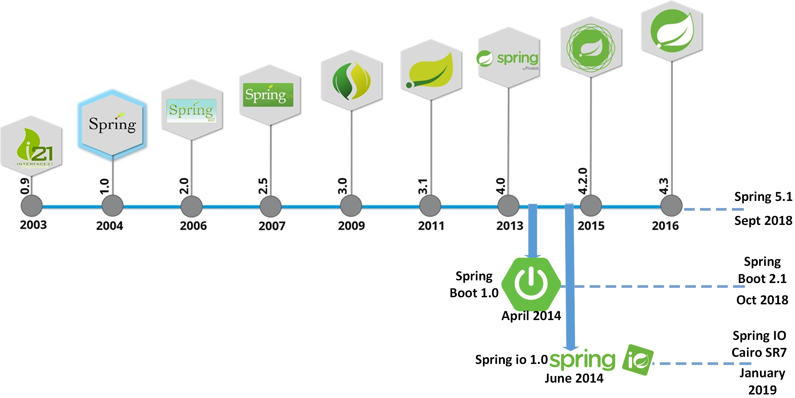


## What is Spring
<br>

<!--style="font-size:20px; text-align:justify;" --> 

* Spring is a comprehensive and widely used open-source framework for building Java-based enterprise and web applications.

* Spring provides a set of tools and libraries that simplifies many aspects of Java application development, making it more modular, efficient, and easier to manage. 

* Spring framework can be user for all layer implementation for a real time appllication

* It can be thought of as a framework of frameworks because it provides support to various frameworks such as Struts, Hibernate, Tapestry, EJB, JSF, etc.

* The Spring framework comprises several modules such as IOC, AOP, DAO, Context, ORM, WEB MVC etc

## What is Spring Framework 
<br>
<!--style="font-size:20px; text-align:justify;" --> 

* Spring is often referred to as the Spring Framework or simply Spring.

* Java Framework is a platform of pre-written codes used by java developers to develop the application(java or web application)

* Java Framework Principle abides the hollywood principle that is **Don't call us ,we'll call you**.Also called inversion of flow or inverstion of Control

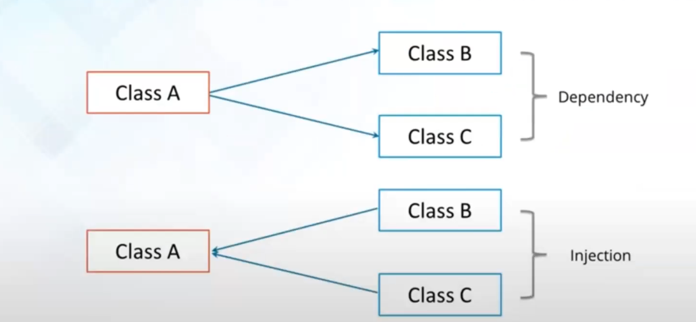   


<div style="font-size:20px; text-align:justify;">
"Let's take plain old java, here Class A has a dependency upon Class B and Class C to instantiate we use a new operator and  it will become tight coupling. To avoid the tight coupling we are injecting the object at run time and trying to make it loose coupling."
</div>

## Why Framework 
<br>
<!--style="font-size:20px; text-align:justify;" --> 
A framework will help us to reuse the code in the application field because it is well-tested code by 100-1000 developers and the community. That's why we always see if a framework is available if not we should write custom code. the Spring Framework, serve several important purposes in software development:

1. **Boilerplate Code Reduction:** Frameworks provide a foundation of pre-written code and structures that address common tasks and challenges in software development. This reduces the amount of repetitive and boilerplate code that developers have to write. In Spring, for example, many infrastructure-related tasks (such as database connection management and transaction handling) are abstracted away, allowing developers to focus on business logic.

2. **Consistency:** Frameworks promote consistency in code architecture and design. They establish conventions and best practices that help developers build applications with a consistent structure. This makes it easier for developers to understand and maintain code written by others, as well as collaborate on large projects.

3. **Productivity:** By providing pre-built components and modules, frameworks can significantly increase development productivity. Developers can leverage these components to speed up development, reduce development effort, and deliver software faster.

4. **Modularity and Reusability:** Frameworks encourage modular and reusable code. Developers can create components, plugins, or modules that can be used across projects or shared with the community. This leads to efficient code reuse and contributes to a developer's ability to create maintainable and scalable software.

5. **Abstraction of Complex Tasks:** Many frameworks abstract complex or low-level tasks, such as managing database connections, handling HTTP requests, or managing security, making these tasks more accessible to developers. This abstraction allows developers to focus on solving business problems rather than dealing with implementation details.

6. **Security:** Frameworks often include security features and best practices, reducing the risk of security vulnerabilities. For example, Spring Security provides tools for authentication, authorization, and protection against common security threats.

7. **Community and Ecosystem:** Popular frameworks like Spring have large and active developer communities. This means that developers can find extensive documentation, tutorials, forums, and libraries to support their development efforts. The ecosystem around a framework can provide valuable resources and support.

8. **Scalability and Performance:** Frameworks are designed with scalability and performance in mind. They often incorporate optimizations and architectural patterns that enable applications to scale horizontally (adding more servers) or vertically (upgrading hardware) as needed.

9. **Maintainability:** Frameworks encourage best practices in code organization and architecture. This makes it easier to maintain and extend applications over time. Frameworks also facilitate testing, which is crucial for maintaining software quality.

10. **Future-Proofing:** Using a well-established framework can future-proof your application to some extent. Frameworks tend to evolve to adopt new technologies, standards, and best practices. This means your application can adapt to changes in the software landscape without a complete rewrite.

## Why Spring is Popular 

* Simplicity - It is simple because as it in non-invasive.it uses POJO or POJI

* Testability - For developing and testing Spring Server(container) is not mandatory

* Loose Coupling - Spring objects are loosely coupled.It will inject the object at runtime in the IOC container or application context.


## Different Java Framework

<br>
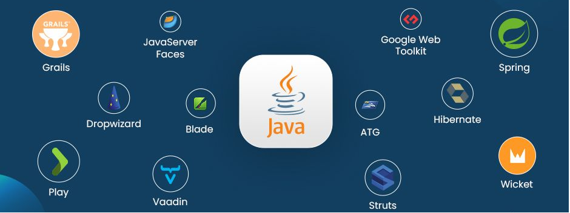   


1. **Spring Framework:** Spring is a comprehensive framework that covers various aspects of application development, including IoC (Inversion of Control), DI (Dependency Injection), AOP (Aspect-Oriented Programming), data access, security, and web development. Spring Boot is a subproject that simplifies the setup and configuration of Spring applications.

2. **Hibernate:** Hibernate is an ORM (Object-Relational Mapping) framework that simplifies database interactions by mapping Java objects to database tables. It provides a higher-level, object-oriented approach to database operations.

3. **Struts:** Apache Struts is a framework for building web applications based on the Model-View-Controller (MVC) design pattern. It helps structure web applications by separating concerns into distinct layers.

4. **JSF (JavaServer Faces):** JSF is another MVC-based web framework, but it focuses on providing a component-based approach to building web user interfaces. It simplifies web application development by offering a set of reusable UI components.

5. **Vaadin:** Vaadin is a Java framework for building modern web applications entirely in Java. It allows developers to create web UIs using Java code with a focus on reusability and maintainability.

6. **Apache Wicket:** Wicket is a component-based web framework that promotes a pure Java approach to web development. It uses a familiar object-oriented programming style for building web applications.

7. **Grails:** Grails is a Groovy-based web application framework that leverages the Spring Framework and Hibernate. It aims to simplify and accelerate web development by using convention over configuration (CoC).

8. **Play Framework:** Play is a reactive web framework designed for building scalable and high-performance web applications. It supports both Java and Scala and emphasizes productivity and developer-friendly features.

9. **Vert.x:** Vert.x is a toolkit for building reactive and event-driven applications on the Java Virtual Machine (JVM). It is suitable for building a wide range of applications, including web and microservices.

10. **Dropwizard:** Dropwizard is a framework for building RESTful web services with Java. It combines various libraries and tools to provide a streamlined and lightweight solution for creating APIs.

11. **Micronaut:** Micronaut is a modern, JVM-based framework designed for building microservices and serverless applications. It offers features like dependency injection, AOP, and a low memory footprint.

12. **Ratpack:** Ratpack is a set of libraries for building asynchronous, non-blocking web applications. It is designed to handle high concurrency and is suitable for building reactive systems.

13. **Quarkus:** Quarkus is a Kubernetes-native Java framework designed for building cloud-native applications. It emphasizes fast startup times and low memory consumption, making it suitable for serverless and containerized environments.


## Spring Features
<br>

<div style="font-size:18px; text-align:justify;"> 

* Lightweight: Spring Framework is lightweight with respect to size and transparency. 

* [Inversion Of Control (IoC)](#ioc-container): In Spring Framework, loose coupling is achieved using Inversion of Control. The objects give their own dependencies instead of creating or looking for dependent objects.

* [Aspect Oriented Programming (AOP)](https://docs.spring.io/spring-framework/docs/2.5.5/reference/aop.html): By separating application business logic from system services, Spring Framework supports Aspect Oriented Programming and enables cohesive development.

* [Container](#bean-life-cycle): Spring Framework creates and manages the life cycle and configuration of application objects.

* [MVC Framework](#model-view-controller): Spring Framework is a MVC web application framework. This framework is configurable via interfaces and accommodates multiple view technologies.

* Transaction Management: For transaction management, Spring framework provides a generic abstraction layer. It is not tied to J2EE environments and it can be used in container-less environments,**for refrences**: [Transaction Management](https://docs.spring.io/spring-framework/docs/4.2.x/spring-framework-reference/html/transaction.html).

* JDBC Exception Handling: The JDBC abstraction layer of the Spring Framework offers an exception hierarchy, which simplifies the error handling strategy.
</div>

## Spring Framework Ecosystem

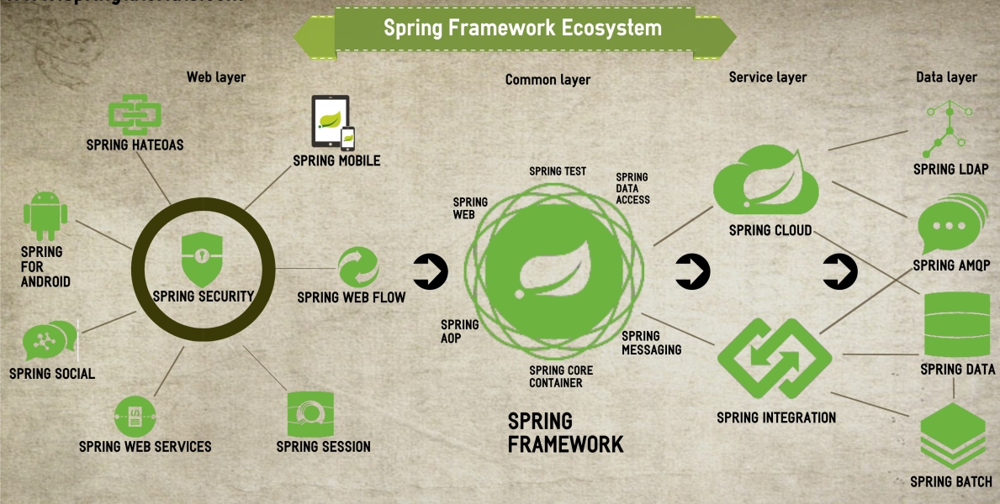

**Web Layer**

* The web layer refers to the part of an application that handles incoming HTTP requests, processes them, and generates corresponding HTTP responses

* It is responsible for handling web-related tasks, such as receiving user input, processing form submissions, and rendering views to present data to users

**Common Layer**

* The "common layer" is a concept used to organize and manage common functionalities, utilities, and shared components that can be used across different parts of an application. 

* It is a separate module or package that contains reusable code that is not specific to any particular layer (presentation, service, or data access layer) but can be leveraged throughout the application.

**Service Layer** 

* The service layer is a crucial component of the application architecture that encapsulates the business logic and coordinates the flow of data and operations between the presentation layer (controller or UI) and the data access layer (repository or DAO).

* The service layer is responsible for processing business-specific rules, orchestrating transactions, and providing a separation of concerns between the presentation and data access layers. 

**Data Layer** 

* The data layer, also known as the persistence layer or data access layer, is responsible for handling data storage, retrieval, and manipulation operations.

* It acts as an intermediary between the business logic in the service layer and the underlying data storage, such as relational databases, NoSQL databases, or any other data source.

* The data layer in Spring helps to abstract the details of data access and provides a consistent and standardized way of interacting with the data source.

[For More details click here](https://springtutorials.com/spring-ecosystem/)

## Spring Architecture Module


### Spring Core Container Layer
<br>

<div style="font-size:18px; text-align:justify;">
The Spring Core container contains core, beans, context and expression language (EL) modules. 

* Core and Beans: These modules provide IOC and Dependency Injection features.

* Context: This module supports the internationalization  EJB, JMS, Basic Remoting.

* Expression Language:  It is an extension to the EL defined in JSP. It provides support to setting and getting property values, method invocation, accessing collections and indexers, named variables, logical and arithmetic operators, retrieval of objects by name etc.
</div>

### AOP Aspects and Instrumentation Layer
<br>

<div style="font-size:18px; text-align:justify;">

* These modules support aspect oriented programming implementation where you can use Advices, Pointcuts etc. to decouple the code.

* The aspects module provides support for integration with AspectJ.

* The instrumentation module provides support to class instrumentation and classloader implementations.


</div>

### Data Access / Integration Layer

<br>
<div style="font-size:18px; text-align:justify;">
This group comprises JDBC, ORM, OXM, JMS and Transaction modules. These modules basically provide support to interact with the database.

* The JDBC module provides a JDBC-abstraction layer that removes the need for tedious JDBC-related coding.

* The ORM module provides integration layers for popular object-relational mapping APIs, including JPA, JDO, Hibernate, and iBatis.

* The OXM module provides an abstraction layer that supports Object/XML mapping implementations for JAXB, Castor, XMLBeans, JiBX and XStream.

* The Java Messaging Service JMS module contains features for producing and consuming messages.

* The Transaction module supports programmatic and declarative transaction management for classes that implement special interfaces and for all your POJOs.
</div>

### Web Layer

<br>
<div style="font-size:18px; text-align:justify;">
This group comprises Web, Web-Servlet, Web-Struts and Web-Portlet. These modules provide support to create a web application.

* The Web module provides basic web-oriented integration features such as multipart file-upload functionality and the initialization of the IoC container using servlet listeners and a web-oriented application context.

* The Web-MVC module contains Spring's Model-View-Controller (MVC) implementation for web applications.

* The Web-Socket module provides support for WebSocket-based, two-way communication between the client and the server in web applications.

* The Web-Portlet module provides the MVC implementation to be used in a portlet environment and mirrors the functionality of Web-Servlet module.
</div>

[for more details click here](https://docs.spring.io/spring-framework/docs/4.3.x/spring-framework-reference/html/overview.html)

## Model View Controller

<br>

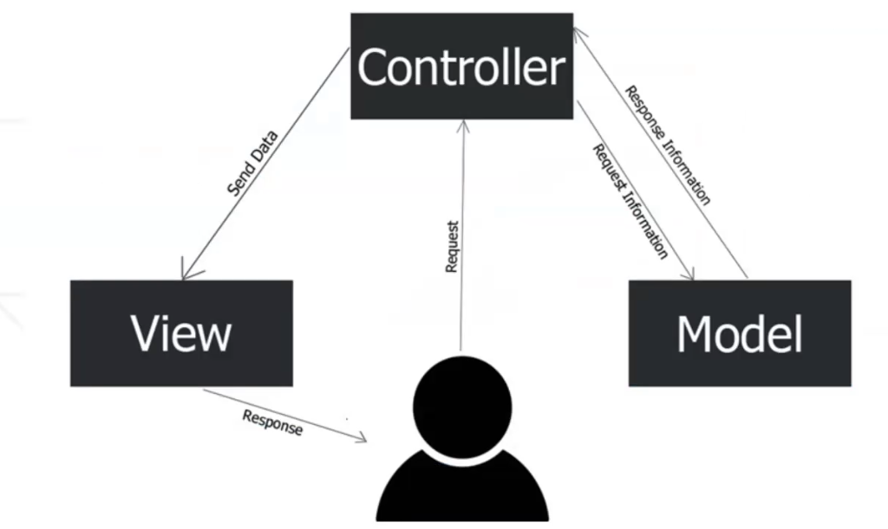   

### MVC Explanation

1. **Model:** 
   - The Model represents the application's data and business logic. It encapsulates the data and the rules for manipulating and processing that data.
   - It is responsible for retrieving and storing data, as well as performing operations on the data.
   - The Model notifies the View of any changes in the data, allowing the View to update accordingly.

2. **View:** 
   - The View is responsible for displaying the data to the user and presenting the user interface.
   - It takes the data from the Model and formats it for presentation. The View is often associated with the user interface components, such as web pages, forms, or graphical elements in GUI applications.
   - The View can receive input from the user and send it to the Controller for processing.

3. **Controller:** 
   - The Controller acts as an intermediary between the Model and the View.
   - It receives user input from the View and processes it. Based on the input and the application's logic, it may interact with the Model to retrieve or modify data.
   - The Controller updates the View with the results of its processing, ensuring that the View displays the appropriate data to the user.

The primary goal of the MVC pattern is to promote the separation of concerns within an application, making it more modular and easier to maintain and extend. Here's how the components interact in a typical MVC application:

1. The user interacts with the View by providing input or triggering actions.

2. The View forwards user input to the Controller.

3. The Controller processes the input, interacts with the Model as needed, and updates the Model's state.

4. The Model notifies the View of any changes in the data.

5. The View retrieves the updated data from the Model and displays it to the user.

6. The cycle continues as the user interacts with the application.

Advantages of using the MVC pattern include:

- **Modularity:** Each component has a clear and well-defined role, making it easier to maintain and modify specific parts of the application without affecting others.

- **Separation of Concerns:** The separation of the user interface (View), application logic (Controller), and data management (Model) simplifies development and testing, as each component can be worked on independently.

- **Reusability:** Components like Models and Controllers can be reused in different parts of the application or even in entirely different applications.

- **Scalability:** MVC helps in scaling an application as you can change or replace components to accommodate new features or changes in requirements.


### Code

[Hand-on-code click here](https://github.com/SwayaanTechnologies/springboot-2.7.8/tree/master/mvc)

[steps click here](https://github.com/SwayaanTechnologies/springboot-2.7.8/blob/master/mvc/README.md)

## IOC Container

* The container gets its instructions on what objects to instantiate, configure, and assemble by reading the configuration metadata provided.

* The configuration metadata can be represented either by XML, Java annotations, or Java code.

* The Spring IoC container makes use of Java POJO classes and configuration metadata to produce a fully configured and executable system or application.

* configured by loading the xml files or by detecting specific java annotations on configuration classes.

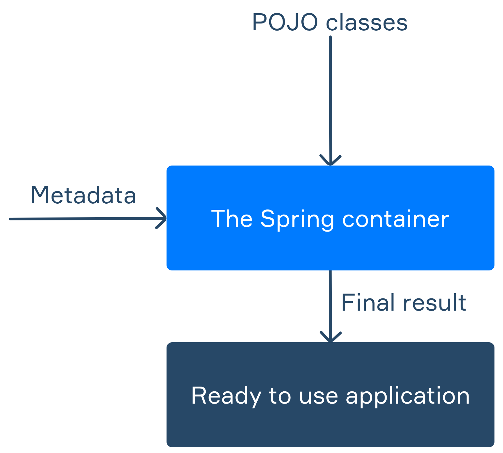  

### Types of IOC Container
<br>

<div style="font-size:18px; text-align:justify;">
1. **BeanFactory Container**
This is the simplest container providing the basic support for DI and is defined by the org.springframework.beans.factory.BeanFactory interface. The BeanFactory and related interfaces, such as BeanFactoryAware, InitializingBean, DisposableBean, are still present in Spring for the purpose of backward compatibility with a large number of third-party frameworks that integrate with Spring.

2. **ApplicationContext Container**
This container adds more enterprise-specific functionality such as the ability to resolve textual messages from a properties file and the ability to publish application events to interested event listeners. This container is defined by the org.springframework.context.ApplicationContext interface.

</div>


### Code

[Hand-on-code click here](https://github.com/SwayaanTechnologies/springboot-2.7.8/tree/Spring-5.X/bean-management/beanmanagement/src/main)

[steps click here](https://github.com/SwayaanTechnologies/springboot-2.7.8/blob/Spring-5.X/bean-management/README.md)


### IOC Features
<br>

<div style="font-size:18px; text-align:justify;">

* It creates the objects 

* Configures and assembles their dependencies 

* Manages their entire life cycle
</div>


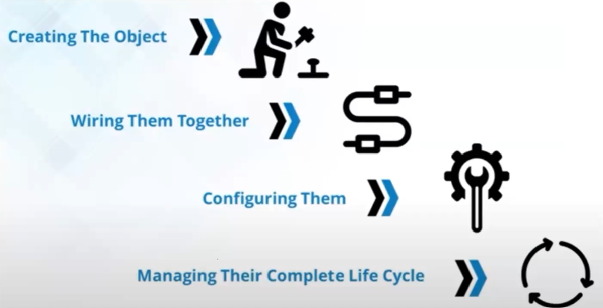  

## Dependency Injection
<br>

<div style="font-size:18px; text-align:justify;">
Dependency injection is a fundamental aspect of the Spring framework, through which the Spring container **injects** objects into other objects or **dependencies**. Simply put, this allows for loose coupling of components and moves responsibility for managing components onto the container.
</div>

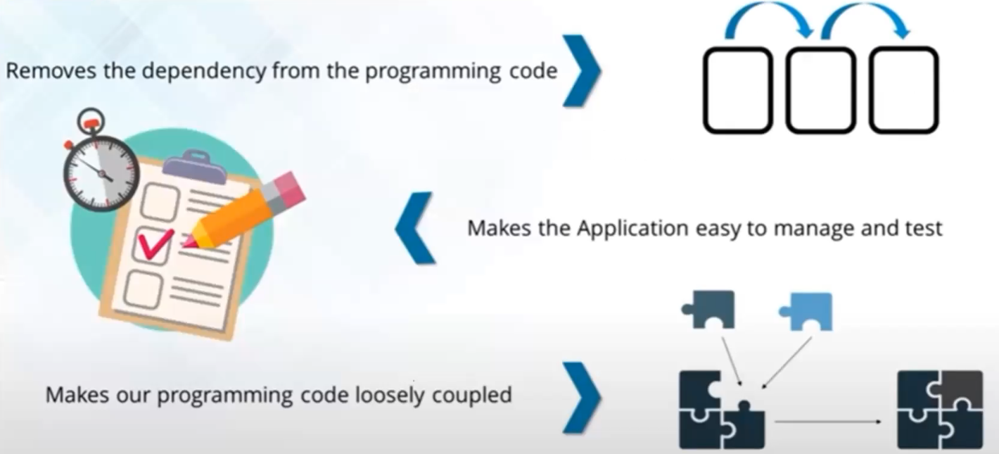

### Types Of Dependency Injection

1. [Constructor-Based Dependency Injection](#constructor-based-dependency-injection)

2. [Setter Based Dependency Injection](#setter-based-dependency-injection)

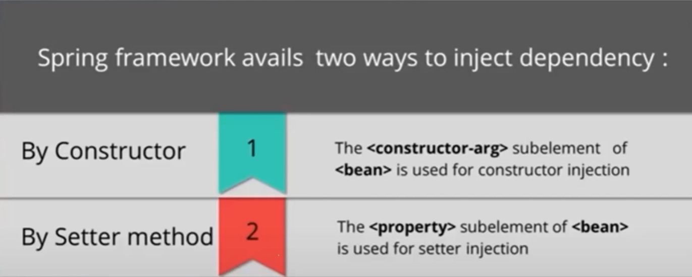


#### Constructor Based Dependency Injection

Constructor-based DI is accomplished when the container invokes a class constructor with a number of arguments, each representing a dependency on the other class.

We can inject the dependency by the constructor. The <constructor-arg> subelement of <bean> is used for constructor injection. Here we are going to inject

* primitive and String-based values
* Dependent object (contained object)
* Collection values etc.

#### Setter Based Dependency Injection

Setter-based DI is accomplished by the container calling setter methods on your beans after invoking a no-argument constructor or no-argument static factory method to instantiate your bean.

We can inject the dependency by the setter method also. The <property> subelement of <bean> is used for setter injection. Here we are going to inject


* primitive and String-based values
* Dependent object (contained object)
* Collection values etc.

#### Code

[Hand-on-code click here](https://github.com/SwayaanTechnologies/springboot-2.7.8/tree/master/Types-of-DI)

[steps click here](https://github.com/SwayaanTechnologies/springboot-2.7.8/blob/master/Types-of-DI/README.md)


## Bean

* Beans are the objects from the backbone of the application and are managed by the Spring IoC container.

* Spring Ioc Container instantiates, assembles and manages The bean Object

* The Configuration metadata that is supplied to the container is used to create the beans object.

* **Bean Dependency Injection**:

1. It’s a design pattern that removes the dependency from the Programming code, which makes the application easy to manage and test.

2. Dependency injection makes our Programming code loosely coupled, which means a change in implementation does not affect the user or invoking application


### bean life cycle
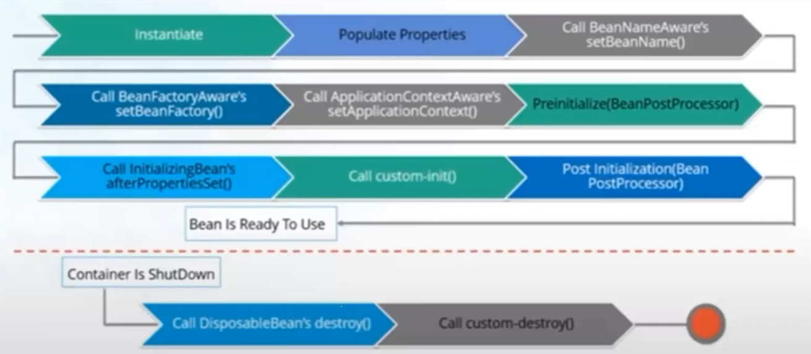

* The life cycle of a Spring bean is easy to understand. When a bean is instantiated, it may be required to perform some initialization to get it into a usable state. Similarly, when the bean is no longer required and is removed from the container, some cleanup may be required.

* To define setup and teardown for a bean, we simply declare the <bean> with init-method and/or destroy-method parameters. The init-method attribute specifies a method that is to be called on the bean immediately upon instantiation. Similarly, destroy method specifies a method that is called just before a bean is removed from the container.


### Bean Scope

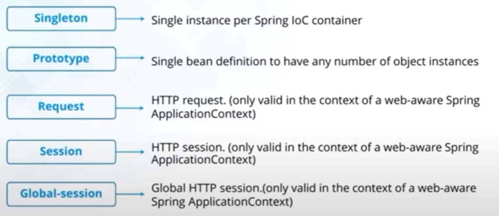

### Code

[Hand-on-code click here](https://github.com/SwayaanTechnologies/springboot-2.7.8/tree/master/bean)

[steps click here](https://github.com/SwayaanTechnologies/springboot-2.7.8/blob/master/bean/README.md)


## Dispatcher Servlet

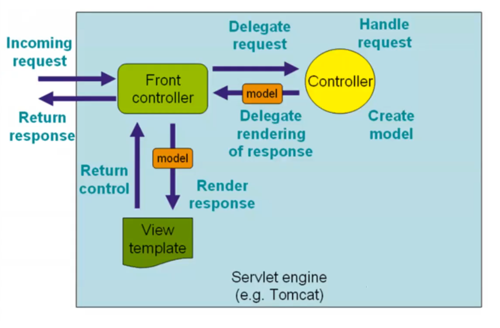

### Dispatcher Servlet Working 
<br>

<div style="font-size:18px; text-align:justify;">

**Servlet**: is an specification as part of jee ascepts.Servlet are used to creating the dispatcher servlets.

* In Spring MVC all incoming requests go through a single servlet called Dispatcher Servlet (front controller). The front controller is a design pattern in web application development. A single servlet receives all the requests and transfers them to all other components of the application.

* The job of DispatcherServlet is to take an incoming URI and find the right combination of handlers (Controller classes) and views (usually JSPs). When the DispatcherServlet determines the view, it renders it as the response. Finally, the DispatcherServlet returns the Response Object back to the client.

</div>

<div style="margin-left:100px;margin-top:20px;width:350px">

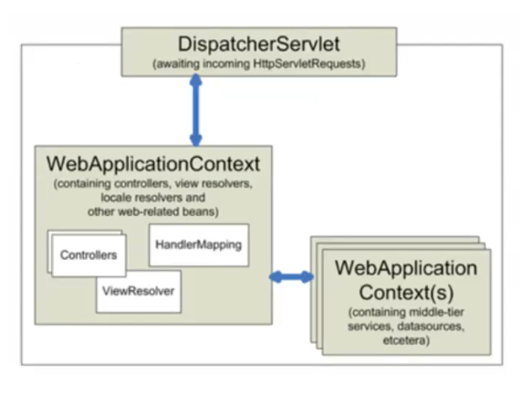
</div>

## Spring interceptor

* Spring interceptor is a class that either extends the HandlerInterceptorAdapter class or implements the HandlerInterceptor interface. The HandlerInterceptor contains three main methods: 

* prehandle() – called before the execution of the actual handler

* postHandle() – called after the handler is executed 

* afterCompletion() – called after the complete request is finished and the view is generated These three methods provide flexibility to do all kinds of pre- and post-processing. 

[Hand-on-code click here](https://github.com/SwayaanTechnologies/springboot-2.7.8/tree/master/Spring%20interceptors)

[steps click here](https://github.com/SwayaanTechnologies/springboot-2.7.8/blob/master/Spring%20interceptors/README.md)


## Bootstrapping Spring boot project
<br>

<div style="font-size:18px; text-align:justify;">

**What is Spring Boot ?**

* Spring Boot makes it easy to create stand-alone, production-grade Spring-based applications that you can "just run".

* We take an opinionated view of the spring platform and third-party libraries so you can get started with minimum fuss. Most Spring Boot applications need very little Spring configuration

* Spring Boot enables developers to focus on the business logic behind their microservice. It aims to take care of all the nitty-gritty technical details involved in developing microservices.
</div>

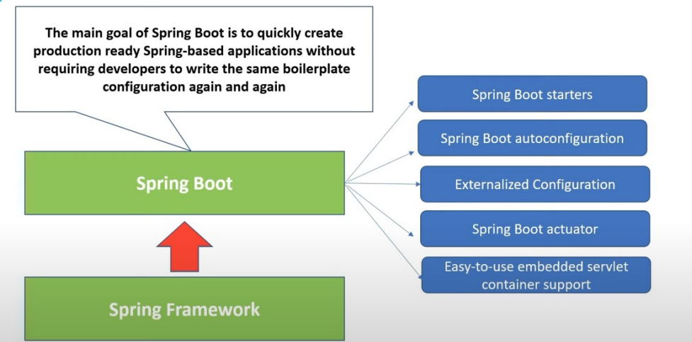

### Spring Vs Spring Boot
<br>

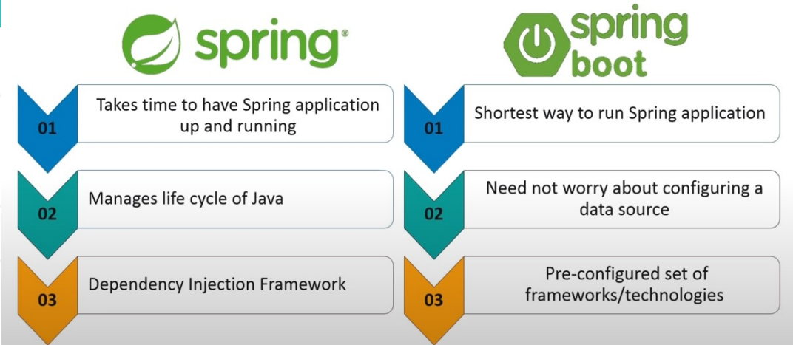

### Spring Initializr
<br>

<div style="font-size:18px; text-align:justify;">
Spring Initializr provides a lot of flexibility in creating projects. 
You have options to do the following:

1. Choose your build tool: Maven or Gradle. Choose the Spring Boot version you want to use.

2. Configure a Group ID and Artifact ID for your component.

3. Choose the starters (dependencies) that you would want for your project. 

4. Choose how to package your component: JAR or WAR.

5. Choose the Java version you want to use.

6. Choose the JVM language you want to use.

**There are 3 ways to create a Spring Boot project**

* Spring Initializr web [spring.io](https://start.spring.io/)
  
  1. installation Steps [video reference](https://www.youtube.com/watch?v=qhZtYAw0C9s) 

* Spring Tool Suite (STS)

* Spring Boot CLI
</div>


### spring boot starters
<br>

<div style="font-size:18px; text-align:justify;">
Starters are simplified dependency descriptors customized for different purposes.

*  For example, spring-boot-starter-web is the starter for building web applications, including RESTful, using Spring MVC. It uses Tomcat as the default embedded container. 

* If I want to develop a web application using Spring MVC, all we would need to do is include spring-boot-starter-web in our dependencies, and we get the following automatically pre-configured: 

1. Spring MVC 

2. Compatible versions of Jackson-databind (for binding) and hibernate-validator (for form validation) 

3. spring-boot-starter-tomcat (starter project for Tomcat)

</div>


### Spring boot starter parent

* The spring-boot-starter-parent dependency is the parent POM providing dependency and plugin management for Spring Boot-based applications.

* A spring-boot-starter-parent dependency contains the default versions of Java to use, the default versions of dependencies that Spring Boot uses, and the default configuration of the Maven plugins

* When you specify spring-boot-starter-parent as the parent of your Maven project in the pom.xml file, your project inherits the default configurations defined in the parent POM.

* These configurations include settings for plugins (e.g., Maven Compiler Plugin, Maven Surefire Plugin), properties (e.g., Java version, project version), and dependencies (e.g., Spring Boot libraries).

* One of the key benefits of using spring-boot-starter-parent is simplified dependency management. It defines a set of recommended dependencies with their versions, so you don't have to specify individual versions for Spring Boot and related libraries.

* It also ensures that these dependencies are compatible with each other.

* spring-boot-starter-parent defines default build profiles for common tasks, such as packaging an executable JAR or WAR file.

* It configures sensible defaults for packaging and naming conventions.

* The parent POM configures Maven plugins, including the Spring Boot Maven Plugin, to handle tasks like packaging, running applications, and creating executable JARs.

* spring-boot-starter-parent specifies the version of Spring Boot to use. This ensures that your project is aligned with a specific Spring Boot version, helping to maintain compatibility.

* While spring-boot-starter-parent provides a set of sensible defaults, you can still customize your project by overriding or adding configurations and dependencies in your project's pom.xml file. This allows you to adapt the default settings to your specific requirements.

Here's an example of how to set up your Maven project to use spring-boot-starter-parent as the parent POM in your pom.xml file:

```xml
<parent>
		<groupId>org.springframework.boot</groupId>
		<artifactId>spring-boot-starter-parent</artifactId>
		<version>2.7.8</version>
		<relativePath /> <!-- lookup parent from repository -->
	</parent>

```

### Spring boot starter web
<br>

<div style="font-size:18px; text-align:justify;">
This will add Spring MVC capabilities to Spring Boot

* Helps you build Spring MVC-based web applications or RESTful applications. It uses Tomcat as the default embedded servlet container.

- spring-boot-starter-web manages dependencies related to web development, such as Spring Web MVC, embedded web server (usually Tomcat), and various other web-related libraries.

- It provides these dependencies with predefined versions, ensuring compatibility and simplifying the management of transitive dependencies.

- Spring Boot leverages auto-configuration to automatically set up various components required for web applications. For example, it configures a DispatcherServlet, which is the central servlet in a Spring MVC application.
   
- Auto-configuration is based on the presence of certain classes and configurations in the classpath, and it adapts to the specific web server (e.g., Tomcat, Jetty) you are using.

- spring-boot-starter-web includes an embedded web server, such as Tomcat or Jetty, depending on your project's dependencies.
- You don't need to manually configure or deploy a separate web server; Spring Boot takes care of it.

- The starter configures Spring Web MVC, which is a popular framework for building web applications. It provides support for handling HTTP requests, routing, controllers, views, and more.
   
- Spring Boot, along with spring-boot-starter-web, simplifies the development of RESTful web services using Spring Web MVC and features like `@RestController` and `@RequestMapping`.

To use spring-boot-starter-web, you typically include it as a dependency in your project's build configuration (Maven or Gradle). For example, in a Maven pom.xml file:


</div>

```xml
<dependency>
			<groupId>org.springframework.boot</groupId>
			<artifactId>spring-boot-starter-web</artifactId>
		</dependency>

```
### Spring boot starter test


The spring-boot-starter-test dependency provides the following test frameworks needed for unit testing: 

- JUnit: Basic unit test framework 

- Mockito: For mocking

- Hamcrest, AssertJ: For readable asserts 

- Spring Test: A unit testing framework for spring-context based applications

```xml

<dependency>
			<groupId>org.springframework.boot</groupId>
			<artifactId>spring-boot-starter-test</artifactId>
			<scope>test</scope>
		</dependency>

```


### Spring boot maven plugin
<br>

<div style="font-size:18px; text-align:justify;">
when we build applications using Spring Boot, there are a couple of situations that are possible:

* We would want to run the applications in place without building a JAR or a WAR

* We would want to build a JAR and a WAR for later deployment

* The spring-boot-maven-plugin dependency provides capabilities for both of the preceding situations. The following snippet shows how we can configure spring-boot-maven-plugin in an application:

* One of the primary functions of the plugin is to package your Spring Boot application into a runnable JAR or WAR file.

* By default, it packages your application as an executable JAR (Java Archive), which includes all the necessary dependencies.

* The plugin automatically detects your application's main class, which is annotated with @SpringBootApplication, and uses it as the entry point.

* It also identifies the necessary dependencies, including Spring Boot's starter dependencies, and includes them in the executable JAR.

* The spring-boot:run goal provided by the plugin allows you to run your Spring Boot application directly from the command line during development.

* It starts an embedded web server (e.g., Tomcat, Jetty) and deploys your application, making it accessible at the specified port.

* The plugin can repackage your application as a standalone executable JAR, which includes all dependencies. This is useful for deploying your application to various environments without worrying about external dependencies

* The plugin includes an optional goal spring-boot:build-info for generating build information that can be consumed by Spring Boot Actuator, providing details about the application's build and version.

* You can customize various properties and configuration settings for the plugin in your pom.xml or external configuration files.These properties allow you to control how your application is packaged and run.

</div>

```xml
<build>
		<plugins>
			<plugin>
				<groupId>org.springframework.boot</groupId>
				<artifactId>spring-boot-maven-plugin</artifactId>
			</plugin>
		</plugins>
	</build>

```
# Spring Boot first basic project

* [Steps](#steps)
* [Working Example](#working-example)
* [Spring Application](#spring-application)
* [SpringBootApplication](#anotation-springbootapplication)
* [Spring boot application working](#spring-boot-application-working)
* [beans loading](#beans-loading)
* [Anotation Component](#anotation-component)
* [Anotation Bean](#anotation-bean)
* [Anotation Component Vs Anotation bean](#anotation-component-vs-anotation-bean)
* [inject from application properties](#inject-from-application-properties)
* [CommandLineRunner](#commandlinerunner)
* [Profile](#profile)

## Steps 

We will start with building our first Spring Boot application.

*  We will use Maven to manage dependencies.

* The following steps are involved in starting up a Spring Boot application:

**Step 1**: Set up your project

You can use Spring Initializr to quickly generate a Spring MVC project. Visit [spring.io](https://start.spring.io/) and configure your project as follows:

- Project: Maven Project

- Language: Java

- Spring Boot: (Choose the latest version)

- Group: com.training

- Artifact: firstspringbootapplication (or any other name you like)

- Dependencies: none

- Click "Generate" to download the project zip file.


**Step 2**: Unzip the created file

**Step 3**: Open STS

**Step 4**: Click on file

**Step 5**: Click on import > select maven > select existing maven project > click next 

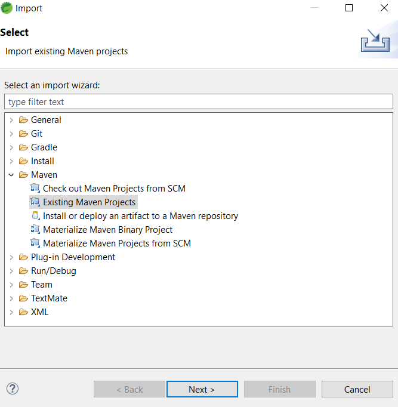

**Step 6**: Browser the unzipped file 

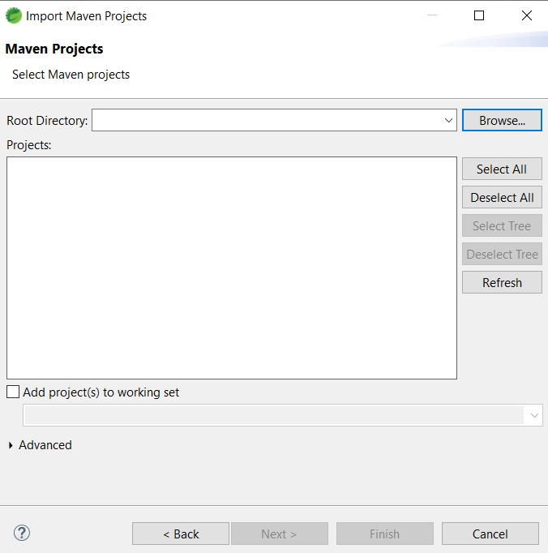

**step 7**: pom.xml file will appear, select it and click on finish

**Folder structure**

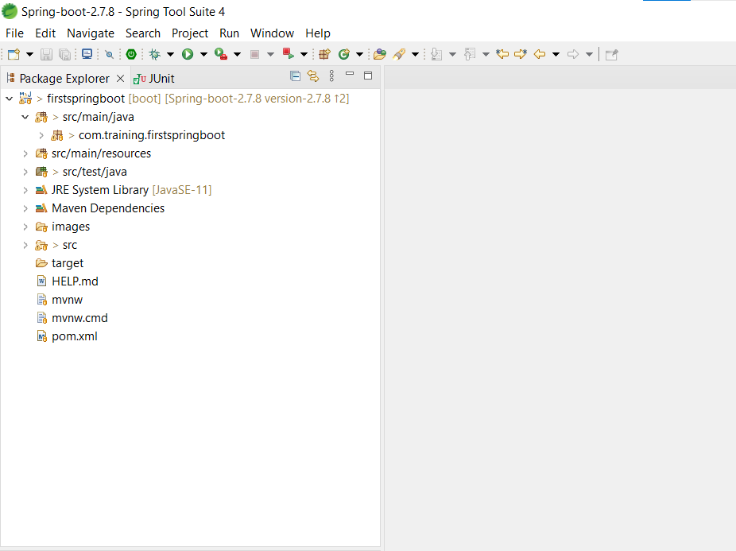

## Working Example

[Hand-on-code click here](https://github.com/SwayaanTechnologies/springboot-2.7.8/tree/master/firstspringboot/src)

[steps click here](https://github.com/SwayaanTechnologies/springboot-2.7.8/blob/master/firstspringboot/README.md)

## Spring Application 

<br>

<div style="font-size:18px; text-align:justify;">
The SpringApplication class can be used to Bootstrap and launch a Spring application from a Java main method.

* The following are the steps that are typically performed when a Spring Boot application is bootstrapped:

1. Create an instance of Spring's ApplicationContext.

2. Enable the functionality to accept command-line arguments and expose them as Spring properties.

3. Load all the Spring beans as per the configuration

</div>


```java
package com.training.firstspringboot;

import org.springframework.boot.SpringApplication;
import org.springframework.boot.autoconfigure.SpringBootApplication;

@SpringBootApplication
public class FirstspringbootApplication {

	public static void main(String[] args) {
		SpringApplication.run(FirstspringbootApplication.class, args);
	}

}


```

## Anotation SpringBootApplication
<br>

<div style="font-size:18px; text-align:justify;">

The @SpringBootApplication annotation is a shortcut for three annotations:

1. @Configuration: Indicates that this is a Spring application context configuration file.

2. @EnableAutoConfiguration: Enables auto-configuration, an important feature of Spring Boot. 

3. @ComponentScan: Enables scanning for Spring beans in the package of this class and all its sub-packages.
</div>

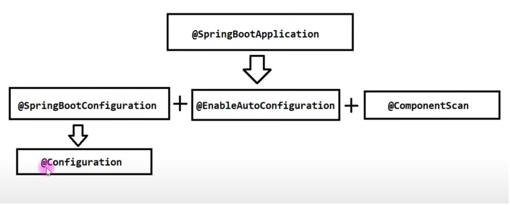


## Spring boot application working

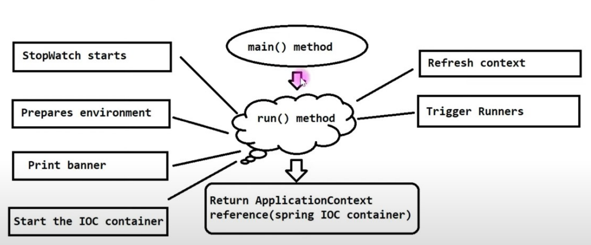


## beans loading

Let’s see what all beans are loaded at this point, Where are these beans defined? & How are these beans created? 

* In the below code, we can get to know the following points 

* That's the magic of Spring auto-configuration.

* Whenever we add a new dependency to a Spring Boot project, Spring Boot auto-configuration automatically tries to configure the beans based on the dependency

**Code for bean Loading**

```java
@SpringBootApplication
public class FirstspringbootApplication  {
	
	
	public static void main(String[] args) {
		
        ConfigurableApplicationContext applicationContext =SpringApplication.run(FirstspringbootApplication.class, args);
		SpringDemoComponent component = applicationContext.getBean(SpringDemoComponent.class);
		System.out.println(component.getMessage());
		
		String[] beanNames =applicationContext.getBeanDefinitionNames();
		Arrays.sort(beanNames);//optional
		for(String beanName: beanNames) {
		System.out.println(beanName);
		}
		}

}
```

## Anotation Component

* The @Component annotation marks a java class as a bean so the component-scanning mechanism of spring can pick it up and pull it into the application context. 

*  To use this annotation, apply it over class as below:

* This should print in console, which indicates this component was instantiated, we can reprint beans and validate.

```java
package com.training.firstspringboot;

import org.springframework.stereotype.Component;

@Component
public class SpringDemoComponent {
	
	public SpringDemoComponent() {
		System.out.println("*********Constructor or SpringDemoComponent use called****");
	}
	
	public String getMessage() {
		return "Hello from SpringDemoComponent get message";
	}

}

```
## Anotation Bean

* When should you use @Bean?

1. Sometimes automatic configuration is not an option. When? Let's imagine that you want to wire components from 3rd-party libraries (you don't have the source code so you can't annotate its classes with @Component), so automatic configuration is not possible.

2. The @Bean annotation returns an object that Spring should register as a bean in the application context. The body of the method bears the logic responsible for creating the instance

* Create a SpringConfig.java class

```java
@Configuration
public class SpringConfig {

	@Bean
	@Conditional(MyCondition.class)
	
	public SpringDemoComponent createBean() {
		return new SpringDemoComponent();
	}
}

```


## Anotation Component Vs Anotation bean

@Component and @Bean do two quite different things, and shouldn't be confused.

* @Component (and @Service and @Repository) are used to auto-detect and auto-configure beans using classpath scanning. There's an implicit one-to-one mapping between the annotated class and the bean (i.e. one bean per class). Control of wiring is quite limited with this approach since it's purely declarative.

* @Bean is used to explicitly declare a single bean, rather than letting Spring do it automatically as shown in the example. It decouples the declaration of the bean from the class definition and lets you create and configure beans exactly how you choose.

* Component Preferable for component scanning and automatic wiring.


## inject from application properties

* Add a property and let’s inject

* server port = 8081 from Spring Boot in application.properties

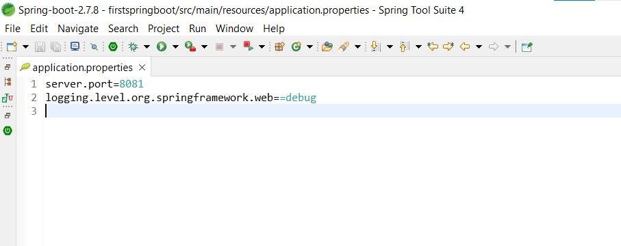


## CommandLineRunner

* It allows you to execute custom code when a Spring Boot application starts. 

* This interface is particularly useful when you want to perform certain initialization or startup tasks for your application.

* The primary purpose of the CommandLineRunner interface is to execute custom code at the beginning of the application's lifecycle, just after the application context is fully initialized and before it starts serving requests.

* When a Spring Boot application starts, Spring Boot searches for all beans that implement the CommandLineRunner interface and automatically invokes the run method on each of these beans. 

* Add the CommandLineRunner interface

```java
package com.training.firstspringboot;

import org.springframework.beans.factory.annotation.Autowired;
import org.springframework.beans.factory.annotation.Value;
import org.springframework.boot.CommandLineRunner;
import org.springframework.boot.SpringApplication;
import org.springframework.boot.autoconfigure.SpringBootApplication;

@SpringBootApplication
public class FirstspringbootApplication implements CommandLineRunner{
	
	@Autowired
	SpringDemoComponent springDemoComponent;

    @Value("${server.port}")
	private String port; 

	public static void main(String[] args) {
			
			 SpringApplication.run(FirstspringbootApplication.class, args);
			   
			
			}
			
	@Override
	public void run(String... args) throws Exception{
		System.out.println(springDemoComponent.getMessage());
        	System.out.println("the server port is :"+ port);
	}
}
```

## Profile

* Spring Profiles provide a way to segregate parts of your application configuration and make it be available only in certain environments. 

* In the context of Spring Framework and Spring Boot, a "profile" is a way to define and manage application-specific configurations and settings for different environments or scenarios.

* Profiles allow you to configure your application to behave differently depending on its current environment, such as development, testing, staging, or production. 

* This is particularly useful for managing configuration properties, database connections, or any other environment-specific settings.

1. **Why Profiles are Useful**:

   - In real-world software development, applications often need to run in various environments, and these environments have distinct requirements and configurations. For example, you might need different database URLs or connection pools for development, testing, and production.
   - Profiles help you manage these variations by allowing you to define configuration settings that are specific to each environment.

2. **Defining Profiles**:

   - Profiles are defined in your Spring Boot application by specifying them in property files, YAML files, or using annotations in the Spring Boot main class.
   - Profiles are usually named based on the environment they represent, e.g., `dev` for development, `test` for testing, and `prod` for production.

3. **Application Properties and YAML Files**:

   - You can define profile-specific configuration properties in separate property or YAML files, named after the profile, such as `application-dev.properties` or `application-test.yml`.
   - These files contain environment-specific property values that override the common application properties defined in the main `application.properties` or `application.yml` file.
   - Spring Boot automatically detects the active profile based on configuration or environment variables and loads the corresponding properties.

4. **Annotation Based Profiles**:

   - In addition to properties files, you can define profiles in your Spring Boot main class using the `@Profile` annotation. For example:
     ```java
     @SpringBootApplication
     @Profile("dev")
     public class DevApplication {
         public static void main(String[] args) {
             SpringApplication.run(DevApplication.class, args);
         }
     }
     ```
   - When you run this class, it activates the `dev` profile.

5. **Activating Profiles**:

   - Profiles can be activated in various ways, including:
     - Setting the `spring.profiles.active` property in your `application.properties` or `application.yml` file.
     - Using the `--spring.profiles.active` command-line argument when starting your application.
     - Setting environment variables.
     - In the `application.properties` or `application.yml` file for specific profiles.
     - Programmatically in your code, using the `SpringApplication.setAdditionalProfiles` method.

6. **Profile Specific Beans and Configurations**:

   - You can define beans and configurations that are specific to a particular profile. For instance, you can have a database configuration that varies by profile.
   - Use `@Profile` annotations on bean definitions to make them active only when the corresponding profile is active.

7. **Spring Profiles in Testing**:

   - Profiles are also useful in testing scenarios. You can activate a specific profile for your tests to ensure that your test environment matches your desired testing conditions.

8. **Default Profile**:

   - If no profile is explicitly set, Spring Boot uses the `default` profile. You can define a `application.properties` or `application.yml` file for the default profile, which will be loaded if no other profile is active.

# Creating Web Project Rest API

* [Starters in Spring Boot](#starters-in-spring-boot)
* [What are the other starters](#what-are-the-other-starters)
* [Anotation Autowired](#anotation-autowired)
* [Autowired by Web starter](#autowired-by-web-starter)
* [Creating a Spring firstspringproject](#creating-a-spring-firstspringproject)


## Starters in Spring Boot

Starters are simplified dependency descriptors customized for different purposes.

* For example, spring-boot-starter-web is the starter for building web application, including RESTful, using Spring MVC. It uses Tomcat as the default embedded container. 

* If I want to develop a web application using Spring MVC, all we would need to do is include spring-boot-starter-web in our dependencies, and we get the following automatically pre-configured:

1. Spring MVC 

2. Compatible versions of jackson-databind (for binding) and hibernate-validator (for form validation)

3. spring-boot-starter-tomcat (starter project for Tomcat)

## What are the other starters

|                    Name                     |                                                         Description                                                        |
|:-------------------------------------------:|:--------------------------------------------------------------------------------------------------------------------------:|
|             spring-boot-starter             |                            Core starter, including auto-configuration support, logging, and YAML                           |
|         spring-boot-starter-activemq        |                                       Starter for JMS messaging using Apache ActiveMQ                                      |
|           spring-boot-starter-amqp          |                                         Starter for using Spring AMQP and Rabbit MQ                                        |
|           spring-boot-starter-aop           |                             Starter for aspect-oriented programming with Spring AOP and AspectJ                            |
|         spring-boot-starter-artemis         |                                       Starter for JMS messaging using Apache Artemis                                       |
|          spring-boot-starter-batch          |                                               Starter for using Spring Batch                                               |
|          spring-boot-starter-cache          |                                    Starter for using Spring Framework’s caching support                                    |
|      spring-boot-starter-data-cassandra     |                         Starter for using Cassandra distributed database and Spring Data Cassandra                         |
| spring-boot-starter-data-cassandra-reactive |                     Starter for using Cassandra distributed database and Spring Data Cassandra Reactive                    |
|      spring-boot-starter-data-couchbase     |                      Starter for using Couchbase document-oriented database and Spring Data Couchbase                      |
| spring-boot-starter-data-couchbase-reactive |                  Starter for using Couchbase document-oriented database and Spring Data Couchbase Reactive                 |
|    spring-boot-starter-data-elasticsearch   |                  Starter for using Elasticsearch search and analytics engine and Spring Data Elasticsearch                 |
|        spring-boot-starter-data-jdbc        |                                             Starter for using Spring Data JDBC                                             |
|         spring-boot-starter-data-jpa        |                                      Starter for using Spring Data JPA with Hibernate                                      |
|        spring-boot-starter-data-ldap        |                                             Starter for using Spring Data LDAP                                             |
|       spring-boot-starter-data-mongodb      |                        Starter for using MongoDB document-oriented database and Spring Data MongoDB                        |
|  spring-boot-starter-data-mongodb-reactive  |                    Starter for using MongoDB document-oriented database and Spring Data MongoDB Reactive                   |
|        spring-boot-starter-data-neo4j       |                                Starter for using Neo4j graph database and Spring Data Neo4j                                |
|        spring-boot-starter-data-r2dbc       |                                             Starter for using Spring Data R2DBC                                            |
|        spring-boot-starter-data-redis       |                 Starter for using Redis key-value data store with Spring Data Redis and the Lettuce client                 |
|   spring-boot-starter-data-redis-reactive   |             Starter for using Redis key-value data store with Spring Data Redis reactive and the Lettuce client            |
|        spring-boot-starter-data-rest        |                       Starter for exposing Spring Data repositories over REST using Spring Data REST                       |
|        spring-boot-starter-freemarker       |                              Starter for building MVC web applications using FreeMarker views                              |
|     spring-boot-starter-groovy-templates    |                           Starter for building MVC web applications using Groovy Templates views                           |
|         spring-boot-starter-hateoas         |              Starter for building hypermedia-based RESTful web application with Spring MVC and Spring HATEOAS              |
|       spring-boot-starter-integration       |                                            Starter for using Spring Integration                                            |
|           spring-boot-starter-jdbc          |                                  Starter for using JDBC with the HikariCP connection pool                                  |
|          spring-boot-starter-jersey         |      Starter for building RESTful web applications using JAX-RS and Jersey. An alternative to spring-boot-starter-web      |
|           spring-boot-starter-jooq          | Starter for using jOOQ to access SQL databases. An alternative to spring-boot-starter-data-jpa or spring-boot-starter-jdbc |
|           spring-boot-starter-json          |                                            Starter for reading and writing json                                            |
|       spring-boot-starter-jta-atomikos      |                                         Starter for JTA transactions using Atomikos                                        |
|           spring-boot-starter-mail          |                          Starter for using Java Mail and Spring Framework’s email sending support                          |
|         spring-boot-starter-mustache        |                                 Starter for building web applications using Mustache views                                 |
|      spring-boot-starter-oauth2-client      |                          Starter for using Spring Security’s OAuth2/OpenID Connect client features                         |
|  spring-boot-starter-oauth2-resource-server |                             Starter for using Spring Security’s OAuth2 resource server features                            |
|          spring-boot-starter-quartz         |                                           Starter for using the Quartz scheduler                                           |
|         spring-boot-starter-rsocket         |                                      Starter for building RSocket clients and servers                                      |
|         spring-boot-starter-security        |                                              Starter for using Spring Security                                             |
|           spring-boot-starter-test          |          Starter for testing Spring Boot applications with libraries including JUnit Jupiter, Hamcrest and Mockito         |
|        spring-boot-starter-thymeleaf        |                               Starter for building MVC web applications using Thymeleaf views                              |
|        spring-boot-starter-validation       |                               Starter for using Java Bean Validation with Hibernate Validator                              |
|           spring-boot-starter-web           | Starter for building web, including RESTful, applications using Spring MVC. Uses Tomcat as the default embedded container. |
|       spring-boot-starter-web-services      |                                            Starter for using Spring Web Services                                           |
|         spring-boot-starter-webflux         |                   Starter for building WebFlux applications using Spring Framework’s Reactive Web support                  |
|        spring-boot-starter-websocket        |                   Starter for building WebSocket applications using Spring Framework’s WebSocket support                   |

## Anotation Autowired

* The @Autowired annotation provides more fine-grained control over where and how autowiring should be accomplished. 

* The @Autowired annotation can be used to autowire bean on the setter method just like @Required annotation, constructor, a property or methods with arbitrary names and/or multiple arguments.

* @Autowired is an annotation in the Spring Framework used for automatic dependency injection. It is commonly used to inject dependencies into Spring-managed beans (such as controllers, services, and repositories) without the need for explicit configuration.

* When a bean is marked with @Autowired, Spring will search for a suitable bean of the requested type and inject it into the bean where @Autowired is applied


## Autowired by Web starter

When we add a dependency in spring-boot-starter-web, the following beans are auto-configured: 

* basicErrorController, handlerExceptionResolver: It is the basic exception handling. It shows a default error page when an exception occurs.

* beanNameHandlerMapping: It is used to resolve paths to a handler (controller). 

* characterEncodingFilter: It provides default character encoding UTF-8. 

* dispatcherServlet: It is the front controller in Spring MVC applications.

* jacksonObjectMapper: It translates objects to JSON and JSON to objects in REST services.

* messageConverters: It is the default message converters to convert from objects into XML or JSON and vice versa.

* multipartResolver: It provides support to upload files in web applications.

* mvcValidator: It supports validation of HTTP requests. – viewResolver: It resolves a logical view name to a physical view. 

* propertySourcesPlaceholderConfigurer: It supports the externalization of application configuration.

* requestContextFilter: It defaults the filter for requests.

* restTemplateBuilder: It is used to make calls to REST services. 

* tomcatEmbeddedServletContainerFactory: Tomcat is the default embedded servlet container for Spring Boot-based web applications

## Creating a Spring firstspringproject

Tomcat server is launched on port 8080 - Tomcat started on port(s): 8080 (http).

* DispatcherServlet is configured. This means that Spring MVC Framework is ready to accept requests-Mapping servlet: 'dispatcherServlet' to [/].

* Four filters are enabled by default 

- characterEncodingFilter

- hiddenHttpMethodFilter, 

- httpPutFormContentFilter 

- requestContextFilter 

*  The default error page is configured

1. Mapped "{[/error]}" onto public org.springframework.http.ResponseEntity<java.util.Map<java.lang.String, java.lang.Object>>

2. org.springframework.boot.autoconfigure.web.BasicErrorController.error(javax.servlet.http.HttpServletRequest) 

* WebJars are autoconfigured. WebJars enable dependency management for static dependencies such as Bootstrap and query--Mapped URL path [/webjars/**] onto handler of type [class org.springframework.web.servlet.resource.ResourceHttpRequestHandler] 


## output

* If we now open a browser and go to http://localhost:8081/ you will notice the default white label error page.


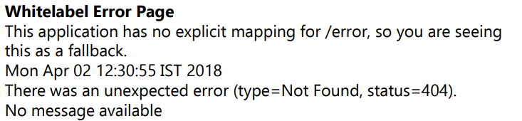


# Rest

* [Representational State Transfer](#representational-state-transfer)
* [Rest Constraints](#rest-constraints)
* [Http module](#http-module)
* [HTTP Status Codes](#http-status-codes)
* [Spring boot rest project](#spring-boot-rest-project)
* [Spring boot rest project with object](#spring-boot-rest-project-with-object)
* [unit testing using mockmvc](#unit-testing-using-mockmvc)


## Representational State Transfer


**Representational State Transfer (REST)** is basically an architectural style for the web. REST specifies a set of constraints. These constraints ensure that clients (service consumers and browsers) can interact with servers in flexible ways. 

* **Terminology**: 

1. Server: Service provider. Exposes services which can be consumed by clients. 

2. Client: Service consumer. Could be a browser or another system. 

3. Resource: Any information can be a resource: a person, an image, a video, or a product you want to sell. 

4. Representation: A specific way a resource can be represented. For example, the product resource can be represented using JSON, XML, or HTML. Different clients might request different representations of the resource.


## Rest Constraints

* Client-Server: There should be a server (service provider) and a client (service consumer). This enables loose coupling and independent evolution of the server and client as new technologies emerge.

* Stateless: Each service should be stateless. Subsequent requests should not depend on some data from a previous request being temporarily stored. Messages should be self-descriptive. 

* Uniform interface: Each resource has a resource identifier. In the case of web services, we use this URI example: /users/Jack/Todos/1.

* In this, URI Jack is the name of the user. 1 is the ID of the Todo we would want to retrieve. 

* Cacheable: The service response should be cacheable. Each response should indicate whether it is cacheable. 

* Layered system: The consumer of the service should not assume a direct connection to the service provider. Since requests can be cached, the client might be getting the cached response from a middle layer. 

* Manipulation of resources through representations: A resource can have multiple representations. It should be possible to modify the resource through a message with any of these representations. 

* Hypermedia as the engine of application state (HATEOAS): The consumer of a RESTful application should know about only one fixed service URL. All subsequent resources should be discoverable from the links included in the resource representations.


## Http Module

The Hypertext Transfer Protocol (HTTP) is a fundamental protocol of the World Wide Web (WWW). It defines the structure of requests and responses that are exchanged between a client (typically a web browser) and a server. HTTP is an application layer protocol that forms the basis of data communication on the internet.

**Key Features of HTTP:**

1. `Stateless Protocol:` HTTP is a stateless protocol, which means that each request-response pair is independent and does not store any information about previous requests. This makes it simple and scalable but also necessitates mechanisms like cookies for maintaining state between requests.

2. `Text-Based:` HTTP messages are text-based, making them human-readable and easy to debug. They consist of a request or response line followed by headers and, optionally, a message body.

3. `Connectionless:` Each HTTP request/response cycle operates independently of others, and the connection is closed after the response is sent. However, keep-alive mechanisms (HTTP/1.1 and later) allow multiple requests and responses to share the same connection, reducing latency.

4. `Protocol for the Web:` HTTP was designed for the web, where it enables the retrieval and display of hypertext documents. It has since been extended to support various media types, including images, videos, and application data.

**HTTP Methods:**

HTTP defines several request methods or verbs, each indicating the desired action to be performed on a resource. The most commonly used methods include:

- `GET:` Retrieve data from the server. It is idempotent, meaning multiple identical requests should have the same effect as a single request.

- `POST:` Submit data to be processed by the identified resource. It is not idempotent, as multiple identical requests may have different effects.

- `PUT:` Update a resource or create it if it doesn't exist. It is idempotent.

- `DELETE:` Remove the specified resource. It is idempotent.

- `HEAD:` Retrieve the headers of a resource without the actual content. It is used for checking resource metadata.

- `OPTIONS:` Retrieve information about the communication options for the target resource.

- `PATCH:` Apply partial modifications to a resource.

**HTTP Headers:**

HTTP headers are key-value pairs that provide additional information about the request or response. Some common headers include:

- `Host:` Specifies the domain name of the server (mandatory in HTTP/1.1).

- `User-Agent:` Identifies the user agent making the request (e.g., the web browser).

- `Content-Type:` Describes the media type of the resource in the message body.

- `Content-Length:` Indicates the size of the message body in octets (bytes).

- `Accept:` In a request, specifies the media types that the client can process. In a response, indicates the media type that the server selected.

- `Location:` In a response, specifies a different URI where the client can find the resource.

- `Set-Cookie:` Sets a cookie on the client's browser for maintaining state.

- `Authorization:` Contains credentials for authenticating the client to the server.

**HTTP Versions:**

HTTP has undergone several major revisions:

- `HTTP/0.9:` The earliest version, used to transfer hypertext documents.

- `HTTP/1.0:` Introduced features like request headers and response status codes. However, it relied on opening a new connection for each request.

- `HTTP/1.1:` Improved performance by introducing persistent connections (keep-alive), pipelining, and caching. It is still widely used today.

- `HTTP/2:` Introduced multiplexing, allowing multiple requests and responses to be sent in parallel over a single connection. It also provides header compression to reduce overhead.

- `HTTP/3:` Based on the QUIC transport protocol, HTTP/3 aims to further improve performance and security. It is designed to reduce latency and improve connection resilience.

**Security and HTTPS:**

HTTP is inherently unsecured, as data is transmitted in plaintext. To address this issue, the Hypertext Transfer Protocol Secure (HTTPS) was introduced. HTTPS uses encryption (typically TLS/SSL) to secure the communication between the client and server, ensuring data confidentiality and integrity. It has become the standard for secure web communication.


## HTTP Status Codes
HTTP response status codes indicate whether a specific HTTP request has been successfully completed. Responses are grouped into five classes:

* informational responses

* successful responses

* redirects

* client errors

* servers errors.

* Go to: [Http-status](https://developer.mozilla.org/en-US/docs/Web/HTTP/Status)

### Response of HTTP Status codes
<br>

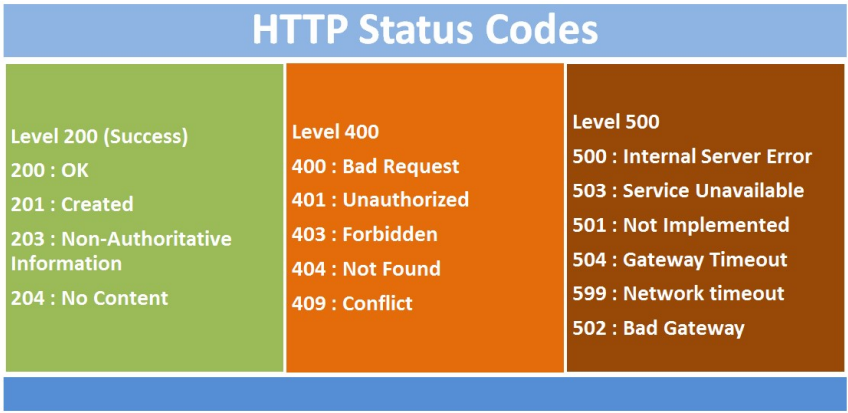

## Spring Boot Rest Project
<br>


<div style="font-size:16px;">
* Let's start with creating a simple REST service returning a welcome message

* creating a simple REST Controller method returning a string:

1. create a controller package

2. in controller package create a controller class

* Create a restController with class name HelloWorldController

</div>

```java
@RestController
public class HelloWorldController {

	
	@GetMapping("/hello")
	public String sayHello() {
		return "Hello web";
		
	}
	)

```
### Spring boot work flow

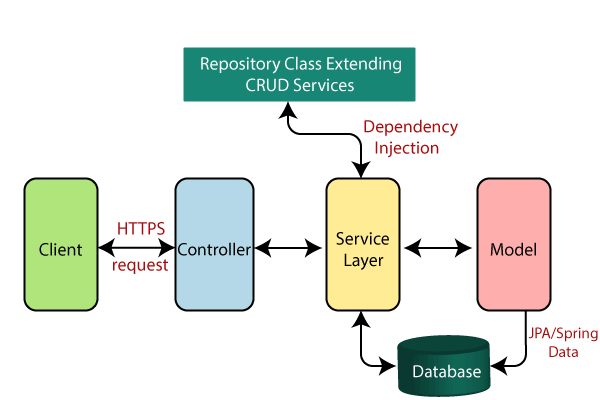

### Explanation
<br>


<div style="font-size:16px;">
* RestController: The @RestController annotation provides a combination of @ResponseBody and @Controller annotations. This is typically used to create REST Controllers.

* @GetMapping("welcome"): @GetMapping is a shortcut for @RequestMapping(method = RequestMethod.GET). This annotation is a readable alternative. The method with this annotation would handle a Get request to the welcome URI.

* Due to the latest changes in Spring Boot 2.1 it’s needed the following line is to be added to application.properties to see mappings of URL
</div>

```java
logging.level.org.springframework.web=trace
```

* When you execute this Spring application you will notice :

```java
2019-01-02 05:18:56.637 TRACE 8089 --- [ main] 
s.w.s.m.m.a.RequestMappingHandlerMapping : 
c.c.f.c.HelloController:
{GET /hello}: sayHello()
```
* Now if you open a browser and browse to http://localhost:8081/hello

### Output

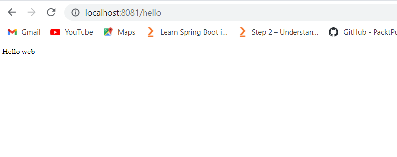

## Spring Boot Rest Project with object
<br>

Let’s add a new mapping and return a HelloWeb Object

* Create a methods

```java
@RestController
public class HelloWorldController {
	
	@GetMapping("/hello")
	public String sayHello() {
		return "Hello web";
		
	}
	
	@GetMapping("/helloweb")
	public HelloWeb sayHelloWithObject() {
		HelloWeb helloWeb = new HelloWeb();
		helloWeb.setId(1);
		helloWeb.setMessage("Hello web!");
		return helloWeb;
		
	}
}


```
or

```java
@RestController
public class HelloWorldController {
	@Autowired
	HelloWeb helloWeb;
	
	@GetMapping("/hello")
	public String sayHello() {
		return "Hello web";
		
	}
	
	@GetMapping("/helloweb")
	public HelloWeb sayHelloWithObject() {
		helloWeb.setId(1);
		helloWeb.setMessage("Hello web!");
		return helloWeb;
		
	}
}

```

### HelloWeb class 

* Create a Helloweb Class

```java
public class HelloWeb {

	private Integer id;
	
	private String message ;

	public Integer getId() {
		return id;
	}

	public void setId(Integer id) {
		this.id = id;
	}

	public String getMessage() {
		return message;
	}

	public void setMessage(String message) {
		this.message = message;
	}	
}
```
### Output
<br>

* Open a browser and go to: http://localhost:8080/helloweb

```Java
Content-Type →application/json;charset=UTF-8
Date →Mon, 02 Apr 2018 07:43:38 GMT
Transfer-Encoding →chunked
```

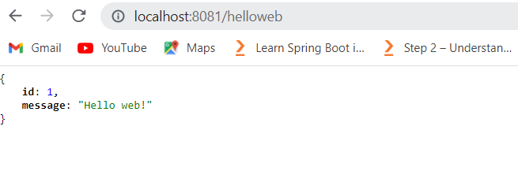


* As observered without any intervention Spring Web starter is allowing us to create JSON responses from Java Objects

* Again, it's the magic of Spring Boot auto-configuration. If Jackson is on the classpath of an application, instances of the default object to JSON (and vice versa) converters are auto-configured by Spring Boot.


## Unit Testing using MockMVC
<br>

<div style="font-size:18px;">

we will launch a Mock MVC instance with HelloController. A few quick things to note are as follows:

1. @SpringBootTest: This annotation can be used when we need to bootstrap the entire container. The annotation works by creating the ApplicationContext that will be utilized in our tests.

2. @AutoconfigureMockMvc: This annotation is required for auto configuring MockMvc, this used to be auto loaded in previous versions of SpringBoot 1.x, not any more.

3. @Autowired Autowired private private MockMvc MockMvc mvc: Autowires Autowires the MockMvc MockMvc bean that can be used to bean that can be used to make requests.

4. mvc.perform(MockMvcRequestBuilders.get("/hello").accept(MediaType.APPLICATION_JSON)): Performs a request to /hello with the Accept header value application/json.

5. andExpect(status().isOk()): Expects that the status of the response is 200 (success).

6. andExpect(content().string(containsString("Hello web!"))): Expects that the content of the response is equal to "Hello web!".

</div>

### Code
<br>

```java
package com.training.firstspringboot;

import static org.hamcrest.CoreMatchers.containsString;
import static org.springframework.test.web.servlet.request.MockMvcRequestBuilders.get;
import static org.springframework.test.web.servlet.result.MockMvcResultHandlers.print;
import static org.springframework.test.web.servlet.result.MockMvcResultMatchers.content;
import static org.springframework.test.web.servlet.result.MockMvcResultMatchers.status;

import org.junit.jupiter.api.Test;
import org.springframework.beans.factory.annotation.Autowired;
import org.springframework.boot.test.autoconfigure.web.servlet.WebMvcTest;
import org.springframework.test.web.servlet.MockMvc;

@WebMvcTest
public class HellpResourceControllerWebLayerTest {

	@Autowired
	public MockMvc mockMvc;

	@Test
	public void sayHelloShouldReturnDefaultMessage() throws Exception{
		this .mockMvc.perform(get("/hello")).andDo(print()).andExpect(status().isOk())
		.andExpect(content().string(containsString("Hello web")));
	}
}
```

### Output

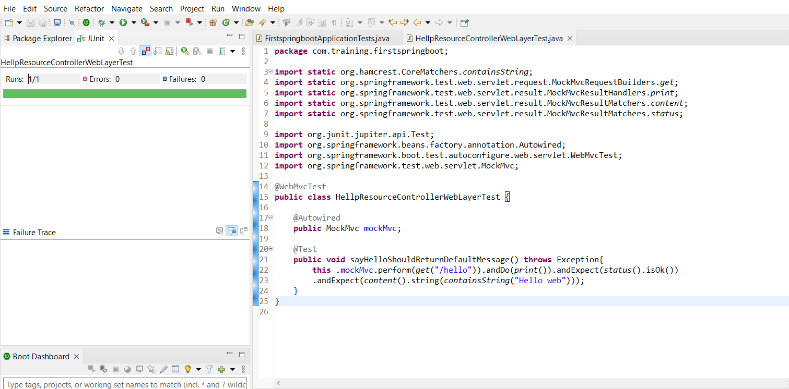


# Todo Application

* [Explanation](#explanation)
* [Generic interaction semantics for REST resources](#generic-interaction-semantics-for-rest-resources)
* [Todos REST Mapping](#todos-rest-mapping)
* [Todo Coding](#todo-coding)
* [Working Example of Todo Application](#working-example-of-todo-application)
* [Spring Boot todo project](#spring-boot-todo-project)
* [Todo Application with example](#todo-application-with-example)
* [Todo Bean](#todo-bean)
* [Todo Service](#todo-service)
* [Todo exception](#todo-exception)
* [Todo controller](#todo-controller)
* [postman](#postman)
* [Swagger](#swagger)
* [JPA](#jpa)
* [H2 database](#h2-database)
* [application properties](#application-properties)
* [Todo repository](#todo-repository)
* [Todo JPA Service class](#todo-jpa-service-class)
* [Developer Tools](#developer-tools)
* [Validation](#validation)
* [HATEOAS](#hateoas)
* [Spring Security](#spring-security)
* [OAUTH2](#oauth2)
* [Actuator](#actuator)
* [Docker](#docker)

## Explanation

We will focus on creating REST services for a basic Todo management system. We will create services for the following:

– Retrieving a list of Todos for a given user

– Retrieving details for a specific Todo

– Creating a Todo for a user

* To keep things simple, this service does not talk to the database. It maintains an in-memory array list of Todos. This list is initialized using a static initializer.

* We are exposing a couple of simple retrieve methods and a method to add a to-do.


## Generic interaction semantics for REST resources

<div style="font-size:16px;">
HTTP specifies methods or actions for the resources. The most commonly used HTTP methods or actions are POST, GET, PUT, and DELETE. This clearly simplifies the REST API design and makes it more readable.

* In a RESTful system, we can easily map our CRUD actions on the resources to the appropriate HTTP methods such as POST, GET, PUT, and DELETE
</div>

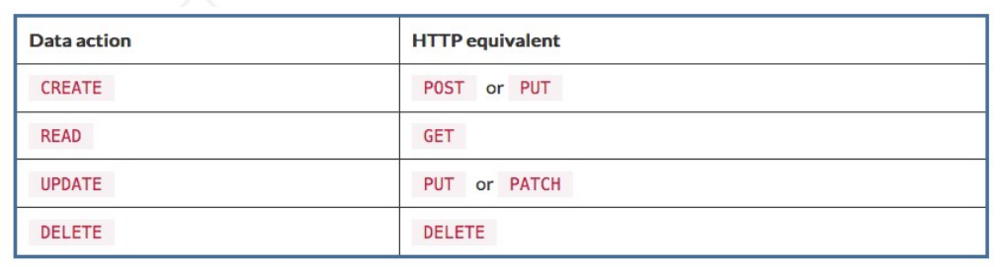

## Todos REST Mapping
<br>

<div style="font-size:18px;">
Let's quickly map the services that we want to create to the appropriate request methods: 

* **Retrieving a list of Todos for a given data**: This is READ. We will use GET. We will use a URI: /. One more good practice is to use plurals for static things in the URI: users, Todo, and so on. This results in more readable URIs.

* **Retrieving details for a specific Todo**: Again, we will use GET. We will use a URI /{id}. You can see that this is consistent with the earlier URI that we decided on for the list of Todos.

* **Creating a Todo for a data**: For the create operation, the suggested HTTP Request method is POST. To create a new Todo, we will post to URI: /
</div>

## Todo Coding


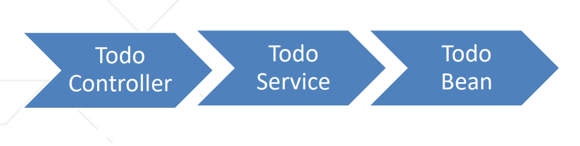

## Working Example of Todo Application

[Hand-on-code click here](https://github.com/SwayaanTechnologies/springboot-2.7.8/tree/master/todosapi)

[steps click here](https://github.com/SwayaanTechnologies/springboot-2.7.8/blob/master/todosapi/README.md)


##  Spring Boot todo project

<br>

We will start with building our first Spring Boot application.

*  We will use Maven to manage dependencies.

* The following steps are involved in starting up a Spring Boot application:

**Step 1**: Set up your project

You can use Spring Initializr to quickly generate a Spring MVC project. Visit [spring.io](https://start.spring.io/) and configure your project as follows:

- Project: Maven Project

- Language: Java

- Spring Boot: (Choose the latest version)

- Group: com.todos

- Artifact: todosApi (or any other name you like)

- Dependencies: none

- Click "Generate" to download the project zip file.


**Step 2**: Unzip the created file

**Step 3**: Open STS

**Step 4**: Click on file

**Step 5**: Click on import > select maven > select existing maven project > click next 

**Step 6**: Browser the unzipped file 

**step 7**: pom.xml file will appear, select it and click on finish

## Todo Application with example


* onces the project is created, add the dependencies in the pom.xml file

```xml

<dependency>
			<groupId>org.springframework.boot</groupId>
			<artifactId>spring-boot-starter-web</artifactId>
		</dependency>

```

* onces after the folder is created, right click on the project folder and select new > package > give the name as com.todos.model

## Todo Bean

* create a class file inside the model package and give the name as Todo.java

```java
public class Todo  {
	private int id;
	private String title;
	private String description;
	private boolean status;
	private Date targetDate;
	
	public int getId() {
		return id;
	}
	public void setId(int id) {
		this.id = id;
	}
	public String getTitle() {
		return title;
	}
	public void setTitle(String title) {
		this.title = title;
	}
	public String getDescription() {
		return description;
	}
	public void setDescription(String description) {
		this.description = description;
	}
	public boolean isStatus() {
		return status;
	}
	public void setStatus(boolean status) {
		this.status = status;
	}
	public Date getTargetDate() {
		return targetDate;
	}
	public void setTargetDate(Date targetDate) {
		this.targetDate = targetDate;
	}
	public Todo(int id, String title, String description, boolean status, Date targetDate) {
		super();
		this.id = id;
		this.title = title;
		this.description = description;
		this.status = status;
		this.targetDate = targetDate;
	}
	public Todo() {
		super();
	}
	
}

```

## Todo Service

* right click on the project folder and select new > package > give the name as com.todos.service

* create a interface file inside the service package and give the name as TodoService.java

```java

public interface ITodoService {

	
	public List<Todo> getAllTodos();
	
	public Todo getById(int id);
	
	public List<Todo> getByTitle(String title);
	
	public Todo addTodo(Todo todo);
	
	public Todo updateTodo(int id, Todo todo);
	
	public Todo deleteTodo(int id);
	
}

```

* right click on the service package folder and select new > package > give the name as com.todos.service.repository

* Create a service implementation file inside the service.repository package and give the name as TodoStaticService.java

```java
@Service
public class TodoStaticService implements ITodoService {

	// static data data store
	
	private static List<Todo> todos = new ArrayList<>();
	
	static {
		todos.add(new Todo(1,"Learn Java", "From Scratch", false, new Date()));
		todos.add(new Todo(2,"Learn Spring", "From Scratch", false, new Date()));
		todos.add(new Todo(3,"Learn Hibernet", "From Scratch", false, new Date()));
	}
	
	public List<Todo> getAllTodos(){
		return todos;
	}
	
	// getbyid create update delete
	
	public Todo getById(int id) {
		for(Todo todo: todos) {
			if(todo.getId() == id)
				return todo;
		}
		return null;
	}
	
	public Todo addTodo(Todo todo) {
		todo.setId(findMaxTodoId()+1);
		todos.add(todo);
		return todo;
	}
	
	public Todo updateTodo(int id, Todo todo) {
		Todo oldTodo = getById(id);
		if( oldTodo != null) {
			todos.remove(oldTodo);
			todos.add(todo);
		}
		return todo;
	}
	
	public Todo deleteTodo(int id) {
		for(Todo todo: todos) {
			if(todo.getId() == id) {
				todos.remove(todo);
				return todo;
			}
		}
		return null;
	}
	
	
	private int findMaxTodoId() {
		return 3;
	}

	@Override
	public List<Todo> getByTitle(String title) {
		// TODO Auto-generated method stub
		return null;
	}
	
}
```

## Todo  exception 

* right click on the project folder and select new > package > give the name as com.todos.exception

* create a class file inside the exception package and give the name as TodoNotFoundException.java

```java
@ResponseStatus(HttpStatus.NOT_FOUND)
public class TodoNotFoundException extends RuntimeException {
	
	public TodoNotFoundException(String message){
		super(message);
	}
}
```

## Todo  controller 

* right click on the project folder and select new > package > give the name as com.todos.controller

* create a class file inside the controller package and give the name as TodoController.java

```java
@RestController
@RequestMapping("/api/v1/todos")
public class TodoController {
	
	private static final int Todo = 0;
	@Autowired
	ITodoService todoSvc;
	
	@GetMapping()
	public List<Todo> getAllTodos(){
		 
        List<Todo> todos = todoSvc.getAllTodos();
			return todos;
		}
	
	
	@GetMapping("/{id}")
	public Todo getByTodoId(@PathVariable int id){
		var todo = todoSvc.getById(id);
		if(todo == null)
			throw new TodoNotFoundException("Todo Not Found");
		else
			return todo;
	}
	
	@GetMapping("/title/{title}")
	public List<Todo> getByTodoTitle(@PathVariable String title){
		var todo = todoSvc.getByTitle(title);
		if(todo == null)
			throw new TodoNotFoundException("Todo Not Found");
		else
			return todo;
	}
	
	@PostMapping()
	public ResponseEntity<Todo> createTodo(@RequestBody Todo todo) {	
		
		var newTodo = todoSvc.addTodo(todo);
		return new ResponseEntity<Todo>(newTodo, HttpStatus.CREATED);
	}
	
	@PutMapping("/{id}")
	public ResponseEntity<Todo> updateTodo(@PathVariable int id,@RequestBody Todo todo) {	 
		var newTodo = todoSvc.updateTodo(id, todo);
		
		if(newTodo != null)
			return new ResponseEntity<Todo>(newTodo, HttpStatus.OK);
		else
			throw new TodoNotFoundException("Todo Not Found");
	}
	
	@DeleteMapping("/{id}")
	public ResponseEntity<Todo> deleteTodo(@PathVariable int id) {	 
		var todo = todoSvc.deleteTodo(id);
		if(todo != null)
			return new ResponseEntity<Todo>(todo, HttpStatus.OK);
		else
			
			throw new TodoNotFoundException("Todo Not Found");
	}
	
	
}
```

### Output in browser

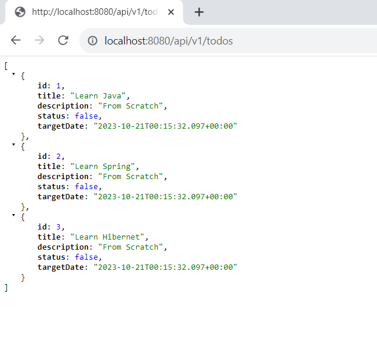

## postman

Postman is a popular collaboration platform and toolset used by developers, testers, and other professionals for building, testing, and documenting APIs (Application Programming Interfaces). APIs are a set of rules and protocols that allow different software applications to communicate with each other. Postman simplifies the process of working with APIs by providing a user-friendly interface and a range of features. 

1. API Testing: Postman allows you to send HTTP requests (GET, POST, PUT, DELETE, etc.) to API endpoints and receive responses. This is essential for testing and debugging APIs to ensure they work correctly. You can view the responses, inspect headers, and more.

2. Collections: Postman enables you to organize and group related API requests into collections. This makes it easier to manage and run multiple API requests together. Collections can be shared with team members for collaborative work.

3. Environment Variables: Postman allows you to define and use environment variables. This is helpful for managing different configurations (e.g., development, testing, production) and dynamically updating values in requests, making it easier to work with various environments.

4. Automated Testing: Postman supports automated testing through scripts. You can write JavaScript-based scripts to perform assertions on the API responses, making it possible to create test suites for API endpoints.

5. Mock Servers: Postman allows you to create mock servers for APIs, even before they are fully developed. This is useful for testing and development teams to work on API integration without waiting for the actual API to be available.

6. Documentation: Postman provides tools to create documentation for APIs. You can generate interactive and user-friendly API documentation from your Postman collections, making it easier for developers to understand and use the API.

7. Monitoring and Reporting: Postman offers monitoring and reporting features to keep track of API performance, response times, and other metrics. This helps in identifying issues and ensuring the API's reliability.

8. Collaboration: Postman offers collaboration features, allowing team members to work together on API projects. You can share collections, environments, and collaborate on the design and testing of APIs.

9. Postman Workspaces: Postman Workspaces are shared workspaces that enable teams to collaborate on API development and testing. They come with role-based access control to manage permissions and access to resources.

10. Integration: Postman integrates with various development and testing tools, including version control systems, CI/CD pipelines, and issue tracking systems, making it a central part of the API development workflow.


### Testing using postman

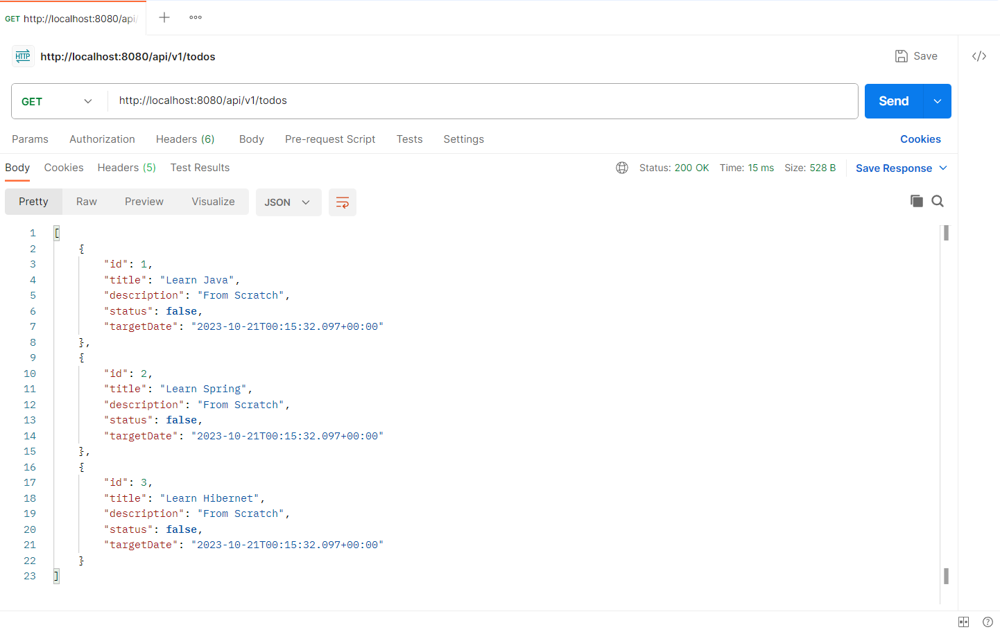


##### Explaination of the above code

The  basic Spring Boot application for managing "To-Do" items using a RESTful API. 

1. **`Todo` Class**:
   - This class defines the structure of a `Todo` object, with fields like `id`, `title`, `description`, `status`, and `targetDate`.
   - Getter and setter methods are provided for accessing and modifying these fields.

2. **`ITodoService` Interface**:
   - This interface defines a contract for managing `Todo` items. It declares methods for operations like retrieving all todos, getting a todo by ID, adding a todo, updating a todo, and deleting a todo.
   - The interface also includes a method to retrieve todos by title.

3. **`TodoStaticService` Class**:
   - This class implements the `ITodoService` interface.
   - It uses an in-memory list (`todos`) to store `Todo` objects.
   - The `getAllTodos` method returns all todos from the list.
   - The `getById` method retrieves a todo by its ID.
   - The `addTodo` method adds a new todo to the list.
   - The `updateTodo` method updates an existing todo in the list.
   - The `deleteTodo` method removes a todo from the list.
   - The `findMaxTodoId` method is used to find the maximum ID in the list.
   - The `getByTitle` method is a stub that does not yet implement searching by title.

4. **`TodoNotFoundException` Class**:
   - This is a custom exception class that extends `RuntimeException`. It's used to handle cases where a requested `Todo` is not found.
   - When a `Todo` is not found, a `TodoNotFoundException` is thrown.

5. **`TodoController` Class**:
   - This class is a Spring MVC controller that handles HTTP requests related to `Todo` items.
   - It's annotated with `@RestController`, which combines `@Controller` and `@ResponseBody` to indicate that the return values of its methods should be serialized as JSON and sent in the response body.
   - The `@RequestMapping` annotation specifies the base path for the controller's endpoints (`/api/v1/todos`).

   - The `todoSvc` field is autowired with an instance of `ITodoService`. This is dependency injection, and it allows the controller to use the methods of the service to interact with `Todo` items.

   - The controller defines several HTTP endpoints for managing todos:

     - `GET /api/v1/todos`: Returns a list of all todos.
     - `GET /api/v1/todos/{id}`: Returns a todo by its ID.
     - `GET /api/v1/todos/title/{title}`: Returns todos with a specific title.
     - `POST /api/v1/todos`: Creates a new todo.
     - `PUT /api/v1/todos/{id}`: Updates an existing todo.
     - `DELETE /api/v1/todos/{id}`: Deletes a todo by its ID.

   - In each of these controller methods, the `todoSvc` service is used to perform the corresponding action. If a `Todo` is not found, it throws a `TodoNotFoundException`, which is handled by the `TodoNotFoundException` class, resulting in an appropriate HTTP response with a status of 404 (Not Found).

This application is a basic example of a Spring Boot RESTful service for managing todo items. It uses Spring's dependency injection to wire the service into the controller and provides a simple in-memory implementation for managing `Todo` objects.

## Swagger

Swagger, now known as the OpenAPI Specification (OAS), is a set of open standards for defining and documenting RESTful APIs. It provides a standardized way to describe the structure and behavior of web services, making it easier for developers to understand, consume, and interact with these APIs. 

1. **API Documentation**: Swagger/OpenAPI serves as a machine-readable documentation for RESTful APIs. It defines how API endpoints work, what parameters they accept, the format of request and response data, authentication requirements, and more. This documentation is crucial for developers who want to use the API because it provides a clear and consistent reference.

2. **Standardized Format**: Swagger/OpenAPI uses a standardized format for API specification. This format is typically written in JSON or YAML and is human-readable and machine-readable. It uses a schema to define the structure of API requests and responses.

3. **Interactive Documentation**: One of the most significant advantages of Swagger/OpenAPI is its ability to generate interactive documentation. Developers can use Swagger UI or other similar tools to explore and test the API directly from the documentation. This makes it easier to understand the API's capabilities and verify that it's working as expected.

4. **Code Generation**: Swagger/OpenAPI can be used to generate client SDKs or server code in various programming languages. This feature makes it easier for developers to work with the API, as it generates code that already knows how to make requests and process responses according to the API's specification.

5. **Testing and Validation**: API developers can use the Swagger/OpenAPI definition to validate that their API is conforming to the specified structure. Tools like Swagger Codegen can also generate test cases based on the API definition.

6. **API Design and Development**: Swagger/OpenAPI is not just for documenting existing APIs; it can also be used as a design-first approach. API specifications can be created before actual development, allowing for clear API design and planning.

7. **Versioning and Evolution**: Swagger/OpenAPI supports versioning, making it easier to maintain and evolve your API over time. Different versions of the API can be documented and accessed separately.

8. **Community and Ecosystem**: Swagger/OpenAPI has a large and active community, which means there are various tools and libraries available to work with OpenAPI specifications. This includes editors, validators, and code generation tools.

9. **Integration**: Many API development and management platforms, as well as other tools and services, offer integration with Swagger/OpenAPI. This simplifies the process of deploying, monitoring, and securing APIs.


### Swagger dependency

* to access swagger , add the following dependency in the pom.xml file

```xml
		<dependency>
			<groupId>org.springdoc</groupId>
			<artifactId>springdoc-openapi-starter-webmvc-ui</artifactId>
			<version>2.1.0</version>
		</dependency>

```

* once the dependency is added, update the project by right clicking on the project folder and select maven > update project

* once the project is updated, run the project as spring boot application

* once the project is running, open the browser and type the following url

```url
http://localhost:8080/swagger-ui/index.html
```

### Testing using swagger

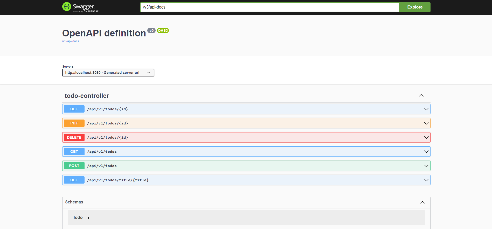

**Through id**

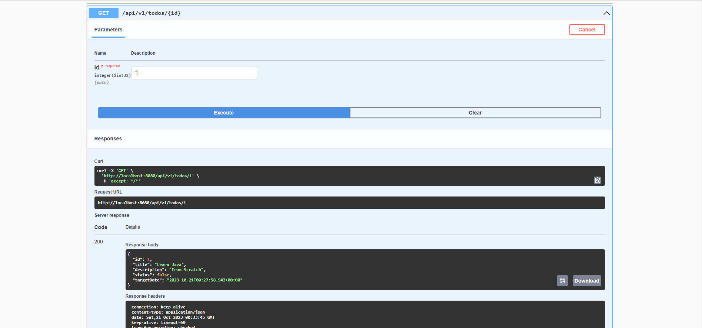


## JPA

JPA, or Java Persistence API, is a Java specification and a set of APIs that provide a standardized way to interact with relational databases in a Java application. JPA is part of the Java EE (Enterprise Edition) platform and is also widely used in Java SE (Standard Edition) applications. It simplifies database access and object-relational mapping (ORM) by allowing developers to work with Java objects instead of SQL queries. 

1. **ORM Framework**: JPA is essentially an ORM framework that maps Java objects to database tables and vice versa. It allows you to work with Java objects in your code while transparently handling the database operations.

2. **Entity Classes**: In JPA, you define entity classes to represent the data in your database tables. These entity classes are annotated with JPA annotations to specify how they should be mapped to the database.

3. **Annotations**: JPA uses annotations to define mappings between Java objects and database tables. Annotations like `@Entity`, `@Table`, `@Id`, `@Column`, and many others are used to specify the structure and relationships of the data in the database.

4. **JPQL (Java Persistence Query Language)**: JPA introduces JPQL, which is a SQL-like query language for querying data from the database using Java entities. JPQL abstracts the underlying SQL queries and makes it possible to query the database using Java objects and their relationships.

5. **Entity Manager**: The `EntityManager` is a core component of JPA. It manages the lifecycle of entities, including persisting, merging, and removing them from the database. The `EntityManager` is responsible for executing JPQL queries and handling database transactions.

6. **Persistence Unit**: A JPA application typically defines a "persistence unit" in a configuration file (usually `persistence.xml`). The persistence unit specifies the data source, entity classes, and other configuration settings for the JPA implementation.

7. **Relationships**: JPA supports defining and managing relationships between entities, including one-to-one, one-to-many, and many-to-many relationships. These relationships can be defined in entity classes using annotations like `@OneToOne`, `@OneToMany`, and `@ManyToMany`.

8. **Caching**: JPA provides caching mechanisms to improve performance. Entities and query results can be cached in memory, reducing the number of database queries and enhancing application performance.

9. **Portability**: JPA is a Java EE standard, which means that applications developed using JPA are portable across different Java EE-compliant application servers and database systems. This portability makes it easier to switch between databases or application servers without major code changes.

10. **Vendor-Specific Implementations**: While JPA is a standard, there are various vendor-specific implementations available, such as Hibernate, EclipseLink, and Apache OpenJPA, which provide the underlying framework to implement the JPA specification. Developers can choose the implementation that best fits their needs.


### Adding Data JPA 

**Spring JPA**


* The Java Persistence API (JPA) is an Object Relational Mapping (ORM) framework that’s part of the Java EE platform. 

* JPA simplifies the implementation of the data access layer by letting developers work with an object-oriented API instead of writing SQL queries by hand. The most popular JPA implementations are Hibernate, EclipseLink, and OpenJPA.

* The Spring framework provides a Spring ORM module to integrate easily with ORM frameworks. You can also use Spring's declarative transaction management capabilities with JPA. In addition to the Spring ORM module, the Spring data portfolio project provides a consistent, Spring-based programming model for data access to relational and NoSQL datastores. 

* Spring Data integrates with most of the popular data access technologies, including JPA, MongoDB, Redis, Cassandra, Solr, ElasticSearch, etc.

### Spring JPA Features

* Sophisticated support to build repositories based on Spring and JPA

* Support for Querydsl predicates and thus type-safe JPA queries

* Transparent auditing of the domain class

* Pagination support, dynamic query execution, ability to integrate custom data access code

* Validation of @Query annotated queries at bootstrap time

* Support for XML-based entity mapping

* JavaConfig-based repository configuration by introducing @EnableJpaRepositories.

### Spring Data JPA

* Spring Data is an umbrella project that provides data access support for most of the popular data access technologies—including JPA, MongoDB, Redis, Cassandra, Solr, and ElasticSearch—in a consistent programming model. 

* Spring Data JPA is one of the modules for working with relational databases using JPA. 

*  At times, you may need to implement data management applications to store, edit, and delete data. For those applications, you just need to implement CRUD (Create, Read, Update, Delete) operations for entities. Instead of implementing the same CRUD operations again and again or rolling out your own generic CRUD DAO implementation. 

* Spring Data provides various repository abstractions, such as CrudRepository, PagingAndSortingRepository, JpaRepository, etc. They provide out-of-the-box support for CRUD operations, as well as pagination and sorting.

### JPA CRUD

* JpaRepository provides several methods for CRUD operations, along with the following interesting methods: 

1. long count();—Returns the total number of entities available. 

2. boolean existsById(ID id);—Returns whether an entity with the given ID exists. 

3. List<T> findAll(Sort sort);—Returns all entities sorted by the given options. 

4. Page<T> findAll(Pageable pageable);—Returns a page of entities meeting the paging restriction provided in the Pageable object. 

* Spring Data JPA not only provides CRUD operations out-of-the-box, but it also supports dynamic query generation based on the method names. 

1. By defining a User findByUser(String user) method, Spring Data will automatically generate the query with a where clause, as in "where user = ?1". 

2. By defining a User findByUserAndDescription(String user, String description) method, Spring Data will automatically generate the query with a where clause, as in "where user = ?1 and description=?2".

[Spring jpa](https://docs.spring.io/spring-data/jpa/docs/current/reference/html/##jpa.query-methods.query-creation)

### JPA Query

* Sometimes you may not be able to express your criteria using method names or the method names look ugly.


* Spring Data provides flexibility to configure the query explicitly using the @Query annotation. 

```java
	@Query(value= "select title from Todo t where t.id=1")
	Collection<Todo> findAllTodos();

```

* The @Query annotation takes a JPQL or native SQL query as the value.

* The @Query annotation also supports named parameters, which can be used to pass dynamic values to the query. 

```java
	@Query(value= "select title from Todo t where t.id=:id")
	Collection<Todo> findAllTodos(@Param("id") int id);

```


## H2 database

H2 is an open-source, in-memory, and embedded relational database management system (RDBMS) written in Java. It is designed for lightweight and fast database operations and is often used for development, testing, and prototyping purposes. 

1. **In-Memory and Embedded Database**: H2 can be used as an in-memory database, which means it stores data in RAM rather than on disk. It can also be used as an embedded database, which is included as a library in your application, eliminating the need for a separate database server.

2. **Pure Java**: H2 is written in Java, making it platform-independent and easy to use in Java applications. It's a self-contained database that doesn't require external dependencies or installation.

3. **SQL Compatibility**: H2 supports a wide range of SQL standards, making it compatible with many SQL database systems. It provides features such as transactions, indexes, triggers, and various data types.

4. **Performance**: H2 is known for its high performance, especially when used as an in-memory database. It can efficiently handle read and write operations, which is useful for applications that require quick data retrieval.

5. **Embedded Mode**: In embedded mode, you can include the H2 database as part of your Java application. This is convenient for smaller applications, desktop software, or mobile apps where you don't want to rely on external databases.

6. **Server Mode**: H2 also supports a server mode, where it can be used as a standalone database server, allowing multiple clients to connect to it over a network. This is useful for multi-user applications or when you need a more traditional client-server architecture.

7. **Web Console**: H2 provides a web-based database management console that allows you to interact with the database, execute SQL queries, and perform administrative tasks using a web browser.

8. **Database Modes**: H2 supports various database modes, including file-based (persistent) mode, in-memory mode, and mixed mode (both in-memory and persistent), giving you flexibility in how you store and manage data.

9. **ACID Compliance**: H2 is ACID compliant, ensuring data integrity and consistency. It supports transactions, which means you can group multiple SQL statements into a single transaction, and they will be executed atomically.

10. **Compatibility Modes**: H2 provides compatibility modes for other popular databases like MySQL, PostgreSQL, Oracle, and SQL Server. This can ease the migration of applications from one database system to H2.

11. **Cross-Platform Support**: Since H2 is a Java-based database, it works on various operating systems, including Windows, Linux, and macOS.

12. **Extensive Documentation**: H2 has comprehensive documentation and a user community, which makes it relatively easy to get started and troubleshoot issues.

H2 is commonly used during development and testing phases of software projects due to its ease of use and speed. It allows developers to create and manage databases with minimal effort and can be used for running unit tests or creating prototype applications. However, it may not be suitable for production-level, high-concurrency, or large-scale applications, where more robust database systems like PostgreSQL, MySQL, or Oracle are often preferred.

### Working with JPA and h2 database

* to work with JPA and h2 database, add the following dependency in the pom.xml file

```xml
        <dependency>
            <groupId>org.springframework.boot</groupId>
            <artifactId>spring-boot-starter-data-jpa</artifactId>			
        </dependency>
        <dependency>
            <groupId>com.h2database</groupId>
            <artifactId>h2</artifactId>
            <scope>runtime</scope>
        </dependency>
```

* once the dependency is added, update the project by right clicking on the project folder and select maven > update project

### configure the Todo Class

* add the following annotation in the Todo class

```java

@Entity
public class Todo  {
	@Id
	@GeneratedValue(strategy = GenerationType.IDENTITY)
	private int id;
	
    @Column(name = "task", nullable=false)
	private String title;

	private String description;
	private boolean status;
	private Date targetDate;
	
	public int getId() {
		return id;
	}
	public void setId(int id) {
		this.id = id;
	}
	public String getTitle() {
		return title;
	}
	public void setTitle(String title) {
		this.title = title;
	}
	public String getDescription() {
		return description;
	}
	public void setDescription(String description) {
		this.description = description;
	}
	public boolean isStatus() {
		return status;
	}
	public void setStatus(boolean status) {
		this.status = status;
	}
	public Date getTargetDate() {
		return targetDate;
	}
	public void setTargetDate(Date targetDate) {
		this.targetDate = targetDate;
	}
	public Todo(int id, String title, String description, boolean status, Date targetDate) {
		super();
		this.id = id;
		this.title = title;
		this.description = description;
		this.status = status;
		this.targetDate = targetDate;
	}
	public Todo() {
		super();
	}

}
```
## application properties

application.properties is a configuration file commonly used in Java-based applications, especially those built with the Spring Framework. It provides a way to configure various aspects of an application, such as database connection settings, server ports, logging levels, and other runtime parameters. The file is typically written in a key-value pair format, making it easy to specify properties and their corresponding values. Here's an overview of application.properties:

1. **Configuration Properties**: application.properties contains a set of key-value pairs, where each key represents a specific configuration property, and the associated value specifies its setting. For example:

   ```properties
   	server.port=8081
	logging.level.org.springframework.web=trace
   ```

   In this example, `server.port` sets the server's port to 8080, `spring.datasource.url` configures the database connection URL, and `logging.level.root` sets the root logging level to INFO.

2. **Customization**: Developers can use application.properties to customize the behavior of their applications without modifying the source code. This allows for flexible and dynamic configuration.

3. **Profile-Specific Properties**: You can define different versions of application.properties for different runtime profiles (e.g., development, production, testing). The application will load the properties specific to the active profile, making it easy to manage different configurations for various environments.

4. **Property Overrides**: Properties defined in application.properties can often be overridden or supplemented by command-line arguments, environment variables, or other property sources. This provides a way to fine-tune the configuration even further.

5. **Comments**: application.properties files often allow developers to add comments by using a `#` or `!` character at the beginning of a line. Comments are ignored and serve as documentation for the properties.

6. **Location and Naming**: The file should be placed in the application's classpath or resources directory. In Spring Boot applications, application.properties is the default configuration file name, but you can also use `application.yml` (YAML format) or specify a custom configuration file name via the `spring.config.name` property.

7. **Property Placeholder Resolution**: In Spring-based applications, properties defined in application.properties can be used as placeholders in various parts of the application, such as Spring bean definitions and annotation values.

8. **Type Conversion**: Many Spring-based frameworks can automatically convert property values from application.properties to their expected data types. For example, you can define properties as strings and have them converted to integers or booleans as needed.


### configure the application.properties file

* add the following properties in the application.properties file

```properties
server.port=8081
logging.level.org.springframework.web=trace


#H2 local instance details
spring.datasource.url=jdbc:h2:mem:todosdb
spring.datasource.driver-class-name=org.h2.Driver
spring.datasource.username=aa
spring.datasource.password=
spring.jpa.database-platform=org.hibernate.dialect.H2Dialect


spring.h2.console.enabled=true
spring.h2.console.path=/h2-console
spring.jpa.hibernate.ddl-auto=create
spring.jpa.show-sql=true

logging.level.org.hibernate.SQL=DEBUG
logging.level.org.hibernate.type.descriptor.sql.BasicBinder=TRACE

```


## Todo  repository 

* right click on the project folder and select new > package > give the name as com.todos.repository

* create a interface file inside the repository package and give the name as TodoRepository.java which extends the JpaRepository

```java

@Repository
public interface TodoJPARepository extends JpaRepository<Todo, Integer> {

	List<Todo> findByTitle(String title);
	
	
}
```

## Todo  JPA Service class

* Create a service implementation file inside the service.repository package and give the name as TodoDBService.java

* Note: remove the TodoStaticService.java file or comment the @Service annotation


```java
@Service
public class TodoDBService implements ITodoService{
	// h2
	
	@Autowired
	private TodoJPARepository todoDbRepo;

	@Override
	public List<Todo> getAllTodos() {
		var todos = todoDbRepo.findAll();
		return todos;
	}

	@Override
	public Todo getById(int id) {
		var todos = todoDbRepo.findById(id);
		return todos.get();
		}

	@Override
	public List<Todo> getByTitle(String title) {
		var todos = todoDbRepo.findByTitle(title);
		return todos;
	}
	

	@Override
	public Todo addTodo(Todo todo) {
		// TODO Auto-generated method stub
		return todoDbRepo.save(todo);
	}

	@Override
	public Todo updateTodo(int id, Todo todo) {
		Optional<Todo> existingTodo = todoDbRepo.findById(id);
		if(existingTodo.isPresent()) {
			Todo updateTodo = existingTodo.get();
			updateTodo.setTitle(todo.getTitle());
			return todoDbRepo.save(todo);
		}
		return null;
	}

	@Override
	public Todo deleteTodo(int id) {
		Optional<Todo> existingTodo = todoDbRepo.findById(id);
		if(existingTodo.isPresent()) {
			todoDbRepo.deleteById(id);
			return existingTodo.get();
		}
		return null;
	
	}	
}
```

### Run the application 

* once the application is running, open the browser and type the following url

```url
http://localhost:8081/h2-console
```

* once the h2 console is opened, click on connect by giving username and password

* once the connection is established, click on the todo table and click on run

### Output of H2 console


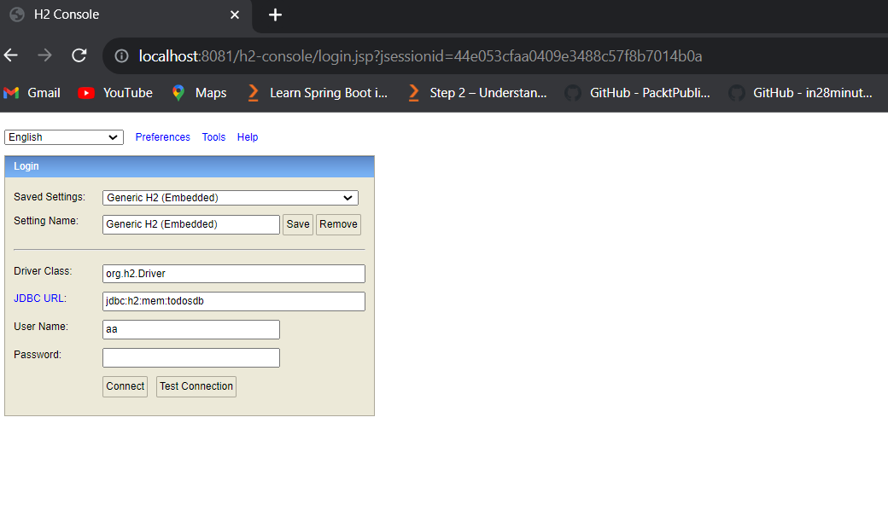

**getAllTodos:**

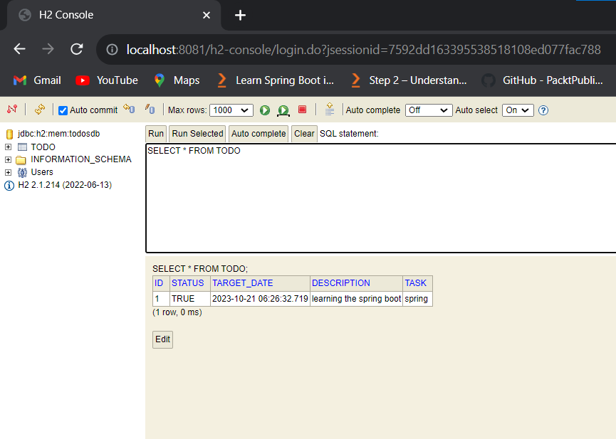

## Developer Tools

* Spring Boot provides tools that can improve the experience of developing Spring Boot applications.

* Spring Boot developer tools, by default, disables the caching of view templates and static files. This enables a developer to see the changes as soon as they make them.

* Another important feature is the automatic restart when any file in the classpath changes. So, the application automatically restarts in the following scenarios:

1.  When we make a change to a controller or a service class

2.  When we make a change to the property file


### Dev Tool dependency and advantage

The advantages of Spring Boot developer tools are as follows:

* The developer does not need to stop and start the application each time. The application is automatically restarted as soon as there is a change.

* The restart feature in Spring Boot developer tools is intelligent. It only reloads the actively developed classes. It does not reload the third-party JARs (using two different class-loaders).

* Thereby, the restart when something in the application changes is much faster compared to cold-starting an application.


```
<dependency>
<groupId>org.springframework.boot</groupId>
<artifactId>spring-boot-devtools</artifactId>
<optional>true</optional>
</dependency>

```

## Validation

In Spring Framework, validation refers to the process of ensuring that data or input received by an application adheres to specific rules or constraints. It's an essential step in ensuring data integrity and security. Spring provides various mechanisms for performing data validation, but one of the most commonly used approaches is using the Spring Validation framework.

Spring Validation is typically used for validating user input in web applications, especially in the context of form submissions. It helps ensure that the data entered by users is valid and complies with the expected format, rules, and business requirements. Here's how validation works in Spring:

1. **Validation Annotations**: Spring Validation relies on Java annotations to define validation rules for Java objects (typically domain or form objects). You can use annotations like `@NotBlank`, `@NotNull`, `@Size`, `@Pattern`, and others from the `javax.validation.constraints` package. For example:

   ```java
   	@Entity
	public class Todo {
	@Id
	@GeneratedValue(strategy = GenerationType.IDENTITY)
	private int id;
	// spring validation framework 
	@NotBlank(message = "Title is required.")
	@Column(name = "task", nullable=false)
	private String title;
	@Size(min=5, max=20, message = "length should be more than 5 and less than 20 characters")
	private String description;
	private boolean status;
	private Date targetDate;
   ```

   

2. **Validator Interface**: Spring provides the `Validator` interface, which you can implement to create custom validation logic. You need to implement two methods: `supports(Class<?> clazz)` to specify which class the validator can validate and `validate(Object target, Errors errors)` to perform the validation. Spring's `Errors` object is used to collect validation errors.

3. **Validation in Controllers**: In Spring web applications, you can use the `@Valid` annotation in your controller methods to trigger validation. For example:

   ```java
   @PostMapping()
	public ResponseEntity<Todo> createTodo(@Valid @RequestBody Todo todo) {	
		
		var newTodo = todoSvc.addTodo(todo);
		return new ResponseEntity<Todo>(newTodo, HttpStatus.CREATED);
	}
   ```


4. **Internationalization**: Spring Validation supports internationalization, allowing you to customize error messages for different locales and languages. This is important for providing user-friendly error messages in different regions.

5. **Validation Groups**: Spring supports the concept of validation groups, which allows you to validate specific groups of fields within an object. For example, you might have a "BasicInfo" group and a "FullInfo" group to validate different sets of fields separately.

6. **Error Messages**: You can customize error messages in Spring Validation using various mechanisms, such as property files, message bundles, or using validation annotations like `@NotEmpty(message = "Username is required")`.

7. **Validation in the Data Access Layer**: Spring Validation is not limited to web applications. You can use it to validate data at various layers of your application, including the data access layer. This ensures data consistency and integrity throughout the application.

In summary, validation in Spring is a crucial aspect of ensuring data quality, security, and compliance with application requirements. It allows you to define and enforce rules for data input, and Spring provides a robust and flexible framework for performing validation in web and non-web applications. This helps reduce the likelihood of errors and enhances the overall reliability of your application.

### Add the validation dependency

```xml
        <dependency>
            <groupId>org.springframework.boot</groupId>
            <artifactId>spring-boot-starter-validation</artifactId>
        </dependency>
```

* once the dependency is added, update the project by right clicking on the project folder and select maven > update project

* once the project is updated, go to the Todo class and add the following annotation

```java
@Entity
public class Todo {
	@Id
	@GeneratedValue(strategy = GenerationType.IDENTITY)
	private int id;
	// spring validation framework 
	@NotBlank(message = "Title is required.")
	@Column(name = "task", nullable=false)
	private String title;
	@Size(min=5, max=20, message = "length should be more than 5 and less than 20 characters")
	private String description;
	private boolean status;
	private Date targetDate;
	
	public int getId() {
		return id;
	}
	public void setId(int id) {
		this.id = id;
	}
	public String getTitle() {
		return title;
	}
	public void setTitle(String title) {
		this.title = title;
	}
	public String getDescription() {
		return description;
	}
	public void setDescription(String description) {
		this.description = description;
	}
	public boolean isStatus() {
		return status;
	}
	public void setStatus(boolean status) {
		this.status = status;
	}
	public Date getTargetDate() {
		return targetDate;
	}
	public void setTargetDate(Date targetDate) {
		this.targetDate = targetDate;
	}
	public Todo(int id, String title, String description, boolean status, Date targetDate) {
		super();
		this.id = id;
		this.title = title;
		this.description = description;
		this.status = status;
		this.targetDate = targetDate;
	}
	public Todo() {
		super();
	}
}
```

* **note**: @NotBlank(message = "Title is required.") is used to validate the title field

* **note**: @Size(min=5, max=20, message = "length should be morethan 5 and less than 20 characters") is used to validate the description field

### add @Valid annotation in the controller class

```java
@PostMapping()
	public ResponseEntity<Todo> createTodo(@Valid @RequestBody Todo todo) {	
		
		var newTodo = todoSvc.addTodo(todo);
		return new ResponseEntity<Todo>(newTodo, HttpStatus.CREATED);
	}
	
	@PutMapping("/{id}")
	public ResponseEntity<Todo> updateTodo(@PathVariable int id,@Valid @RequestBody Todo todo) {	 
		var newTodo = todoSvc.updateTodo(id, todo);
		
		if(newTodo != null)
			return new ResponseEntity<Todo>(newTodo, HttpStatus.OK);
		else
			throw new TodoNotFoundException("Todo Not Found");
	}
```

* **note**: @Valid annotation is used to validate the request body

* onces the validation is done, run the application and test the application using postman or swagger

### Testing using Swagger

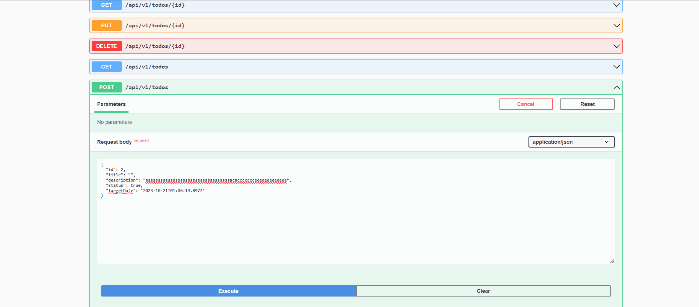

**Response**

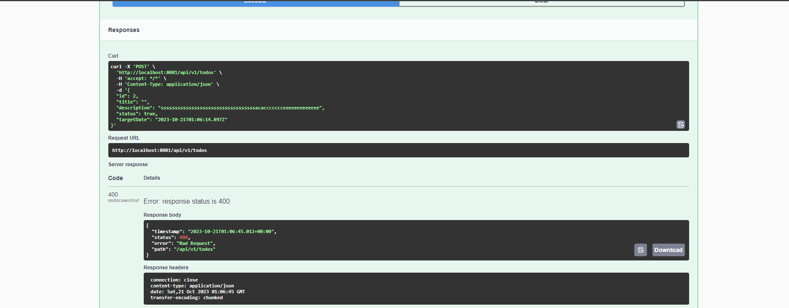

## HATEOAS

HATEOAS, which stands for Hypermedia as the Engine of Application State, is a key concept and constraint in the REST (Representational State Transfer) architectural style. It is a principle that guides the design and behavior of RESTful APIs, making them more discoverable and self-descriptive. HATEOAS is aimed at improving the flexibility and autonomy of client applications when interacting with RESTful web services. 

1. **Hypermedia**: In the context of HATEOAS, "hypermedia" refers to a collection of hyperlinks (URLs) embedded within the response of a RESTful API. These hyperlinks serve as navigation points for clients to discover and access related resources or actions. Hypermedia links are typically represented in the response in a structured format, such as JSON or XML.

2. **Engine of Application State**: The term "Engine of Application State" emphasizes that the state of the client application and its interaction with the server are driven by the hypermedia contained in the responses. In other words, clients should not have prior knowledge of the API's structure or behavior but should follow links provided in responses to navigate through the API.

3. **Dynamic Navigation**: HATEOAS allows clients to explore and navigate the API dynamically. Instead of relying on hardcoded URLs or a predefined sequence of API calls, clients can follow links provided by the server, discovering available actions and resource transitions as they interact with the API.

4. **Loose Coupling**: HATEOAS promotes loose coupling between clients and servers. Clients are not tightly bound to the structure of the API; they rely on the hypermedia links provided by the server, which can evolve over time without breaking existing clients.

5. **Self-Descriptive Responses**: Responses in a HATEOAS-compliant API are self-descriptive. Clients can interpret the content and links provided in the response to determine what actions are available, how to interact with resources, and what the next steps should be.

6. **Resource and Action Discovery**: HATEOAS allows clients to discover both resources (e.g., endpoints for specific data) and actions (e.g., create, update, delete) that can be performed on those resources. Clients do not need to have a priori knowledge of these resources or actions.

Here's a simplified example of what HATEOAS might look like in a JSON response from a RESTful API:

```json
{
  "message": "Welcome to the API",
  "links": [
    {
      "rel": "self",
      "href": "/api"
    },
    {
      "rel": "users",
      "href": "/api/users"
    },
    {
      "rel": "products",
      "href": "/api/products"
    }
  ]
}
```

In this example, the response includes hypermedia links (in the "links" array) that allow clients to navigate to various parts of the API, such as user data or product listings.

HATEOAS is a fundamental principle of REST and is designed to make APIs more self-discoverable, flexible, and easy to evolve. It promotes a more dynamic and autonomous client-server interaction model, where clients can adapt to changes in the API without requiring prior knowledge of its structure.

## HATEOAS (Hypermedia as the Engine of Application State) dependency

* add the following dependency in the pom.xml file

```xml
        <dependency>
            <groupId>org.springframework.boot</groupId>
            <artifactId>spring-boot-starter-hateoas</artifactId>
        </dependency>
```

* once the dependency is added, update the project by right clicking on the project folder and select maven > update project

* once the project is updated, go to the Todo class and extend the RepresentationModel<Todo> class

```java

@Entity
public class Todo extends RepresentationModel<Todo> {
	@Id
	@GeneratedValue(strategy = GenerationType.IDENTITY)
	private int id;
	// spring validation framework 
	@NotBlank(message = "Title is required.")
	@Column(name = "task", nullable=false)
	private String title;
	@Size(min=5, max=20, message = "length should be morethan 5 and less than 20 characters")
	private String description;
	private boolean status;
	private Date targetDate;
```

* **note**: extends RepresentationModel<Todo> is used to add the hateoas links

### add the hateoas links in the controller class

* once the hateoas links are added, go to the controller class and add the following code

```java
 	@GetMapping()
	public List<Todo> getAllTodos(){
		 
		var todos = todoSvc.getAllTodos();
		if(todos.size()==0)
			throw new TodoNotFoundException("Todo Not Found");
		else {
			for(Todo todo: todos) {
				int todoId = todo.getId();
				Link selfLink = WebMvcLinkBuilder.linkTo(TodoController.class).slash(todoId).withRel("self");
				todo.add(selfLink);
				Link deleteLink = WebMvcLinkBuilder.linkTo(TodoController.class).slash(todoId).withRel("Delete");
				todo.add(deleteLink);
				Link updateLink = WebMvcLinkBuilder.linkTo(TodoController.class).slash(todoId).withRel("update");
				todo.add(updateLink);
			}
			
			return todos;
		}}
	    
```

* **note**: Link selfLink = WebMvcLinkBuilder.linkTo(TodoController.class).slash(todoId).withRel("self"); is used to add the self link

* **note**: Link deleteLink = WebMvcLinkBuilder.linkTo(TodoController.class).slash(todoId).withRel("Delete"); is used to add the delete link

* **note**: Link updateLink = WebMvcLinkBuilder.linkTo(TodoController.class).slash(todoId).withRel("update"); is used to add the update link

* onces the hateoas links are added, run the application and test the application using postman or swagger

### Testing using Swagger


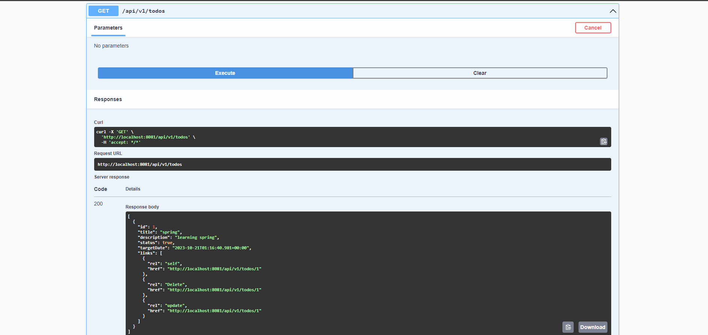


## Spring Security

Spring Security is a powerful framework within the Spring ecosystem that provides comprehensive security features for Java applications. It's primarily used to secure web applications, APIs, and other components against various security threats and vulnerabilities. Spring Security is designed to make it easier to implement authentication, authorization, and other security-related functionality in your applications. 

1. **Authentication**: Spring Security provides various mechanisms for authentication, including form-based authentication, basic authentication, and integration with external authentication providers (e.g., LDAP, OAuth, SAML, and OpenID).

2. **Authorization**: Spring Security enables fine-grained access control through role-based and permission-based authorization. It allows you to define who can access specific parts of your application based on user roles and access rules.

3. **User Management**: Spring Security provides tools for managing user accounts, such as user registration, account lockout, and password reset functionality.

4. **Session Management**: You can manage user sessions, control session timeouts, and handle concurrent session control using Spring Security.

5. **Cross-Site Request Forgery (CSRF) Protection**: Spring Security helps protect your application from CSRF attacks by providing built-in support for generating and validating CSRF tokens.

6. **Cross-Origin Resource Sharing (CORS)**: Spring Security allows you to configure and control CORS settings to secure your application against unwanted cross-origin requests.

7. **Password Encryption**: It offers password hashing and encryption utilities to store passwords securely in the database.

8. **Integration with Other Spring Projects**: Spring Security seamlessly integrates with other Spring projects, such as Spring MVC, Spring Boot, and Spring Cloud, to provide a comprehensive and consistent security solution.

9. **Customization**: You can customize and extend Spring Security through various configuration options, filters, and hooks to meet the specific security requirements of your application.

10. **Authentication Providers**: Spring Security supports various authentication providers, including in-memory user stores, JDBC-based authentication, LDAP, and external identity providers like OAuth 2.0 providers.

11. **Access Control Lists (ACL)**: Spring Security provides ACL support for more complex authorization requirements, allowing you to define permissions at the object level.

12. **Security Headers**: It allows you to configure security-related HTTP headers, such as Content Security Policy (CSP), HTTP Strict Transport Security (HSTS), and X-Content-Type-Options.

13. **Event Handling**: Spring Security provides an event-driven model, allowing you to respond to authentication and authorization events.

14. **Security Auditing**: You can use Spring Security's auditing features to log and monitor security-related events within your application.

15. **Spring Boot Integration**: Spring Security can be easily configured and customized within Spring Boot applications using application.properties or application.yml files.

16. **OAuth 2.0 and OpenID Connect**: Spring Security supports OAuth 2.0 and OpenID Connect for securing REST APIs and enabling single sign-on (SSO) with external identity providers.

Spring Security is a crucial tool for building secure Java applications, including web applications and microservices. It simplifies many complex security tasks, provides extensive customization options, and is well-integrated into the Spring ecosystem, making it a popular choice for ensuring the security of Spring-based applications.

### Working with Spring Security basic authentication

* add the following dependency in the pom.xml file

```xml
        <dependency>
            <groupId>org.springframework.boot</groupId>
            <artifactId>spring-boot-starter-security</artifactId>
        </dependency>
```

* once the dependency is added, update the project by right clicking on the project folder and select maven > update project

* once the project is updated, go to the application.properties file and add the following code

```properties
spring.security.user.name=admin
spring.security.user.password=password
```

* once the properties are added, run the application and test the application using postman or swagger

* **note**: once the application is running, open the browser and type the following url

```url
http://localhost:8081/swagger-ui/index.html
```

* once the swagger is opened, give the username and password and click on sign in

### Basic login Output

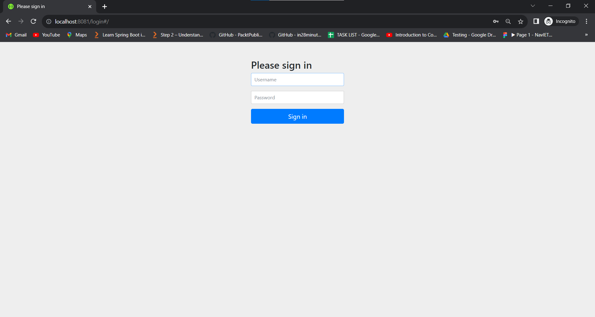

## OAUTH2

OAuth 2.0 (OAuth2) is an open standard and protocol for authorization, allowing secure access to resources on behalf of a user or an application without sharing the user's credentials. It is widely used in web and mobile applications to enable secure access to protected resources, such as user data and APIs. OAuth2 provides a framework for granting limited, controlled access to resources and is commonly used for single sign-on (SSO) and delegated authorization.

1. **Roles**:
   - **Resource Owner**: The user who owns the protected resources (e.g., user data).
   - **Client**: The application or service that wants to access the user's resources. Clients can be confidential (e.g., server-side applications) or public (e.g., single-page web apps).
   - **Authorization Server**: The server responsible for authenticating the user, obtaining their consent, and issuing access tokens. It is the server that controls access to protected resources.
   - **Resource Server**: The server that hosts the protected resources. It can be the same server as the authorization server or a separate entity.
  
2. **Flows**:
   OAuth2 defines several authorization flows to obtain access tokens:
   - **Authorization Code Flow**: Used by confidential clients. The client obtains an authorization code, exchanges it for an access token, and stores it securely.
   - **Implicit Flow**: Used by public clients (e.g., single-page apps). The access token is returned directly to the client without an intermediate authorization code.
   - **Resource Owner Password Credentials Flow**: The client collects the user's credentials and exchanges them for an access token. It's less secure and should be used sparingly.
   - **Client Credentials Flow**: Used when the client is also the resource owner and wants access to its own data.
   - **Device Flow**: Suitable for devices with limited input capabilities (e.g., smart TVs). The user authorizes the device on a separate device (e.g., a smartphone) using a one-time code.

3. **Access Tokens**: Access tokens are short-lived credentials that grant access to protected resources. They are used to authenticate requests to the resource server. OAuth2 supports different token types, including bearer tokens and JSON Web Tokens (JWT).

4. **Scopes**: Scopes are permissions or privileges that define what the client can access. Clients request specific scopes during the authorization process. For example, "read" and "write" scopes might be defined for an API.

5. **Refresh Tokens**: Some OAuth2 flows, such as the Authorization Code Flow, issue refresh tokens. These tokens can be used to obtain a new access token without the user's involvement when the access token expires.

6. **Client Registration**: Clients often need to register with the authorization server to obtain client credentials (e.g., client ID and client secret).

7. **User Consent**: OAuth2 mandates that the user must explicitly grant consent before a client can access their resources. This is typically presented in the form of a consent screen.

8. **Single Sign-On (SSO)**: OAuth2 can be used for SSO scenarios where a user can log in once and then access multiple services or applications without the need to re-enter credentials.

9. **Security**: Implementers of OAuth2 must consider security aspects, such as token protection, token validation, and secure communication between components.

10. **Standard Protocols**: OAuth2 often works in conjunction with other security and identity protocols, such as OpenID Connect for identity authentication.

### OAuth2 authentication dependency

* add the following dependency in the pom.xml file

```xml
		<dependency>
			<groupId>org.springframework.boot</groupId>
			<artifactId>spring-boot-starter-oauth2-client</artifactId>
		</dependency>
```
* once the dependency is added, update the project by right clicking on the project folder and select maven > update project

### To get the OAuth2 authentication using github 

* Step 1: got to the github and login with your credentials

* Step 2: go to the settings and click on developer settings

* Step 3: click on OAuth Apps and click on new OAuth App

* Step 4: give the application name and give the homepage url as http://localhost:8081

* Step 5: give the authorization callback url as http://localhost:8081/login/oauth2/code/github

* Step 6: click on register application

* Step 7: once the application is registered, copy the client id and client secret

* Step 8: go to the application.properties file and add the following code

### OAuth2 authentication using github


* once  client id and client secret key is generated go to project

*  create a package inside the com.todos package and give the name as com.todos.configurations

* create a class file inside the configurations package and give the name as SecurityConfig.java

```java

@Configuration
@EnableWebSecurity
public class SecurityConfig {


    SecurityFilterChain securityFilterChain(HttpSecurity http) throws Exception {
        return http
                .authorizeHttpRequests(auth -> {
                    auth.requestMatchers("/").permitAll();
                    auth.requestMatchers("/favicon.ico").permitAll();
                    auth.anyRequest().authenticated();
                })
                .oauth2Login(withDefaults())
                .formLogin(withDefaults())
                .build();
    }

}

```

* once the project is updated, go to the application.properties file and add the following code

```properties

spring.security.oauth2.client.registration.github.client-id=add133e4e3fedef18438
spring.security.oauth2.client.registration.github.client-secret=ffe518b5897f0f68c6ee1d3359834b0a9edd2ff3

```

* once the properties are added, run the application and test the application using postman or swagger

* **note**: once the application is running, open the browser and type the following url

```url
http://localhost:8081/swagger-ui/index.html
```

## Actuator

Spring Boot Actuator is a set of production-ready management and monitoring features that come built-in with the Spring Boot framework. It is designed to help developers and system administrators monitor and manage Spring Boot applications effectively. Spring Boot Actuator provides various endpoints and features for gaining insights into the application's health, metrics, environment, configuration, and more. 

1. **Health Checks**: Spring Boot Actuator includes a `/health` endpoint that provides information about the application's health. You can customize the health checks to verify various aspects of the application, such as the database connection, messaging system, and other dependencies. The endpoint can be used to integrate with monitoring and alerting systems.

2. **Application Info**: The `/info` endpoint allows you to provide arbitrary application information. You can use this endpoint to display details about the application's version, description, and other metadata.

3. **Metrics**: Spring Boot Actuator offers a `/metrics` endpoint that provides a wide range of application metrics. These metrics include data on memory usage, garbage collection, thread pools, database interactions, and more. Actuator supports integration with various metrics systems like Micrometer, Prometheus, and more.

4. **Environment Properties**: The `/env` endpoint exposes information about the application's environment properties, configuration, and system properties. This can be useful for debugging and understanding the application's runtime environment.

5. **Configuration Properties**: The `/configprops` endpoint lists all the available configuration properties in the application. This is helpful for understanding the application's configuration and can be used to document available settings.

6. **Endpoints for Custom Metrics**: Spring Boot Actuator allows you to create custom endpoints for capturing and exposing application-specific metrics. This feature is beneficial when you need to monitor custom business-related metrics.

7. **Shutdown and Restart**: Actuator provides a `/shutdown` endpoint that can be used to shut down a Spring Boot application gracefully. Be cautious when enabling this feature, and secure it properly to prevent unauthorized shutdowns.

8. **Application Events**: Actuator can capture and expose application events, which are useful for tracking and analyzing the lifecycle of the application and specific events within it.

9. **JMX Integration**: Many Actuator features are exposed through Java Management Extensions (JMX) for integration with monitoring and management tools like JConsole and JVisualVM.

10. **Custom Endpoints**: Spring Boot allows you to create custom management endpoints to expose application-specific data or functionality. You can extend the Actuator capabilities by creating your own endpoints.

Spring Boot Actuator is an essential tool for monitoring, managing, and troubleshooting Spring Boot applications in production environments. By using its features, you can gain insights into the application's health, performance, and configuration. These insights are valuable for diagnosing issues, optimizing performance, and ensuring the application is running smoothly. Additionally, Spring Boot Actuator's integration with various monitoring and alerting systems makes it a powerful tool for DevOps and system administrators.

### Actuator dependency

* add the following dependency in the pom.xml file

```xml
		<dependency>
			<groupId>org.springframework.boot</groupId>
			<artifactId>spring-boot-starter-actuator</artifactId>
		</dependency>
```

* once the dependency is added, update the project by right clicking on the project folder and select maven > update project

* once the project is updated, go to the application.properties file and add the following code

```properties

management.endpoints.web.exposure.include=beans,health,info,metrics,prometheus,env,httptrace,logfile,threaddump

```

* once the properties are added, run the application and test the application using postman or swagger

* **note**: once the application is running, open the browser and type the following url

```url
http://localhost:8081/actuator
```

### Output 

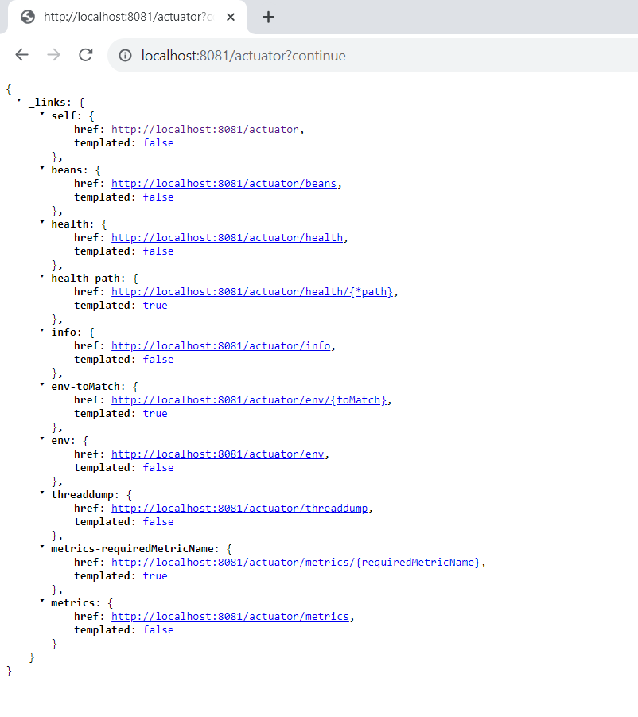

## Configuring application

**Application.yml**

<div style="font-size:18px;">

Using YAML Instead of Properties files is better.

* YAML is a superset of JSON and, as such, is a convenient format for specifying hierarchical configuration data.

* The SpringApplication class automatically supports YAML as an alternative to properties whenever you have the SnakeYAML library on your classpath.

* You can specify multiple profile-specific YAML documents in a single file by using a spring.profiles key to indicate when the document applies.

* In addition to application.properties files, profile-specific properties can also be defined by using the following naming convention: application-{profile}.properties. 

* The Environment has a set of default profiles (by default, [default]) that are used if no active profiles are set. In other words, if no profiles are explicitly activated, then properties from application-default.properties are loaded.
</div>

### Yml Example
<br>

You can specify multiple profile-specific YAML documents in a single file by using a spring.profiles key to indicate when the document applies, as shown in the following example:

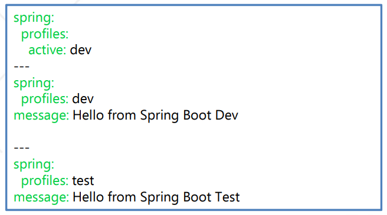


## Docker

Docker is a platform that enables developers to create, deploy, and run applications in containers. Containers are lightweight, portable, and self-sufficient units that package an application and its dependencies together. Docker provides tools and a platform to build, ship, and run these containers consistently across different environments, from development to production.


1. **Container:** A container is a standalone and executable package that includes everything needed to run a piece of software, including the code, runtime, libraries, and system tools. Containers are isolated from each other and from the host system, ensuring consistency and eliminating "it works on my machine" issues.

2. **Docker Image:** A Docker image is a read-only blueprint or template for creating containers. It defines the application, its dependencies, and other configuration details. Images are the building blocks of containers and can be stored in a registry for easy distribution.

3. **Dockerfile:** A Dockerfile is a text file that contains instructions for building a Docker image. It specifies a base image, sets the environment, copies files into the image, and configures how the container should run. Dockerfiles are used to automate image creation.

4. **Docker Hub:** Docker Hub is a cloud-based registry service provided by Docker where you can find and share Docker images. It hosts a vast collection of official and community-contributed images that can be used as base images.

5. **Containerization:** Containerization is the process of creating and running containers. Containers can be started, stopped, and deleted with ease, allowing for efficient resource utilization and quick scaling.

6. **Docker Compose:** Docker Compose is a tool for defining and running multi-container Docker applications. It uses a YAML file to define the services, networks, and volumes that make up the application, making it easy to manage complex applications.

7. **Orchestration:** Docker Swarm and Kubernetes are orchestration tools that manage the deployment, scaling, and management of containers in a cluster of machines. They provide features for load balancing, service discovery, and high availability.

8. **Microservices:** Docker is often used in microservices architectures, where applications are broken down into small, independent services running in containers. This approach allows for easier development, deployment, and scaling of individual services.

9. **Cross-Platform Compatibility:** Docker containers can run consistently on various operating systems, including Linux, Windows, and macOS, thanks to Docker's platform-agnostic nature.

10. **Isolation and Security:** Containers provide process and filesystem isolation, enhancing security by isolating applications from one another and from the host system. However, proper security practices must still be followed when building and deploying containers.

11. **Version Control for Infrastructure:** Docker allows infrastructure (containers) to be version-controlled, making it easier to manage infrastructure changes and rollbacks.

12. **DevOps Integration:** Docker is widely used in DevOps practices to enable continuous integration, continuous delivery (CI/CD), and infrastructure as code (IaC) by providing consistent environments for testing and deployment.

### Dockerfile Example

```dockerfile

# Use OpenJDK 17 as the base image
FROM openjdk:17

# Set the working directory to /app
WORKDIR /app

# Copy the JAR file from the target directory to /app inside the container
COPY target/*.jar app.jar

# Expose port 8081
EXPOSE 8081

# Set the entry point to run the JAR file using the java command
ENTRYPOINT ["java", "-jar", "app.jar"]
```

### Docker explanation code

This is a Dockerfile that sets up a Docker image for a Java application using OpenJDK 17 as the base image. 

1. `FROM openjdk:17`: This specifies the base image to use for the Docker image. In this case, it's using OpenJDK 17 as the base image, which is suitable for running Java applications.

2. `WORKDIR /app`: This sets the working directory inside the container to `/app`. This is the directory where the application's files will be copied and where the application will run.

3. `COPY target/todo-0.0.1-SNAPSHOT.jar /app`: This instruction copies the JAR file of the Java application from the host machine (assuming it's located in the `target` directory) to the `/app` directory inside the container.

4. `EXPOSE 8081`: This instruction exposes port 8081 to the outside world. It informs Docker that the application inside the container will listen on port 8081, but it doesn't actually publish the port to the host machine. You would need to specify port mapping when running the container to make it accessible from the host.

5. `ENTRYPOINT ["java", "-jar", "todo-0.0.1-SNAPSHOT.jar"]`: This sets the entry point for the container. It specifies that the container should run the Java application by executing the `java -jar todo-0.0.1-SNAPSHOT.jar` command. This command will launch the Java application using the provided JAR file as the main application entry point.


# Reactive Spring 

* [Reactive spring explanation](#reactive-spring-explanation)
* [Why Do We Need Reactive Programming](#why-do-we-need-reactive-programming)
* [Reactive Streams Specification and work flow](#reactive-streams-specification-and-work-flow)
* [Reactive Types](#reactive-types)
* [Working Example of Reative Spring](#working-example-of-reative-spring)
* [Subscribing to Reactive Streams](#subscribing-to-reactive-streams)
* [Transforming reactive sequences with operators](#transforming-reactive-sequences-with-operators)

## Reactive spring explanation

Reactive systems have certain characteristics that make them ideal for low-latency, high-throughput workloads. Project Reactor and the Spring portfolio work together to enable developers to build enterprise-grade reactive systems that are responsive, resilient, elastic, and message-driven.

**What is reactive processing?**

Reactive processing is a paradigm that enables developers to build systems that are responsive, resilient, elastic, and message-driven. Reactive systems are:

* Responsive: The system responds in a timely manner if at all possible. Responsiveness means that problems may be detected quickly and dealt with effectively. Responsive systems focus on providing rapid and consistent response times, establishing reliable upper bounds so they deliver a consistent quality of service. This consistent behavior simplifies error handling, builds end-user confidence, and encourages further interaction.

* Resilient: The system stays responsive in the face of failure. This applies not only to highly-available, mission-critical systems—any system that is not resilient will be unresponsive after a failure. Resilience is achieved by replication, containment, isolation, and delegation. Failures are contained within each component, isolating components from each other and thereby ensuring that parts of the system can fail and recover without compromising the system as a whole. Recovery of each component is delegated to another (external) component and high-availability is ensured by replication where necessary. The client of a component is not burdened with handling its failures.

* Elastic: The system stays responsive under varying workload. Reactive systems can react to changes in the input rate by increasing or decreasing the resources allocated to service these inputs. This implies designs that have no contention points or central bottlenecks, resulting in the ability to shard or replicate components and distribute inputs among them. Reactive systems support predictive, as well as reactive, scaling algorithms by providing relevant live performance measures. They achieve elasticity in a cost-effective way on commodity hardware and software platforms.

* Message-driven: Reactive systems rely on asynchronous message-passing to establish a boundary between components that ensures loose coupling, isolation, location transparency, and provides the means to delegate errors as messages. Employing explicit message-passing enables load management, elasticity, and flow control by shaping and monitoring the message queues in the system and applying back-pressure when necessary. Location transparent messaging as a means of communication makes it possible for the management of failure to work with the same constructs and semantics across a cluster or within a single host. Non-blocking communication allows recipients to only consume resources while active, leading to less system overhead.

**What is Project Reactor?**

Project Reactor is a fully non-blocking reactive programming foundation for the JVM, with efficient demand management (in the form of managing "backpressure"). It integrates directly with the Java 8 functional APIs, notably CompletableFuture, Stream, and Duration. It offers composable asynchronous sequence APIs Flux (for [N] elements) and Mono (for [0|1] elements), extensively implementing the Reactive Extensions specification.

**What is Spring WebFlux?**

Spring WebFlux is the reactive-stack web framework in Spring Framework 5. It is a fully non-blocking web framework built on top of Project Reactor, implementing the Reactive Streams specification. It provides a reactive WebClient that can consume reactive services. It also offers non-blocking web service components, including WebFlux.fn, annotation-based Spring WebFlux, WebClient, and WebClient-based testing support.

## Why Do We Need Reactive Programming

* **Asynchronous Operations:** In modern software development, many tasks involve asynchronous operations like handling user input, network requests, or database queries. Reactive programming simplifies handling these asynchronous operations in a structured and efficient way.

* **Concurrency and Scalability:** Reactive programming can improve the concurrency and scalability of applications, allowing them to handle a large number of concurrent users or events without blocking resources.

* **Responsiveness:** It is crucial for applications to be responsive and not block the user interface or other services. Reactive programming enables this by handling operations without blocking.

* **Stream Processing:** In scenarios involving data streams (e.g., sensor data, log files, social media updates), reactive programming is an ideal choice for processing and reacting to these continuous streams of data.

**When to use it :**

Reactive programming is particularly useful in the following scenarios:

* **Real-time applications:** Like chat applications, live sports updates, and financial systems that require real-time data processing and updates.

* **High-concurrency scenarios:** In applications that need to handle many concurrent connections or requests.

* **Event-driven systems:** For handling and reacting to asynchronous events or data streams, such as IoT, sensors, or social media feeds.

* **Responsiveness:** In scenarios where it's essential to keep the user interface or other services responsive and not block due to long-running operations.

## Reactive Streams Specification and work flow

The Reactive Streams Specification is a set of interfaces and contracts that define a standard for asynchronous stream processing in a reactive programming environment. It provides a common way for publishers of data to interact with subscribers while addressing issues like backpressure. 

**1. Interfaces in the Reactive Streams Specification**:

The Reactive Streams Specification defines several core interfaces:

- **Publisher**: A `Publisher` is the source of data or events. It produces elements and publishes them to subscribers.
- **Subscriber**: A `Subscriber` receives elements from a `Publisher` and processes them. A subscriber can signal demand for more elements and handle errors.
- **Subscription**: A `Subscription` represents the link between a `Publisher` and a `Subscriber`. It allows a subscriber to request more elements (backpressure) or cancel the subscription.

**2. Workflow of Reactive Streams**:

The typical workflow of Reactive Streams involves the interaction between publishers and subscribers:

1. **Publisher Emission**: The publisher emits data elements. This can be continuous data, events, or asynchronous results from operations.

2. **Subscriber Subscription**: A subscriber expresses its interest in receiving data by subscribing to a publisher. This subscription establishes the link between the publisher and the subscriber.

3. **Demand for Data (Backpressure)**: The subscriber can signal its demand for data by requesting a certain number of elements using the `Subscription`. This is a critical concept known as backpressure. It allows subscribers to control the rate at which data is delivered to them, ensuring they don't get overwhelmed with data.

4. **Data Propagation**: The publisher sends data to the subscriber according to the requested demand. Data flows from the publisher to the subscriber asynchronously.

5. **Error Handling**: If an error occurs during the data emission or processing, the publisher can signal the error to the subscriber. The subscriber can handle the error as needed.

6. **Completion Signal**: When the publisher has no more data to emit, it can signal a completion event to the subscriber. This signifies the end of the data stream.

7. **Subscriber Cancellation**: At any point, the subscriber can decide to cancel the subscription. This allows the subscriber to stop receiving data and release resources.

8. **Clean-Up**: After the data stream is complete or the subscription is canceled, any necessary clean-up operations can be performed by the publisher and subscriber.

## Reactive Types

Reactive Streams defines two types of reactive streams:


**1. Flux**:

* A Flux is a reactive type that represents a stream of zero to many items. It's used for handling sequences of data, such as multiple values from a database query, events from a real-time source, or any data that can be emitted asynchronously.

- **Characteristics**:
  - Can emit zero, one, or multiple items.
  - Supports backpressure, which allows subscribers to control the rate at which they receive data from the Flux.
  - Suitable for handling multiple items in an asynchronous and non-blocking manner.
  - Can be transformed and manipulated using various operators.

- **Use Cases**:
  - Reading data from a database and processing multiple records asynchronously.
  - Subscribing to a real-time event stream and reacting to incoming events.
  - Handling batches of data in parallel.

**2. Mono**:

- **Description**: A Mono is a reactive type that represents a stream that can emit at most one item. It's used for handling asynchronous operations that may result in a single value or an error.

- **Characteristics**:
  - Emits either a single item or an error signal (not both).
  - Supports backpressure, but in most cases, the demand is 0 or 1 (to request one item or none).
  - Suitable for handling asynchronous operations that produce a single result.

- **Use Cases**:
  - Making an HTTP request and processing the response, which may succeed with a single result or fail with an error.
  - Querying a database for a specific record, which might return one record or none.
  - Asynchronous computations that produce a single result.

**Comparing Flux and Mono**:

- Flux is used for handling sequences of data, while Mono is used for handling single values or error results.
- Both Flux and Mono support backpressure, but the demand pattern differs. Flux can have a demand of zero, one, or more, while Mono typically has a demand of 0 or 1.
- You can apply a wide range of operators to both Flux and Mono to transform, filter, and manipulate the data.
- When working with either Flux or Mono, you can subscribe to them to initiate the asynchronous processing. Subscribers can consume the data, react to events, and handle errors.


## Reactive work flow

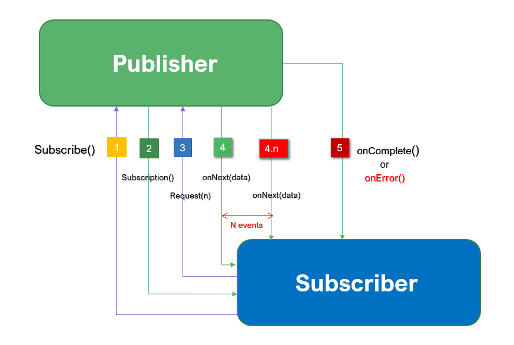


### Reactive work flow explanation

The concepts of "Publisher," "Subscriber," and "Subscription" are fundamental to understanding reactive programming and the Reactive Streams API. These concepts describe how data flows from a data source (the Publisher) to a data consumer (the Subscriber) with a mechanism for managing the flow (the Subscription). Here's an explanation of the workflow for each of these components:

**Publisher:**
- A Publisher is the source of data in a reactive system. It represents a sequence of data that can emit values to multiple Subscribers.
- Publishers are typically asynchronous, meaning they can emit data at any time, and Subscribers should be prepared to handle these emissions as they arrive.
- Publishers implement the org.reactivestreams.Publisher interface, which defines methods like `subscribe` for attaching Subscribers to the Publisher.
- Publishers emit data via the `onNext`, `onError`, and `onComplete` methods.
  - `onNext`: Emits a data item to Subscribers.
  - `onError`: Signals an error condition to Subscribers, terminating the sequence.
  - `onComplete`: Signals the successful completion of the sequence to Subscribers.

**Subscriber:**
- A Subscriber is a data consumer in a reactive system. It subscribes to a Publisher to receive and react to data emitted by the Publisher.
- Subscribers implement the org.reactivestreams.Subscriber interface, which defines methods for handling emissions, errors, and the completion of the sequence.
- Subscribers register themselves with a Publisher by calling the `subscribe` method of the Publisher. The `subscribe` method establishes a connection between the Publisher and the Subscriber.
- Subscribers receive data through the `onNext` method, handle errors through the `onError` method, and respond to the completion of the sequence through the `onComplete` method.
- Subscribers can request a specific number of items they want to receive from the Publisher using the `Subscription` object provided to them. This allows Subscribers to manage backpressure.

**Subscription:**
- A Subscription is an object that represents the connection between a Publisher and a Subscriber. It's created when a Subscriber subscribes to a Publisher using the `subscribe` method.
- The Subscription object provides the Subscriber with the ability to request more data (backpressure) or to cancel the subscription altogether.
- Subscribers can call the `request` method on the Subscription to request a specified number of data items they are ready to consume. This helps in managing the flow of data from the Publisher, preventing data overload.
- Subscribers can call the `cancel` method on the Subscription to terminate the subscription and stop receiving data from the Publisher.

**Workflow:**

1. A Subscriber expresses its interest in receiving data by subscribing to a Publisher using the `subscribe` method. This establishes a connection between the Subscriber and the Publisher.

2. The Publisher begins emitting data items and sends them to the Subscriber using the `onNext` method. The Subscriber processes these emissions.

3. If an error occurs during the data emission, the Publisher signals this to the Subscriber using the `onError` method. The Subscriber can handle the error as needed.

4. When the Publisher has completed emitting data, it signals the completion to the Subscriber using the `onComplete` method.

5. Throughout this process, the Subscriber can use the Subscription to manage backpressure, requesting more data items when it's ready to handle them and cancelling the subscription when it's done.


## Working Example of Reative Spring


[Hand-on-code click here](https://github.com/SwayaanTechnologies/springboot-2.7.8/tree/master/spring-reactive/springreactive)

[steps click here](https://github.com/SwayaanTechnologies/springboot-2.7.8/blob/master/spring-reactive/README.md)


## Subscribing to Reactive Streams

Subscribing to Reactive Streams is a fundamental concept in reactive programming. Reactive Streams are a specification for asynchronous stream processing, and they are implemented in various reactive libraries, including Project Reactor (used in Spring WebFlux) and RxJava. Subscribing to a reactive stream means initiating the consumption of data from the stream in an asynchronous and non-blocking manner. Let's break down the process of subscribing to a reactive stream:

1. **Create a Publisher**:
   
   Reactive Streams start with a Publisher. A Publisher is a source of data, and it emits data items asynchronously. In the context of Spring WebFlux and Project Reactor, a Publisher can be a `Flux` or a `Mono` or any other reactive data source. You create a Publisher to represent your data source.


2. **Subscribe to the Publisher**:

   Subscribing to a Publisher is the act of initiating the data flow. You do this by calling the `subscribe()` method on the Publisher. The `subscribe()` method takes one or more subscribers as arguments.

3. **Define Subscribers**:

   A Subscriber is an entity that processes the data emitted by the Publisher. Subscribers define how to react to the data, including handling emitted items, handling errors, and responding when the stream completes. Subscribers implement the `Subscriber` interface, which includes methods like `onNext()`, `onError()`, and `onComplete()`.


4. **Handle Data**:

   Inside the Subscriber, you define how to handle the data as it is emitted. For example, in the `onNext()` method of a Subscriber, you can specify what to do with each data item. This is where you perform your business logic or processing.

5. **Handle Errors and Completion**:

   Subscribers also need to handle errors and the completion of the stream. In the `onError()` method, you can define what should happen when an error occurs in the stream. In the `onComplete()` method, you specify what to do when the stream has finished emitting all the data.

## Transforming reactive sequences with operators

Transforming reactive sequences with operators is a key aspect of reactive programming and is essential for manipulating, filtering, and transforming data in reactive streams. Reactive operators enable you to modify or process the data emitted by reactive streams in various ways. Operators are a powerful tool for working with data in a reactive, non-blocking manner. These operators are typically available in reactive libraries like Project Reactor and RxJava. Here are some common categories of reactive operators and explanations of each:

1. **Mapping Operators**:

   - **`map`**: This operator applies a function to each item emitted by the source Publisher (e.g., Flux or Mono) and returns a new item, effectively transforming each item. It's often used for data transformation.

     ```java
     Flux<Integer> originalFlux = Flux.just(1, 2, 3, 4, 5);
     Flux<String> mappedFlux = originalFlux.map(item -> "Number " + item);
     ```

2. **Filtering Operators**:

   - **`filter`**: This operator filters items emitted by the source Publisher based on a given predicate function. Only items that satisfy the condition are propagated to the downstream.

     ```java
     Flux<Integer> originalFlux = Flux.just(1, 2, 3, 4, 5);
     Flux<Integer> filteredFlux = originalFlux.filter(item -> item % 2 == 0); // Emits only even numbers
     ```

3. **Combining Operators**:

   - **`concat`, `merge`, and `zip`**: These operators are used to combine multiple Publishers into a single stream. `concat` combines streams sequentially, `merge` combines them concurrently, and `zip` combines them element-wise.

   - **`concat` example**:

     ```java
     Flux<Integer> flux1 = Flux.just(1, 2, 3);
     Flux<Integer> flux2 = Flux.just(4, 5, 6);
     Flux<Integer> combinedFlux = Flux.concat(flux1, flux2); // Emits items from flux1 followed by flux2
     ```

4. **Error Handling Operators**:

   - **`onErrorResume` and `onErrorReturn`**: These operators allow you to handle errors gracefully by specifying a fallback value or a different data source to switch to in case of an error.

# Conclusion

Course Conclusion:

In this comprehensive course, we have explored a wide range of topics related to modern software architecture, specifically focusing on microservices using the Spring Framework, Spring Boot, and other relevant technologies.

**Spring Framework Spring 5.x Overview:**
- We delved into the core concepts of the Spring Framework, focusing on Inversion of Control (IoC) and how beans are managed.
- The creation of beans through IoC, along with constructor and setter injection, was explained.

**Spring Boot Internals:**
- Spring Boot's key annotations, such as @EnableAutoConfiguration and @SpringBootApplication, were introduced.
- Auto-Configuration was discussed as a mechanism for automatic setup.
- External configuration, profiles, and logging were explored.
- Packaging Spring applications for deployment was explained.

**Data Access with Spring Boot:**
- We covered Spring Data JPA and REST, which are essential for building the data tier of microservices.
- The @Repository annotation and the basics of Java Persistence API (JPA) were introduced.
- Creating repositories for CRUD operations and handling entity relationships were explained.

**Spring Web Applications and REST-Based Web Services:**
- Building RESTful web services with Spring Boot using the @RestController annotation was discussed.
- CRUD applications and REST Controllers were explored.
- The use of Java Bean Models and consuming REST services with REST Template was demonstrated.
- Managing Spring Boot environment variables and profiles were explained.
- Testing REST services using tools like Postman was highlighted.

**Spring Boot with HATEOAS & Swagger:**
- We learned about hypermedia and how HATEOAS (Hypertext as the Engine of Application State) can be implemented.
- The importance of Swagger documentation in documenting APIs was emphasized.

**Microservices Security:**
- The significance of security in a microservices environment was explained.
- We looked into securing microservices through Spring Security, OAuth 2, CQRS (Command Query Responsibility Segregation), and API Gateways.

**Spring Boot Actuator:**
- Observability and troubleshooting in microservices were discussed, and we explored how Spring Boot Actuator provides insights into application health and performance.

**Docker Overview:**
- The concept of containers and Docker as a containerization platform were introduced.
- The differences between dedicated hosts, virtual machines, and containers were highlighted.
- We learned how to install Docker, use the Docker command-line client, and create Docker images with Dockerfiles.

**Reactive Spring:**
- An introduction to Project Reactor and its role in building reactive applications with Spring Boot was provided.
- The use of reactive types like Flux and Mono, along with operators for stream transformation, was explained.
- Building purely functional web applications with WebFlux was discussed.


     
