#  Spring Boot todo project

<br>

We will start with building our first Spring Boot application.

*  We will use Maven to manage dependencies.

* The following steps are involved in starting up a Spring Boot application:

**Step 1**: Set up your project

You can use Spring Initializr to quickly generate a Spring MVC project. Visit [spring.io](https://start.spring.io/) and configure your project as follows:

- Project: Maven Project

- Language: Java

- Spring Boot: (Choose the latest version)

- Group: com.todos

- Artifact: todosApi (or any other name you like)

- Dependencies: none

- Click "Generate" to download the project zip file.


**Step 2**: Unzip the created file

**Step 3**: Open STS

**Step 4**: Click on file

**Step 5**: Click on import > select maven > select existing maven project > click next 

**Step 6**: Browser the unzipped file 

**step 7**: pom.xml file will appear, select it and click on finish

# Todo Application


* onces the project is created, add the dependencies in the pom.xml file

```xml

<dependency>
			<groupId>org.springframework.boot</groupId>
			<artifactId>spring-boot-starter-web</artifactId>
		</dependency>

```

* onces after the folder is created, right click on the project folder and select new > package > give the name as com.todos.model

* create a class file inside the model package and give the name as Todo.java

```java
public class Todo  {
	private int id;
	private String title;
	private String description;
	private boolean status;
	private Date targetDate;
	
	public int getId() {
		return id;
	}
	public void setId(int id) {
		this.id = id;
	}
	public String getTitle() {
		return title;
	}
	public void setTitle(String title) {
		this.title = title;
	}
	public String getDescription() {
		return description;
	}
	public void setDescription(String description) {
		this.description = description;
	}
	public boolean isStatus() {
		return status;
	}
	public void setStatus(boolean status) {
		this.status = status;
	}
	public Date getTargetDate() {
		return targetDate;
	}
	public void setTargetDate(Date targetDate) {
		this.targetDate = targetDate;
	}
	public Todo(int id, String title, String description, boolean status, Date targetDate) {
		super();
		this.id = id;
		this.title = title;
		this.description = description;
		this.status = status;
		this.targetDate = targetDate;
	}
	public Todo() {
		super();
	}
	
}

```

# Create a service package 

* right click on the project folder and select new > package > give the name as com.todos.service

* create a interface file inside the service package and give the name as TodoService.java

```java

public interface ITodoService {

	
	public List<Todo> getAllTodos();
	
	public Todo getById(int id);
	
	public List<Todo> getByTitle(String title);
	
	public Todo addTodo(Todo todo);
	
	public Todo updateTodo(int id, Todo todo);
	
	public Todo deleteTodo(int id);
	
}

```

* right click on the service package folder and select new > package > give the name as com.todos.service.repository

* Create a service implementation file inside the service.repository package and give the name as TodoStaticService.java

```java
@Service
public class TodoStaticService implements ITodoService {

	// static data data store
	
	private static List<Todo> todos = new ArrayList<>();
	
	static {
		todos.add(new Todo(1,"Learn Java", "From Scratch", false, new Date()));
		todos.add(new Todo(2,"Learn Spring", "From Scratch", false, new Date()));
		todos.add(new Todo(3,"Learn Hibernet", "From Scratch", false, new Date()));
	}
	
	public List<Todo> getAllTodos(){
		return todos;
	}
	
	// getbyid create update delete
	
	public Todo getById(int id) {
		for(Todo todo: todos) {
			if(todo.getId() == id)
				return todo;
		}
		return null;
	}
	
	public Todo addTodo(Todo todo) {
		todo.setId(findMaxTodoId()+1);
		todos.add(todo);
		return todo;
	}
	
	public Todo updateTodo(int id, Todo todo) {
		Todo oldTodo = getById(id);
		if( oldTodo != null) {
			todos.remove(oldTodo);
			todos.add(todo);
		}
		return todo;
	}
	
	public Todo deleteTodo(int id) {
		for(Todo todo: todos) {
			if(todo.getId() == id) {
				todos.remove(todo);
				return todo;
			}
		}
		return null;
	}
	
	
	private int findMaxTodoId() {
		return 3;
	}

	@Override
	public List<Todo> getByTitle(String title) {
		// TODO Auto-generated method stub
		return null;
	}
	
}
```

# Create a exception package

* right click on the project folder and select new > package > give the name as com.todos.exception

* create a class file inside the exception package and give the name as TodoNotFoundException.java

```java
@ResponseStatus(HttpStatus.NOT_FOUND)
public class TodoNotFoundException extends RuntimeException {
	
	public TodoNotFoundException(String message){
		super(message);
	}
}
```

# Create a controller package

* right click on the project folder and select new > package > give the name as com.todos.controller

* create a class file inside the controller package and give the name as TodoController.java

```java
@RestController
@RequestMapping("/api/v1/todos")
public class TodoController {
	
	private static final int Todo = 0;
	@Autowired
	ITodoService todoSvc;
	
	@GetMapping()
	public List<Todo> getAllTodos(){
		 
        List<Todo> todos = todoSvc.getAllTodos();
			return todos;
		}
	
	
	@GetMapping("/{id}")
	public Todo getByTodoId(@PathVariable int id){
		var todo = todoSvc.getById(id);
		if(todo == null)
			throw new TodoNotFoundException("Todo Not Found");
		else
			return todo;
	}
	
	@GetMapping("/title/{title}")
	public List<Todo> getByTodoTitle(@PathVariable String title){
		var todo = todoSvc.getByTitle(title);
		if(todo == null)
			throw new TodoNotFoundException("Todo Not Found");
		else
			return todo;
	}
	
	@PostMapping()
	public ResponseEntity<Todo> createTodo(@RequestBody Todo todo) {	
		
		var newTodo = todoSvc.addTodo(todo);
		return new ResponseEntity<Todo>(newTodo, HttpStatus.CREATED);
	}
	
	@PutMapping("/{id}")
	public ResponseEntity<Todo> updateTodo(@PathVariable int id,@RequestBody Todo todo) {	 
		var newTodo = todoSvc.updateTodo(id, todo);
		
		if(newTodo != null)
			return new ResponseEntity<Todo>(newTodo, HttpStatus.OK);
		else
			throw new TodoNotFoundException("Todo Not Found");
	}
	
	@DeleteMapping("/{id}")
	public ResponseEntity<Todo> deleteTodo(@PathVariable int id) {	 
		var todo = todoSvc.deleteTodo(id);
		if(todo != null)
			return new ResponseEntity<Todo>(todo, HttpStatus.OK);
		else
			
			throw new TodoNotFoundException("Todo Not Found");
	}
	
	
}
```

## Output in browser

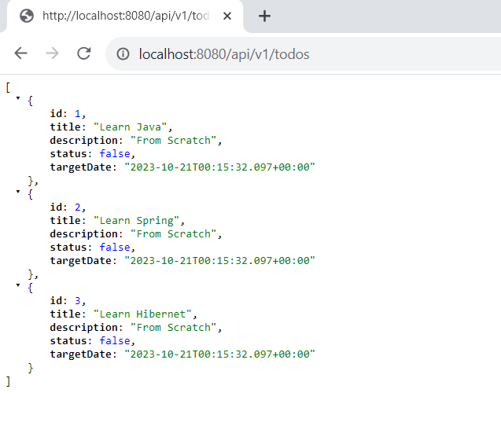

# postman

Postman is a popular collaboration platform and toolset used by developers, testers, and other professionals for building, testing, and documenting APIs (Application Programming Interfaces). APIs are a set of rules and protocols that allow different software applications to communicate with each other. Postman simplifies the process of working with APIs by providing a user-friendly interface and a range of features. 

1. API Testing: Postman allows you to send HTTP requests (GET, POST, PUT, DELETE, etc.) to API endpoints and receive responses. This is essential for testing and debugging APIs to ensure they work correctly. You can view the responses, inspect headers, and more.

2. Collections: Postman enables you to organize and group related API requests into collections. This makes it easier to manage and run multiple API requests together. Collections can be shared with team members for collaborative work.

3. Environment Variables: Postman allows you to define and use environment variables. This is helpful for managing different configurations (e.g., development, testing, production) and dynamically updating values in requests, making it easier to work with various environments.

4. Automated Testing: Postman supports automated testing through scripts. You can write JavaScript-based scripts to perform assertions on the API responses, making it possible to create test suites for API endpoints.

5. Mock Servers: Postman allows you to create mock servers for APIs, even before they are fully developed. This is useful for testing and development teams to work on API integration without waiting for the actual API to be available.

6. Documentation: Postman provides tools to create documentation for APIs. You can generate interactive and user-friendly API documentation from your Postman collections, making it easier for developers to understand and use the API.

7. Monitoring and Reporting: Postman offers monitoring and reporting features to keep track of API performance, response times, and other metrics. This helps in identifying issues and ensuring the API's reliability.

8. Collaboration: Postman offers collaboration features, allowing team members to work together on API projects. You can share collections, environments, and collaborate on the design and testing of APIs.

9. Postman Workspaces: Postman Workspaces are shared workspaces that enable teams to collaborate on API development and testing. They come with role-based access control to manage permissions and access to resources.

10. Integration: Postman integrates with various development and testing tools, including version control systems, CI/CD pipelines, and issue tracking systems, making it a central part of the API development workflow.


## Testing using postman

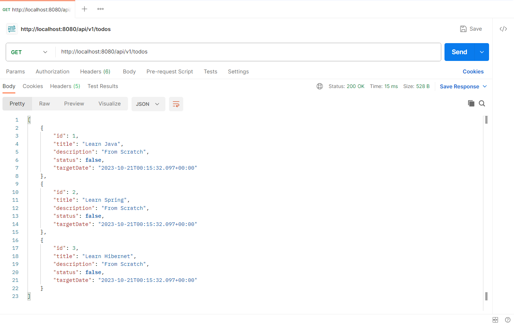


### Explaination of the above code

The  basic Spring Boot application for managing "To-Do" items using a RESTful API. 

1. **`Todo` Class**:
   - This class defines the structure of a `Todo` object, with fields like `id`, `title`, `description`, `status`, and `targetDate`.
   - Getter and setter methods are provided for accessing and modifying these fields.

2. **`ITodoService` Interface**:
   - This interface defines a contract for managing `Todo` items. It declares methods for operations like retrieving all todos, getting a todo by ID, adding a todo, updating a todo, and deleting a todo.
   - The interface also includes a method to retrieve todos by title.

3. **`TodoStaticService` Class**:
   - This class implements the `ITodoService` interface.
   - It uses an in-memory list (`todos`) to store `Todo` objects.
   - The `getAllTodos` method returns all todos from the list.
   - The `getById` method retrieves a todo by its ID.
   - The `addTodo` method adds a new todo to the list.
   - The `updateTodo` method updates an existing todo in the list.
   - The `deleteTodo` method removes a todo from the list.
   - The `findMaxTodoId` method is used to find the maximum ID in the list.
   - The `getByTitle` method is a stub that does not yet implement searching by title.

4. **`TodoNotFoundException` Class**:
   - This is a custom exception class that extends `RuntimeException`. It's used to handle cases where a requested `Todo` is not found.
   - When a `Todo` is not found, a `TodoNotFoundException` is thrown.

5. **`TodoController` Class**:
   - This class is a Spring MVC controller that handles HTTP requests related to `Todo` items.
   - It's annotated with `@RestController`, which combines `@Controller` and `@ResponseBody` to indicate that the return values of its methods should be serialized as JSON and sent in the response body.
   - The `@RequestMapping` annotation specifies the base path for the controller's endpoints (`/api/v1/todos`).

   - The `todoSvc` field is autowired with an instance of `ITodoService`. This is dependency injection, and it allows the controller to use the methods of the service to interact with `Todo` items.

   - The controller defines several HTTP endpoints for managing todos:

     - `GET /api/v1/todos`: Returns a list of all todos.
     - `GET /api/v1/todos/{id}`: Returns a todo by its ID.
     - `GET /api/v1/todos/title/{title}`: Returns todos with a specific title.
     - `POST /api/v1/todos`: Creates a new todo.
     - `PUT /api/v1/todos/{id}`: Updates an existing todo.
     - `DELETE /api/v1/todos/{id}`: Deletes a todo by its ID.

   - In each of these controller methods, the `todoSvc` service is used to perform the corresponding action. If a `Todo` is not found, it throws a `TodoNotFoundException`, which is handled by the `TodoNotFoundException` class, resulting in an appropriate HTTP response with a status of 404 (Not Found).

This application is a basic example of a Spring Boot RESTful service for managing todo items. It uses Spring's dependency injection to wire the service into the controller and provides a simple in-memory implementation for managing `Todo` objects.

# Swagger

Swagger, now known as the OpenAPI Specification (OAS), is a set of open standards for defining and documenting RESTful APIs. It provides a standardized way to describe the structure and behavior of web services, making it easier for developers to understand, consume, and interact with these APIs. 

1. **API Documentation**: Swagger/OpenAPI serves as a machine-readable documentation for RESTful APIs. It defines how API endpoints work, what parameters they accept, the format of request and response data, authentication requirements, and more. This documentation is crucial for developers who want to use the API because it provides a clear and consistent reference.

2. **Standardized Format**: Swagger/OpenAPI uses a standardized format for API specification. This format is typically written in JSON or YAML and is human-readable and machine-readable. It uses a schema to define the structure of API requests and responses.

3. **Interactive Documentation**: One of the most significant advantages of Swagger/OpenAPI is its ability to generate interactive documentation. Developers can use Swagger UI or other similar tools to explore and test the API directly from the documentation. This makes it easier to understand the API's capabilities and verify that it's working as expected.

4. **Code Generation**: Swagger/OpenAPI can be used to generate client SDKs or server code in various programming languages. This feature makes it easier for developers to work with the API, as it generates code that already knows how to make requests and process responses according to the API's specification.

5. **Testing and Validation**: API developers can use the Swagger/OpenAPI definition to validate that their API is conforming to the specified structure. Tools like Swagger Codegen can also generate test cases based on the API definition.

6. **API Design and Development**: Swagger/OpenAPI is not just for documenting existing APIs; it can also be used as a design-first approach. API specifications can be created before actual development, allowing for clear API design and planning.

7. **Versioning and Evolution**: Swagger/OpenAPI supports versioning, making it easier to maintain and evolve your API over time. Different versions of the API can be documented and accessed separately.

8. **Community and Ecosystem**: Swagger/OpenAPI has a large and active community, which means there are various tools and libraries available to work with OpenAPI specifications. This includes editors, validators, and code generation tools.

9. **Integration**: Many API development and management platforms, as well as other tools and services, offer integration with Swagger/OpenAPI. This simplifies the process of deploying, monitoring, and securing APIs.


## Swagger dependency

* to access swagger , add the following dependency in the pom.xml file

```xml
		<dependency>
			<groupId>org.springdoc</groupId>
			<artifactId>springdoc-openapi-starter-webmvc-ui</artifactId>
			<version>2.1.0</version>
		</dependency>

```

* once the dependency is added, update the project by right clicking on the project folder and select maven > update project

* once the project is updated, run the project as spring boot application

* once the project is running, open the browser and type the following url

```url
http://localhost:8080/swagger-ui/index.html
```

## Testing using swagger

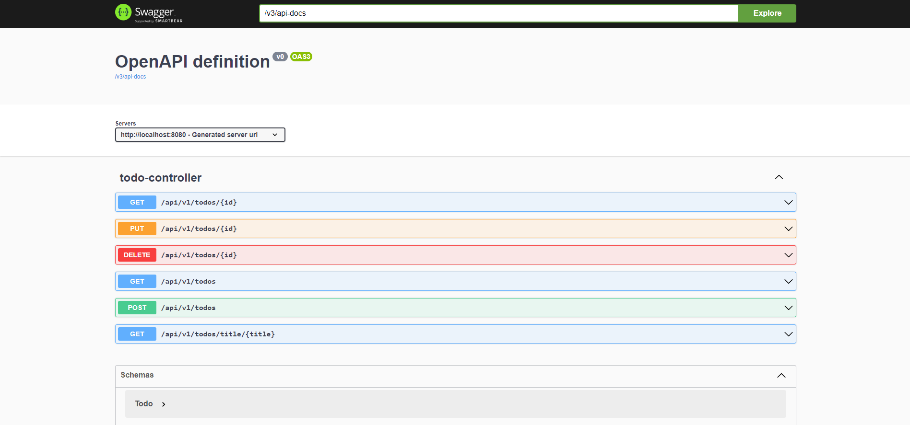

**Through id**

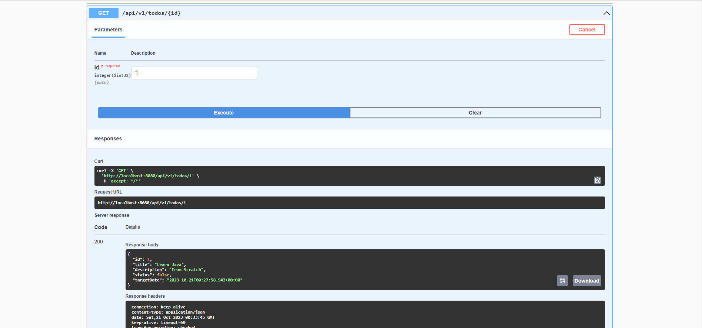

# JPA

JPA, or Java Persistence API, is a Java specification and a set of APIs that provide a standardized way to interact with relational databases in a Java application. JPA is part of the Java EE (Enterprise Edition) platform and is also widely used in Java SE (Standard Edition) applications. It simplifies database access and object-relational mapping (ORM) by allowing developers to work with Java objects instead of SQL queries. 

1. **ORM Framework**: JPA is essentially an ORM framework that maps Java objects to database tables and vice versa. It allows you to work with Java objects in your code while transparently handling the database operations.

2. **Entity Classes**: In JPA, you define entity classes to represent the data in your database tables. These entity classes are annotated with JPA annotations to specify how they should be mapped to the database.

3. **Annotations**: JPA uses annotations to define mappings between Java objects and database tables. Annotations like `@Entity`, `@Table`, `@Id`, `@Column`, and many others are used to specify the structure and relationships of the data in the database.

4. **JPQL (Java Persistence Query Language)**: JPA introduces JPQL, which is a SQL-like query language for querying data from the database using Java entities. JPQL abstracts the underlying SQL queries and makes it possible to query the database using Java objects and their relationships.

5. **Entity Manager**: The `EntityManager` is a core component of JPA. It manages the lifecycle of entities, including persisting, merging, and removing them from the database. The `EntityManager` is responsible for executing JPQL queries and handling database transactions.

6. **Persistence Unit**: A JPA application typically defines a "persistence unit" in a configuration file (usually `persistence.xml`). The persistence unit specifies the data source, entity classes, and other configuration settings for the JPA implementation.

7. **Relationships**: JPA supports defining and managing relationships between entities, including one-to-one, one-to-many, and many-to-many relationships. These relationships can be defined in entity classes using annotations like `@OneToOne`, `@OneToMany`, and `@ManyToMany`.

8. **Caching**: JPA provides caching mechanisms to improve performance. Entities and query results can be cached in memory, reducing the number of database queries and enhancing application performance.

9. **Portability**: JPA is a Java EE standard, which means that applications developed using JPA are portable across different Java EE-compliant application servers and database systems. This portability makes it easier to switch between databases or application servers without major code changes.

10. **Vendor-Specific Implementations**: While JPA is a standard, there are various vendor-specific implementations available, such as Hibernate, EclipseLink, and Apache OpenJPA, which provide the underlying framework to implement the JPA specification. Developers can choose the implementation that best fits their needs.

# H2 database

H2 is an open-source, in-memory, and embedded relational database management system (RDBMS) written in Java. It is designed for lightweight and fast database operations and is often used for development, testing, and prototyping purposes. 

1. **In-Memory and Embedded Database**: H2 can be used as an in-memory database, which means it stores data in RAM rather than on disk. It can also be used as an embedded database, which is included as a library in your application, eliminating the need for a separate database server.

2. **Pure Java**: H2 is written in Java, making it platform-independent and easy to use in Java applications. It's a self-contained database that doesn't require external dependencies or installation.

3. **SQL Compatibility**: H2 supports a wide range of SQL standards, making it compatible with many SQL database systems. It provides features such as transactions, indexes, triggers, and various data types.

4. **Performance**: H2 is known for its high performance, especially when used as an in-memory database. It can efficiently handle read and write operations, which is useful for applications that require quick data retrieval.

5. **Embedded Mode**: In embedded mode, you can include the H2 database as part of your Java application. This is convenient for smaller applications, desktop software, or mobile apps where you don't want to rely on external databases.

6. **Server Mode**: H2 also supports a server mode, where it can be used as a standalone database server, allowing multiple clients to connect to it over a network. This is useful for multi-user applications or when you need a more traditional client-server architecture.

7. **Web Console**: H2 provides a web-based database management console that allows you to interact with the database, execute SQL queries, and perform administrative tasks using a web browser.

8. **Database Modes**: H2 supports various database modes, including file-based (persistent) mode, in-memory mode, and mixed mode (both in-memory and persistent), giving you flexibility in how you store and manage data.

9. **ACID Compliance**: H2 is ACID compliant, ensuring data integrity and consistency. It supports transactions, which means you can group multiple SQL statements into a single transaction, and they will be executed atomically.

10. **Compatibility Modes**: H2 provides compatibility modes for other popular databases like MySQL, PostgreSQL, Oracle, and SQL Server. This can ease the migration of applications from one database system to H2.

11. **Cross-Platform Support**: Since H2 is a Java-based database, it works on various operating systems, including Windows, Linux, and macOS.

12. **Extensive Documentation**: H2 has comprehensive documentation and a user community, which makes it relatively easy to get started and troubleshoot issues.

H2 is commonly used during development and testing phases of software projects due to its ease of use and speed. It allows developers to create and manage databases with minimal effort and can be used for running unit tests or creating prototype applications. However, it may not be suitable for production-level, high-concurrency, or large-scale applications, where more robust database systems like PostgreSQL, MySQL, or Oracle are often preferred.

## Working with JPA and h2 database

* to work with JPA and h2 database, add the following dependency in the pom.xml file

```xml
        <dependency>
            <groupId>org.springframework.boot</groupId>
            <artifactId>spring-boot-starter-data-jpa</artifactId>			
        </dependency>
        <dependency>
            <groupId>com.h2database</groupId>
            <artifactId>h2</artifactId>
            <scope>runtime</scope>
        </dependency>
```

* once the dependency is added, update the project by right clicking on the project folder and select maven > update project

## configure the Todo Class

* add the following annotation in the Todo class

```java

@Entity
public class Todo  {
	@Id
	@GeneratedValue(strategy = GenerationType.IDENTITY)
	private int id;
	
    @Column(name = "task", nullable=false)
	private String title;

	private String description;
	private boolean status;
	private Date targetDate;
	
	public int getId() {
		return id;
	}
	public void setId(int id) {
		this.id = id;
	}
	public String getTitle() {
		return title;
	}
	public void setTitle(String title) {
		this.title = title;
	}
	public String getDescription() {
		return description;
	}
	public void setDescription(String description) {
		this.description = description;
	}
	public boolean isStatus() {
		return status;
	}
	public void setStatus(boolean status) {
		this.status = status;
	}
	public Date getTargetDate() {
		return targetDate;
	}
	public void setTargetDate(Date targetDate) {
		this.targetDate = targetDate;
	}
	public Todo(int id, String title, String description, boolean status, Date targetDate) {
		super();
		this.id = id;
		this.title = title;
		this.description = description;
		this.status = status;
		this.targetDate = targetDate;
	}
	public Todo() {
		super();
	}

}
```
# application.properties

application.properties is a configuration file commonly used in Java-based applications, especially those built with the Spring Framework. It provides a way to configure various aspects of an application, such as database connection settings, server ports, logging levels, and other runtime parameters. The file is typically written in a key-value pair format, making it easy to specify properties and their corresponding values. Here's an overview of application.properties:

1. **Configuration Properties**: application.properties contains a set of key-value pairs, where each key represents a specific configuration property, and the associated value specifies its setting. For example:

   ```properties
   	server.port=8081
	logging.level.org.springframework.web=trace
   ```

   In this example, `server.port` sets the server's port to 8080, `spring.datasource.url` configures the database connection URL, and `logging.level.root` sets the root logging level to INFO.

2. **Customization**: Developers can use application.properties to customize the behavior of their applications without modifying the source code. This allows for flexible and dynamic configuration.

3. **Profile-Specific Properties**: You can define different versions of application.properties for different runtime profiles (e.g., development, production, testing). The application will load the properties specific to the active profile, making it easy to manage different configurations for various environments.

4. **Property Overrides**: Properties defined in application.properties can often be overridden or supplemented by command-line arguments, environment variables, or other property sources. This provides a way to fine-tune the configuration even further.

5. **Comments**: application.properties files often allow developers to add comments by using a `#` or `!` character at the beginning of a line. Comments are ignored and serve as documentation for the properties.

6. **Location and Naming**: The file should be placed in the application's classpath or resources directory. In Spring Boot applications, application.properties is the default configuration file name, but you can also use `application.yml` (YAML format) or specify a custom configuration file name via the `spring.config.name` property.

7. **Property Placeholder Resolution**: In Spring-based applications, properties defined in application.properties can be used as placeholders in various parts of the application, such as Spring bean definitions and annotation values.

8. **Type Conversion**: Many Spring-based frameworks can automatically convert property values from application.properties to their expected data types. For example, you can define properties as strings and have them converted to integers or booleans as needed.


## configure the application.properties file

* add the following properties in the application.properties file

```properties
server.port=8081
logging.level.org.springframework.web=trace


#H2 local instance details
spring.datasource.url=jdbc:h2:mem:todosdb
spring.datasource.driver-class-name=org.h2.Driver
spring.datasource.username=aa
spring.datasource.password=
spring.jpa.database-platform=org.hibernate.dialect.H2Dialect


spring.h2.console.enabled=true
spring.h2.console.path=/h2-console
spring.jpa.hibernate.ddl-auto=create
spring.jpa.show-sql=true

logging.level.org.hibernate.SQL=DEBUG
logging.level.org.hibernate.type.descriptor.sql.BasicBinder=TRACE

```


## Create a repository package

* right click on the project folder and select new > package > give the name as com.todos.repository

* create a interface file inside the repository package and give the name as TodoRepository.java which extends the JpaRepository

```java

@Repository
public interface TodoJPARepository extends JpaRepository<Todo, Integer> {

	List<Todo> findByTitle(String title);
	
	
}
```

# Create a JPA Service class

* Create a service implementation file inside the service.repository package and give the name as TodoDBService.java

* Note: remove the TodoStaticService.java file or comment the @Service annotation


```java
@Service
public class TodoDBService implements ITodoService{
	// h2
	
	@Autowired
	private TodoJPARepository todoDbRepo;

	@Override
	public List<Todo> getAllTodos() {
		var todos = todoDbRepo.findAll();
		return todos;
	}

	@Override
	public Todo getById(int id) {
		var todos = todoDbRepo.findById(id);
		return todos.get();
		}

	@Override
	public List<Todo> getByTitle(String title) {
		var todos = todoDbRepo.findByTitle(title);
		return todos;
	}
	

	@Override
	public Todo addTodo(Todo todo) {
		// TODO Auto-generated method stub
		return todoDbRepo.save(todo);
	}

	@Override
	public Todo updateTodo(int id, Todo todo) {
		Optional<Todo> existingTodo = todoDbRepo.findById(id);
		if(existingTodo.isPresent()) {
			Todo updateTodo = existingTodo.get();
			updateTodo.setTitle(todo.getTitle());
			return todoDbRepo.save(todo);
		}
		return null;
	}

	@Override
	public Todo deleteTodo(int id) {
		Optional<Todo> existingTodo = todoDbRepo.findById(id);
		if(existingTodo.isPresent()) {
			todoDbRepo.deleteById(id);
			return existingTodo.get();
		}
		return null;
	
	}	
}
```

## Run the application 

* once the application is running, open the browser and type the following url

```url
http://localhost:8081/h2-console
```

* once the h2 console is opened, click on connect by giving username and password

* once the connection is established, click on the todo table and click on run

## Output of H2-console


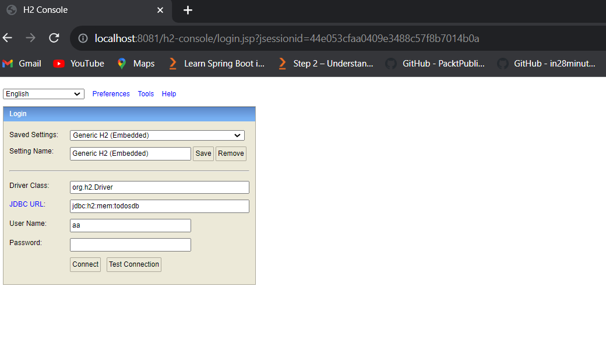

**getAllTodos:**

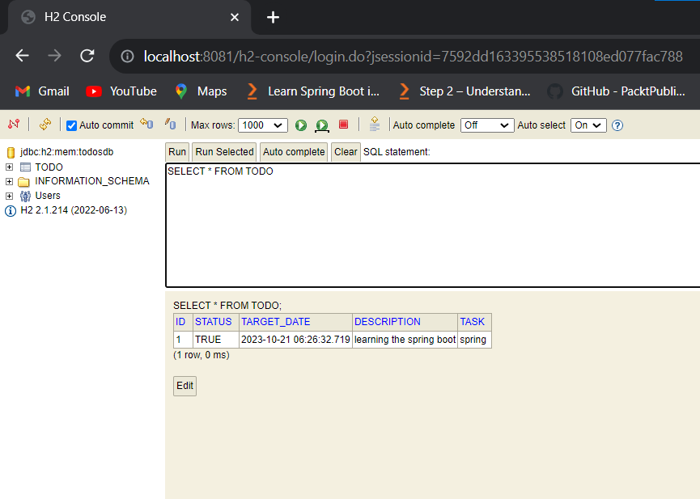


# Validation

In Spring Framework, validation refers to the process of ensuring that data or input received by an application adheres to specific rules or constraints. It's an essential step in ensuring data integrity and security. Spring provides various mechanisms for performing data validation, but one of the most commonly used approaches is using the Spring Validation framework.

Spring Validation is typically used for validating user input in web applications, especially in the context of form submissions. It helps ensure that the data entered by users is valid and complies with the expected format, rules, and business requirements. Here's how validation works in Spring:

1. **Validation Annotations**: Spring Validation relies on Java annotations to define validation rules for Java objects (typically domain or form objects). You can use annotations like `@NotBlank`, `@NotNull`, `@Size`, `@Pattern`, and others from the `javax.validation.constraints` package. For example:

   ```java
   	@Entity
	public class Todo {
	@Id
	@GeneratedValue(strategy = GenerationType.IDENTITY)
	private int id;
	// spring validation framework 
	@NotBlank(message = "Title is required.")
	@Column(name = "task", nullable=false)
	private String title;
	@Size(min=5, max=20, message = "length should be more than 5 and less than 20 characters")
	private String description;
	private boolean status;
	private Date targetDate;
   ```

   

2. **Validator Interface**: Spring provides the `Validator` interface, which you can implement to create custom validation logic. You need to implement two methods: `supports(Class<?> clazz)` to specify which class the validator can validate and `validate(Object target, Errors errors)` to perform the validation. Spring's `Errors` object is used to collect validation errors.

3. **Validation in Controllers**: In Spring web applications, you can use the `@Valid` annotation in your controller methods to trigger validation. For example:

   ```java
   @PostMapping()
	public ResponseEntity<Todo> createTodo(@Valid @RequestBody Todo todo) {	
		
		var newTodo = todoSvc.addTodo(todo);
		return new ResponseEntity<Todo>(newTodo, HttpStatus.CREATED);
	}
   ```


4. **Internationalization**: Spring Validation supports internationalization, allowing you to customize error messages for different locales and languages. This is important for providing user-friendly error messages in different regions.

5. **Validation Groups**: Spring supports the concept of validation groups, which allows you to validate specific groups of fields within an object. For example, you might have a "BasicInfo" group and a "FullInfo" group to validate different sets of fields separately.

6. **Error Messages**: You can customize error messages in Spring Validation using various mechanisms, such as property files, message bundles, or using validation annotations like `@NotEmpty(message = "Username is required")`.

7. **Validation in the Data Access Layer**: Spring Validation is not limited to web applications. You can use it to validate data at various layers of your application, including the data access layer. This ensures data consistency and integrity throughout the application.

In summary, validation in Spring is a crucial aspect of ensuring data quality, security, and compliance with application requirements. It allows you to define and enforce rules for data input, and Spring provides a robust and flexible framework for performing validation in web and non-web applications. This helps reduce the likelihood of errors and enhances the overall reliability of your application.

## Add the validation dependency

```xml
        <dependency>
            <groupId>org.springframework.boot</groupId>
            <artifactId>spring-boot-starter-validation</artifactId>
        </dependency>
```

* once the dependency is added, update the project by right clicking on the project folder and select maven > update project

* once the project is updated, go to the Todo class and add the following annotation

```java
@Entity
public class Todo {
	@Id
	@GeneratedValue(strategy = GenerationType.IDENTITY)
	private int id;
	// spring validation framework 
	@NotBlank(message = "Title is required.")
	@Column(name = "task", nullable=false)
	private String title;
	@Size(min=5, max=20, message = "length should be more than 5 and less than 20 characters")
	private String description;
	private boolean status;
	private Date targetDate;
	
	public int getId() {
		return id;
	}
	public void setId(int id) {
		this.id = id;
	}
	public String getTitle() {
		return title;
	}
	public void setTitle(String title) {
		this.title = title;
	}
	public String getDescription() {
		return description;
	}
	public void setDescription(String description) {
		this.description = description;
	}
	public boolean isStatus() {
		return status;
	}
	public void setStatus(boolean status) {
		this.status = status;
	}
	public Date getTargetDate() {
		return targetDate;
	}
	public void setTargetDate(Date targetDate) {
		this.targetDate = targetDate;
	}
	public Todo(int id, String title, String description, boolean status, Date targetDate) {
		super();
		this.id = id;
		this.title = title;
		this.description = description;
		this.status = status;
		this.targetDate = targetDate;
	}
	public Todo() {
		super();
	}
}
```

* **note**: @NotBlank(message = "Title is required.") is used to validate the title field

* **note**: @Size(min=5, max=20, message = "length should be morethan 5 and less than 20 characters") is used to validate the description field

## add @Valid annotation in the controller class

```java
@PostMapping()
	public ResponseEntity<Todo> createTodo(@Valid @RequestBody Todo todo) {	
		
		var newTodo = todoSvc.addTodo(todo);
		return new ResponseEntity<Todo>(newTodo, HttpStatus.CREATED);
	}
	
	@PutMapping("/{id}")
	public ResponseEntity<Todo> updateTodo(@PathVariable int id,@Valid @RequestBody Todo todo) {	 
		var newTodo = todoSvc.updateTodo(id, todo);
		
		if(newTodo != null)
			return new ResponseEntity<Todo>(newTodo, HttpStatus.OK);
		else
			throw new TodoNotFoundException("Todo Not Found");
	}
```

* **note**: @Valid annotation is used to validate the request body

* onces the validation is done, run the application and test the application using postman or swagger

## Testing using Swagger

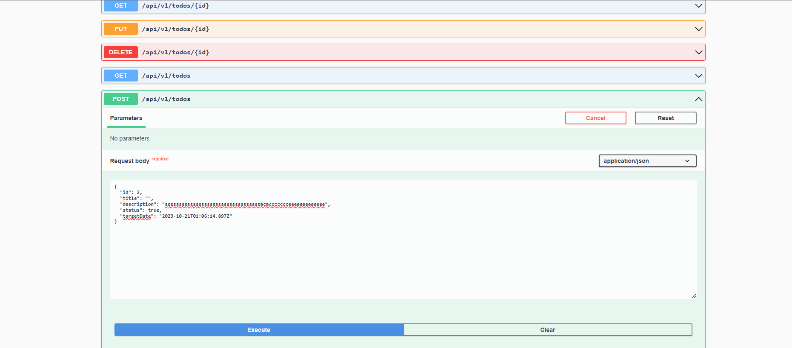

**Response**

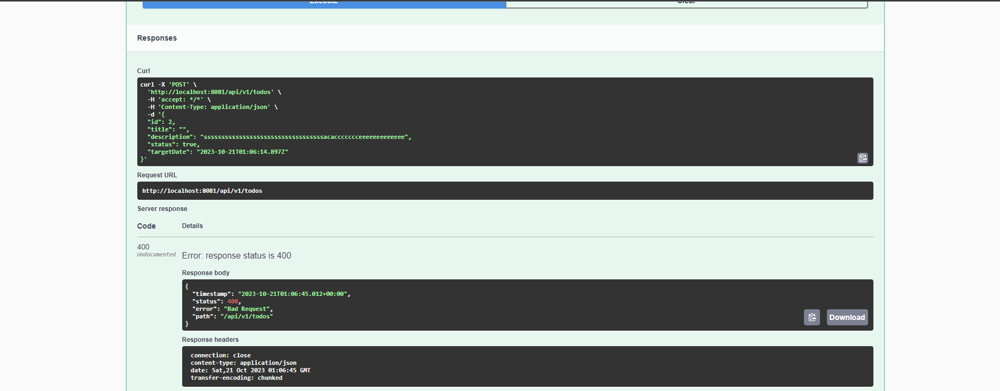

# HATEOAS

HATEOAS, which stands for Hypermedia as the Engine of Application State, is a key concept and constraint in the REST (Representational State Transfer) architectural style. It is a principle that guides the design and behavior of RESTful APIs, making them more discoverable and self-descriptive. HATEOAS is aimed at improving the flexibility and autonomy of client applications when interacting with RESTful web services. 

1. **Hypermedia**: In the context of HATEOAS, "hypermedia" refers to a collection of hyperlinks (URLs) embedded within the response of a RESTful API. These hyperlinks serve as navigation points for clients to discover and access related resources or actions. Hypermedia links are typically represented in the response in a structured format, such as JSON or XML.

2. **Engine of Application State**: The term "Engine of Application State" emphasizes that the state of the client application and its interaction with the server are driven by the hypermedia contained in the responses. In other words, clients should not have prior knowledge of the API's structure or behavior but should follow links provided in responses to navigate through the API.

3. **Dynamic Navigation**: HATEOAS allows clients to explore and navigate the API dynamically. Instead of relying on hardcoded URLs or a predefined sequence of API calls, clients can follow links provided by the server, discovering available actions and resource transitions as they interact with the API.

4. **Loose Coupling**: HATEOAS promotes loose coupling between clients and servers. Clients are not tightly bound to the structure of the API; they rely on the hypermedia links provided by the server, which can evolve over time without breaking existing clients.

5. **Self-Descriptive Responses**: Responses in a HATEOAS-compliant API are self-descriptive. Clients can interpret the content and links provided in the response to determine what actions are available, how to interact with resources, and what the next steps should be.

6. **Resource and Action Discovery**: HATEOAS allows clients to discover both resources (e.g., endpoints for specific data) and actions (e.g., create, update, delete) that can be performed on those resources. Clients do not need to have a priori knowledge of these resources or actions.

Here's a simplified example of what HATEOAS might look like in a JSON response from a RESTful API:

```json
{
  "message": "Welcome to the API",
  "links": [
    {
      "rel": "self",
      "href": "/api"
    },
    {
      "rel": "users",
      "href": "/api/users"
    },
    {
      "rel": "products",
      "href": "/api/products"
    }
  ]
}
```

In this example, the response includes hypermedia links (in the "links" array) that allow clients to navigate to various parts of the API, such as user data or product listings.

HATEOAS is a fundamental principle of REST and is designed to make APIs more self-discoverable, flexible, and easy to evolve. It promotes a more dynamic and autonomous client-server interaction model, where clients can adapt to changes in the API without requiring prior knowledge of its structure.

# HATEOAS (Hypermedia as the Engine of Application State) dependency

* add the following dependency in the pom.xml file

```xml
        <dependency>
            <groupId>org.springframework.boot</groupId>
            <artifactId>spring-boot-starter-hateoas</artifactId>
        </dependency>
```

* once the dependency is added, update the project by right clicking on the project folder and select maven > update project

* once the project is updated, go to the Todo class and extend the RepresentationModel<Todo> class

```java

@Entity
public class Todo extends RepresentationModel<Todo> {
	@Id
	@GeneratedValue(strategy = GenerationType.IDENTITY)
	private int id;
	// spring validation framework 
	@NotBlank(message = "Title is required.")
	@Column(name = "task", nullable=false)
	private String title;
	@Size(min=5, max=20, message = "length should be morethan 5 and less than 20 characters")
	private String description;
	private boolean status;
	private Date targetDate;
```

* **note**: extends RepresentationModel<Todo> is used to add the hateoas links

## add the hateoas links in the controller class

* once the hateoas links are added, go to the controller class and add the following code

```java
 	@GetMapping()
	public List<Todo> getAllTodos(){
		 
		var todos = todoSvc.getAllTodos();
		if(todos.size()==0)
			throw new TodoNotFoundException("Todo Not Found");
		else {
			for(Todo todo: todos) {
				int todoId = todo.getId();
				Link selfLink = WebMvcLinkBuilder.linkTo(TodoController.class).slash(todoId).withRel("self");
				todo.add(selfLink);
				Link deleteLink = WebMvcLinkBuilder.linkTo(TodoController.class).slash(todoId).withRel("Delete");
				todo.add(deleteLink);
				Link updateLink = WebMvcLinkBuilder.linkTo(TodoController.class).slash(todoId).withRel("update");
				todo.add(updateLink);
			}
			
			return todos;
		}}
	    
```

* **note**: Link selfLink = WebMvcLinkBuilder.linkTo(TodoController.class).slash(todoId).withRel("self"); is used to add the self link

* **note**: Link deleteLink = WebMvcLinkBuilder.linkTo(TodoController.class).slash(todoId).withRel("Delete"); is used to add the delete link

* **note**: Link updateLink = WebMvcLinkBuilder.linkTo(TodoController.class).slash(todoId).withRel("update"); is used to add the update link

* onces the hateoas links are added, run the application and test the application using postman or swagger

## Testing using Swagger


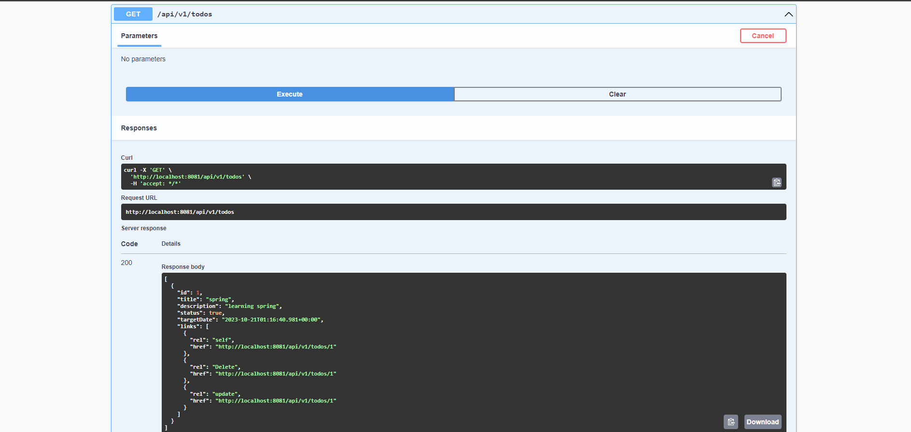


# Spring Security

Spring Security is a powerful framework within the Spring ecosystem that provides comprehensive security features for Java applications. It's primarily used to secure web applications, APIs, and other components against various security threats and vulnerabilities. Spring Security is designed to make it easier to implement authentication, authorization, and other security-related functionality in your applications. 

1. **Authentication**: Spring Security provides various mechanisms for authentication, including form-based authentication, basic authentication, and integration with external authentication providers (e.g., LDAP, OAuth, SAML, and OpenID).

2. **Authorization**: Spring Security enables fine-grained access control through role-based and permission-based authorization. It allows you to define who can access specific parts of your application based on user roles and access rules.

3. **User Management**: Spring Security provides tools for managing user accounts, such as user registration, account lockout, and password reset functionality.

4. **Session Management**: You can manage user sessions, control session timeouts, and handle concurrent session control using Spring Security.

5. **Cross-Site Request Forgery (CSRF) Protection**: Spring Security helps protect your application from CSRF attacks by providing built-in support for generating and validating CSRF tokens.

6. **Cross-Origin Resource Sharing (CORS)**: Spring Security allows you to configure and control CORS settings to secure your application against unwanted cross-origin requests.

7. **Password Encryption**: It offers password hashing and encryption utilities to store passwords securely in the database.

8. **Integration with Other Spring Projects**: Spring Security seamlessly integrates with other Spring projects, such as Spring MVC, Spring Boot, and Spring Cloud, to provide a comprehensive and consistent security solution.

9. **Customization**: You can customize and extend Spring Security through various configuration options, filters, and hooks to meet the specific security requirements of your application.

10. **Authentication Providers**: Spring Security supports various authentication providers, including in-memory user stores, JDBC-based authentication, LDAP, and external identity providers like OAuth 2.0 providers.

11. **Access Control Lists (ACL)**: Spring Security provides ACL support for more complex authorization requirements, allowing you to define permissions at the object level.

12. **Security Headers**: It allows you to configure security-related HTTP headers, such as Content Security Policy (CSP), HTTP Strict Transport Security (HSTS), and X-Content-Type-Options.

13. **Event Handling**: Spring Security provides an event-driven model, allowing you to respond to authentication and authorization events.

14. **Security Auditing**: You can use Spring Security's auditing features to log and monitor security-related events within your application.

15. **Spring Boot Integration**: Spring Security can be easily configured and customized within Spring Boot applications using application.properties or application.yml files.

16. **OAuth 2.0 and OpenID Connect**: Spring Security supports OAuth 2.0 and OpenID Connect for securing REST APIs and enabling single sign-on (SSO) with external identity providers.

Spring Security is a crucial tool for building secure Java applications, including web applications and microservices. It simplifies many complex security tasks, provides extensive customization options, and is well-integrated into the Spring ecosystem, making it a popular choice for ensuring the security of Spring-based applications.

## Working with Spring Security basic authentication

* add the following dependency in the pom.xml file

```xml
        <dependency>
            <groupId>org.springframework.boot</groupId>
            <artifactId>spring-boot-starter-security</artifactId>
        </dependency>
```

* once the dependency is added, update the project by right clicking on the project folder and select maven > update project

* once the project is updated, go to the application.properties file and add the following code

```properties
spring.security.user.name=admin
spring.security.user.password=password
```

* once the properties are added, run the application and test the application using postman or swagger

* **note**: once the application is running, open the browser and type the following url

```url
http://localhost:8081/swagger-ui/index.html
```

* once the swagger is opened, give the username and password and click on sign in

## Basic login Output

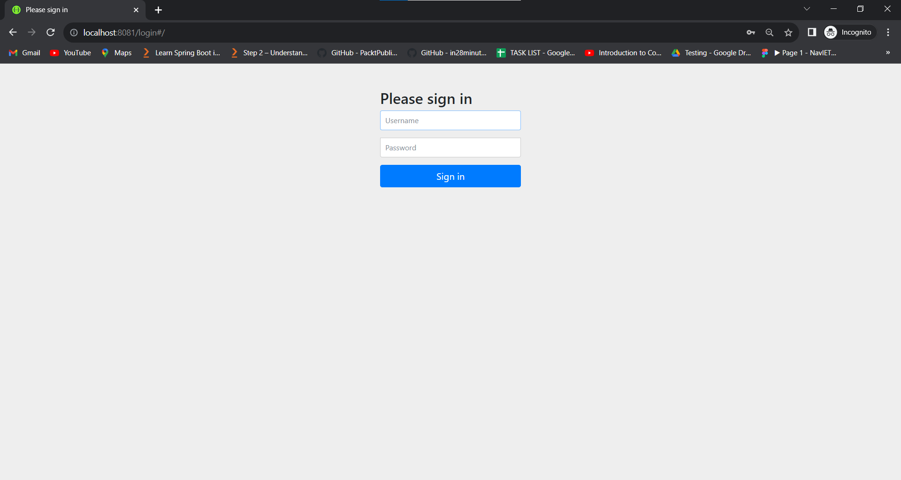

# OAUTH2

OAuth 2.0 (OAuth2) is an open standard and protocol for authorization, allowing secure access to resources on behalf of a user or an application without sharing the user's credentials. It is widely used in web and mobile applications to enable secure access to protected resources, such as user data and APIs. OAuth2 provides a framework for granting limited, controlled access to resources and is commonly used for single sign-on (SSO) and delegated authorization.

1. **Roles**:
   - **Resource Owner**: The user who owns the protected resources (e.g., user data).
   - **Client**: The application or service that wants to access the user's resources. Clients can be confidential (e.g., server-side applications) or public (e.g., single-page web apps).
   - **Authorization Server**: The server responsible for authenticating the user, obtaining their consent, and issuing access tokens. It is the server that controls access to protected resources.
   - **Resource Server**: The server that hosts the protected resources. It can be the same server as the authorization server or a separate entity.
  
2. **Flows**:
   OAuth2 defines several authorization flows to obtain access tokens:
   - **Authorization Code Flow**: Used by confidential clients. The client obtains an authorization code, exchanges it for an access token, and stores it securely.
   - **Implicit Flow**: Used by public clients (e.g., single-page apps). The access token is returned directly to the client without an intermediate authorization code.
   - **Resource Owner Password Credentials Flow**: The client collects the user's credentials and exchanges them for an access token. It's less secure and should be used sparingly.
   - **Client Credentials Flow**: Used when the client is also the resource owner and wants access to its own data.
   - **Device Flow**: Suitable for devices with limited input capabilities (e.g., smart TVs). The user authorizes the device on a separate device (e.g., a smartphone) using a one-time code.

3. **Access Tokens**: Access tokens are short-lived credentials that grant access to protected resources. They are used to authenticate requests to the resource server. OAuth2 supports different token types, including bearer tokens and JSON Web Tokens (JWT).

4. **Scopes**: Scopes are permissions or privileges that define what the client can access. Clients request specific scopes during the authorization process. For example, "read" and "write" scopes might be defined for an API.

5. **Refresh Tokens**: Some OAuth2 flows, such as the Authorization Code Flow, issue refresh tokens. These tokens can be used to obtain a new access token without the user's involvement when the access token expires.

6. **Client Registration**: Clients often need to register with the authorization server to obtain client credentials (e.g., client ID and client secret).

7. **User Consent**: OAuth2 mandates that the user must explicitly grant consent before a client can access their resources. This is typically presented in the form of a consent screen.

8. **Single Sign-On (SSO)**: OAuth2 can be used for SSO scenarios where a user can log in once and then access multiple services or applications without the need to re-enter credentials.

9. **Security**: Implementers of OAuth2 must consider security aspects, such as token protection, token validation, and secure communication between components.

10. **Standard Protocols**: OAuth2 often works in conjunction with other security and identity protocols, such as OpenID Connect for identity authentication.

## OAuth2 authentication dependency

* add the following dependency in the pom.xml file

```xml
		<dependency>
			<groupId>org.springframework.boot</groupId>
			<artifactId>spring-boot-starter-oauth2-client</artifactId>
		</dependency>
```
* once the dependency is added, update the project by right clicking on the project folder and select maven > update project

## To get the OAuth2 authentication using github 

* Step 1: got to the github and login with your credentials

* Step 2: go to the settings and click on developer settings

* Step 3: click on OAuth Apps and click on new OAuth App

* Step 4: give the application name and give the homepage url as http://localhost:8081

* Step 5: give the authorization callback url as http://localhost:8081/login/oauth2/code/github

* Step 6: click on register application

* Step 7: once the application is registered, copy the client id and client secret

* Step 8: go to the application.properties file and add the following code

## OAuth2 authentication using github


* once  client id and client secret key is generated go to project

*  create a package inside the com.todos package and give the name as com.todos.configurations

* create a class file inside the configurations package and give the name as SecurityConfig.java

```java

@Configuration
@EnableWebSecurity
public class SecurityConfig {


    SecurityFilterChain securityFilterChain(HttpSecurity http) throws Exception {
        return http
                .authorizeHttpRequests(auth -> {
                    auth.requestMatchers("/").permitAll();
                    auth.requestMatchers("/favicon.ico").permitAll();
                    auth.anyRequest().authenticated();
                })
                .oauth2Login(withDefaults())
                .formLogin(withDefaults())
                .build();
    }

}

```

* once the project is updated, go to the application.properties file and add the following code

```properties

spring.security.oauth2.client.registration.github.client-id=add133e4e3fedef18438
spring.security.oauth2.client.registration.github.client-secret=ffe518b5897f0f68c6ee1d3359834b0a9edd2ff3

```

* once the properties are added, run the application and test the application using postman or swagger

* **note**: once the application is running, open the browser and type the following url

```url
http://localhost:8081/swagger-ui/index.html
```

# Actuator

Spring Boot Actuator is a set of production-ready management and monitoring features that come built-in with the Spring Boot framework. It is designed to help developers and system administrators monitor and manage Spring Boot applications effectively. Spring Boot Actuator provides various endpoints and features for gaining insights into the application's health, metrics, environment, configuration, and more. 

1. **Health Checks**: Spring Boot Actuator includes a `/health` endpoint that provides information about the application's health. You can customize the health checks to verify various aspects of the application, such as the database connection, messaging system, and other dependencies. The endpoint can be used to integrate with monitoring and alerting systems.

2. **Application Info**: The `/info` endpoint allows you to provide arbitrary application information. You can use this endpoint to display details about the application's version, description, and other metadata.

3. **Metrics**: Spring Boot Actuator offers a `/metrics` endpoint that provides a wide range of application metrics. These metrics include data on memory usage, garbage collection, thread pools, database interactions, and more. Actuator supports integration with various metrics systems like Micrometer, Prometheus, and more.

4. **Environment Properties**: The `/env` endpoint exposes information about the application's environment properties, configuration, and system properties. This can be useful for debugging and understanding the application's runtime environment.

5. **Configuration Properties**: The `/configprops` endpoint lists all the available configuration properties in the application. This is helpful for understanding the application's configuration and can be used to document available settings.

6. **Endpoints for Custom Metrics**: Spring Boot Actuator allows you to create custom endpoints for capturing and exposing application-specific metrics. This feature is beneficial when you need to monitor custom business-related metrics.

7. **Shutdown and Restart**: Actuator provides a `/shutdown` endpoint that can be used to shut down a Spring Boot application gracefully. Be cautious when enabling this feature, and secure it properly to prevent unauthorized shutdowns.

8. **Application Events**: Actuator can capture and expose application events, which are useful for tracking and analyzing the lifecycle of the application and specific events within it.

9. **JMX Integration**: Many Actuator features are exposed through Java Management Extensions (JMX) for integration with monitoring and management tools like JConsole and JVisualVM.

10. **Custom Endpoints**: Spring Boot allows you to create custom management endpoints to expose application-specific data or functionality. You can extend the Actuator capabilities by creating your own endpoints.

Spring Boot Actuator is an essential tool for monitoring, managing, and troubleshooting Spring Boot applications in production environments. By using its features, you can gain insights into the application's health, performance, and configuration. These insights are valuable for diagnosing issues, optimizing performance, and ensuring the application is running smoothly. Additionally, Spring Boot Actuator's integration with various monitoring and alerting systems makes it a powerful tool for DevOps and system administrators.

## Actuator dependency

* add the following dependency in the pom.xml file

```xml
		<dependency>
			<groupId>org.springframework.boot</groupId>
			<artifactId>spring-boot-starter-actuator</artifactId>
		</dependency>
```

* once the dependency is added, update the project by right clicking on the project folder and select maven > update project

* once the project is updated, go to the application.properties file and add the following code

```properties

management.endpoints.web.exposure.include=beans,health,info,metrics,prometheus,env,httptrace,logfile,threaddump

```

* once the properties are added, run the application and test the application using postman or swagger

* **note**: once the application is running, open the browser and type the following url

```url
http://localhost:8081/actuator
```

## Output 

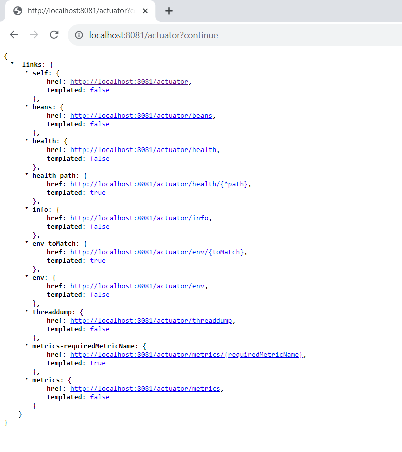


# Docker

Docker is a platform that enables developers to create, deploy, and run applications in containers. Containers are lightweight, portable, and self-sufficient units that package an application and its dependencies together. Docker provides tools and a platform to build, ship, and run these containers consistently across different environments, from development to production.


1. **Container:** A container is a standalone and executable package that includes everything needed to run a piece of software, including the code, runtime, libraries, and system tools. Containers are isolated from each other and from the host system, ensuring consistency and eliminating "it works on my machine" issues.

2. **Docker Image:** A Docker image is a read-only blueprint or template for creating containers. It defines the application, its dependencies, and other configuration details. Images are the building blocks of containers and can be stored in a registry for easy distribution.

3. **Dockerfile:** A Dockerfile is a text file that contains instructions for building a Docker image. It specifies a base image, sets the environment, copies files into the image, and configures how the container should run. Dockerfiles are used to automate image creation.

4. **Docker Hub:** Docker Hub is a cloud-based registry service provided by Docker where you can find and share Docker images. It hosts a vast collection of official and community-contributed images that can be used as base images.

5. **Containerization:** Containerization is the process of creating and running containers. Containers can be started, stopped, and deleted with ease, allowing for efficient resource utilization and quick scaling.

6. **Docker Compose:** Docker Compose is a tool for defining and running multi-container Docker applications. It uses a YAML file to define the services, networks, and volumes that make up the application, making it easy to manage complex applications.

7. **Orchestration:** Docker Swarm and Kubernetes are orchestration tools that manage the deployment, scaling, and management of containers in a cluster of machines. They provide features for load balancing, service discovery, and high availability.

8. **Microservices:** Docker is often used in microservices architectures, where applications are broken down into small, independent services running in containers. This approach allows for easier development, deployment, and scaling of individual services.

9. **Cross-Platform Compatibility:** Docker containers can run consistently on various operating systems, including Linux, Windows, and macOS, thanks to Docker's platform-agnostic nature.

10. **Isolation and Security:** Containers provide process and filesystem isolation, enhancing security by isolating applications from one another and from the host system. However, proper security practices must still be followed when building and deploying containers.

11. **Version Control for Infrastructure:** Docker allows infrastructure (containers) to be version-controlled, making it easier to manage infrastructure changes and rollbacks.

12. **DevOps Integration:** Docker is widely used in DevOps practices to enable continuous integration, continuous delivery (CI/CD), and infrastructure as code (IaC) by providing consistent environments for testing and deployment.

## Dockerfile Example

```dockerfile

# Use OpenJDK 17 as the base image
FROM openjdk:17

# Set the working directory to /app
WORKDIR /app

# Copy the JAR file from the target directory to /app inside the container
COPY target/*.jar app.jar

# Expose port 8081
EXPOSE 8081

# Set the entry point to run the JAR file using the java command
ENTRYPOINT ["java", "-jar", "app.jar"]
```

## Docker explanation code

This is a Dockerfile that sets up a Docker image for a Java application using OpenJDK 17 as the base image. 

1. `FROM openjdk:17`: This specifies the base image to use for the Docker image. In this case, it's using OpenJDK 17 as the base image, which is suitable for running Java applications.

2. `WORKDIR /app`: This sets the working directory inside the container to `/app`. This is the directory where the application's files will be copied and where the application will run.

3. `COPY target/todo-0.0.1-SNAPSHOT.jar /app`: This instruction copies the JAR file of the Java application from the host machine (assuming it's located in the `target` directory) to the `/app` directory inside the container.

4. `EXPOSE 8081`: This instruction exposes port 8081 to the outside world. It informs Docker that the application inside the container will listen on port 8081, but it doesn't actually publish the port to the host machine. You would need to specify port mapping when running the container to make it accessible from the host.

5. `ENTRYPOINT ["java", "-jar", "todo-0.0.1-SNAPSHOT.jar"]`: This sets the entry point for the container. It specifies that the container should run the Java application by executing the `java -jar todo-0.0.1-SNAPSHOT.jar` command. This command will launch the Java application using the provided JAR file as the main application entry point.


